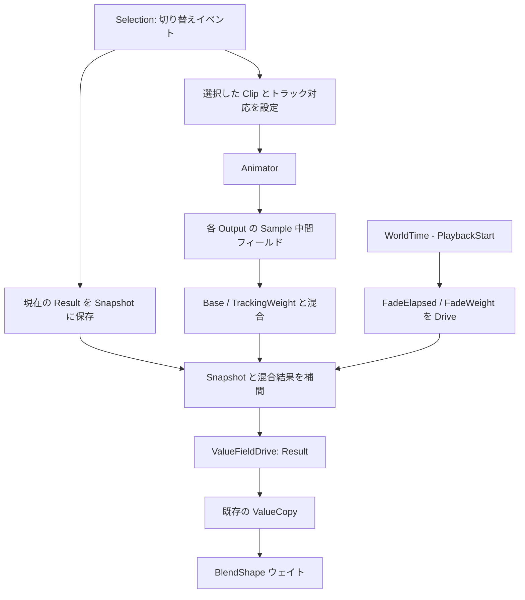

# Playback を Animator / Drive へ移す設計検証

2026-09-21 時点の設計検証。以下は移行案であり、現在の生成コードはまだ
`LocalUpdate` から各 Output の `Result` を書き込む実装である。

## 結論と維持する仕様

`Animator → 中間フィールド → Output ごとの混合 → ValueFieldDrive<float>` は実現可能。
LocalUpdate / ForEach による毎フレームの Output 書き込みをなくせる。
ただし、既存のアセットをそのまま Animator に差し替えるだけでは同じ動作にならない。

- フェード終了後も動く表情とループ表情の再生を継続する。
  FadeDuration 後に一律停止する案は採用しない。
- クリップの時刻と、フェードの経過時間を独立させる。
- トラック番号と Output の対応、Duration の編集、末尾境界を明示的に扱う。
- 既存の Base / TrackingWeight / Snapshot と、表情なしへの FadeOut を維持する。
- LocalUpdate ノードの除去は、すべての毎フレーム処理の除去を意味しない。
  Animator と Drive は内部で更新する。性能改善量は別途測定する。

## 値の流れ



フィールドの書き込み元は一つずつにする。Animator は Sample を、Output の Flux は
Result を、既存 ValueCopy は元の BlendShape フィールドを Drive する。
まばたき・リップシンクの既存ドライバーは引き続き Base に接続する。
Result を Drive へ移す際には Lifecycle と同期 Playback 呼び出しからの直接書き込みも
取り除く必要がある。

## 二つの時間

現在の計算を維持する場合：

```text
elapsed    = max(0, WorldTime - PlaybackStart)
sampleTime = Loop ? elapsed % max(Duration, 0.001) : elapsed
fadeWeight = FadeDuration > 0 ? clamp01(elapsed / FadeDuration) : 1
sample     = HasTrack && ClipReady ? Sample : Base
mixed      = lerp(sample, Base, clamp01(TrackingWeight))
Result     = lerp(Snapshot, mixed, fadeWeight)
```

`AnimationTime` はクリップの現在位置として公開してよいが、フェード時間には使わない。
Animator.Position は非ループではアセット全長で clamp され、ループでは折り返す。
全長 0.001 秒 / FadeDuration 0.1 秒なら Position は 0.001 で止まるが、
独立した elapsed は 0.1 まで進み、フェードを完了できる。
CurrentExpression が null の FadeOut でも、この独立時計は有効である。

Animator の Play / Loop を直接使う場合、周期は AnimX.GlobalDuration から決まり、
ExpressionClip/Duration の変更は反映されない。既存の Duration 編集を維持するには、
外部で上記 sampleTime を計算して PlaybackDrive へ渡す方法がある。
その場合は内部の自動再生とループを止め、
`NormalizedPosition = sampleTime / Animator.ClipLength` を Drive する。
Play=false でも外部位置が変われば Animator の出力は変わる。
これは時刻の制御方法を変えるもので、FadeDuration 後に表情を固定する処理ではない。
ただし Position 自体の clamp は残るため、末尾境界の対策は別に必要。

## トラックとフィールドの対応

Animator は `Fields[i]` と `Clip.Data[i]` を対応付ける。
各トラックの Node / Property を変更のたびに自動照合するコンポーネントではない。
現在のアセットは `Node="Expression", Property=Output.Id` という識別情報を持つが、
トラック順序は Catalog の表情ごとに異なる。

移行時は次のいずれかを実装する必要がある。

1. 選択・アセット変更時に ID から対応を解決し、Fields の接続を組み直す。
   全接続を解除してから再接続し、同じ Sample を二つの DriveRef が奪い合わないようにする。
   トラック番号の穴は詰めない。未知トラックには null の接続先を用意する。
2. 変換時に全アセットのトラック順を共通化し、Fields を固定する。
   トラックが存在しなかった Output の情報を別に保持し、ダミーのゼロ値と区別する。
   任意のアセットへの差し替えには再正規化または明示的な検証が必要になる。

既存の Catalog/Clip 差し替えを維持するなら 1 が適している。
今回の試作では C# による Fields の再接続を検証した。
エクスポート後の標準 Flux だけで可変長リストの再構築を行う実装は未検証であり、
コンバーターのコールバックが残らないように別途実装・検証する必要がある。

対応するトラックがない Output は HasTrack=false として Base を使う。
前の Sample の残留や、存在しないトラックから Animator が出す既定値を採用しない。
アセットのロード完了と Fields の設定完了まで新しい Sample を有効にしない。
短時間の連続切り替えでは、古いロード完了が新しい選択を上書きしないようにする。

## 末尾境界と停止

確認した実 DLL では、Hold 補間のカーブが以下の値を持つ場合：

```text
0 秒: 0.2
1 秒: 0.8
```

`Sample(1)` は 0.2、`Sample(1.1)` は 0.8 になる。
アセット全長が 1 秒の Animator は Position が 1 で止まるため、0.2 が残る。
現在の Playback は 1 秒を超えてサンプリングするため、0.8 へ変わる。
この差は Loop=false の移行回帰として検査する必要がある。

対策候補は、要求した sampleTime がトラック末尾を超えた場合に保存した末尾値を使う、
または再生用アセットの末尾を補正すること。単純に Animator.Position を使うだけでは
現在のサンプリング仕様を完全には維持できない。GlobalDuration より後にキーを持つ
差し替えアセットも、clamp の影響を別途検査する。

Pause は現在位置を保持し、Stop は開始位置へ戻す。
今回の移行ではフェード完了時にどちらも呼ばない。
Pause 後も Animator.OnCommonUpdate はサンプリングするため、Pause だけで
更新負荷がなくなるわけではない。

## 切り替えと同期

装着者が行う切り替えイベントで、現在の混合済み Result を Snapshot に保存し、
次の表情の FadeIn または元の表情の FadeOut を FadeDuration に保存する。
参照・バインド・ロードの準備が整った時点を PlaybackStart と一致させ、
Sample が前の表情のまま新しいフェードを進めないようにする。
表情なしの場合は Sample を使わず Base を補間先にする。

Drive 化後の Result は各クライアントで計算されることを前提に、切り替え状態と
Snapshot を同期し、観測側が初期化や切り替えを書き戻さないようにする。
複製・再読込・装着解除・所有者交代を検証する。
既存 API の同期実行と、Animator / Drive の更新順序の差も検証対象である。

ノードは各 Output の近くに置き、Sample・Base・TrackingWeight・Snapshot などの
入力を接続先の左側にポート順で上から下へ並べる。共有時刻は DynamicVariable を
介して読み、Output 間に長い配線を引かない。

## 検証した範囲

Resonite 2026.9.18.82 に ResoLoop で読み取り接続し、Animator の Clip / Fields /
SyncPlayback の型を確認した。実行環境の DLL を確認し、独立したヘッドレス試作で
次を実行した。ユーザーのアバターには変更していない。

- LocalUpdate なしの Animator → 中間値 → ValueFieldDrive のグラフが有効。
- 0.001 秒クリップの位置が止まった後も 0.1 秒フェードが完了。
- トラック順が変わると Fields の接続を組み直す必要があること。
- Pause の値保持と Stop の巻き戻し。
- Animator が Pause していても Base の変更が Result に伝わること。
- Animator のループ位置の折り返し。
- Hold の末尾時刻と末尾を超えた時刻の差。
- PlaybackDrive による外部位置指定・末尾 clamp・外部からの折り返し。

試作とログはコミット対象外の `.tmp_verify/animator-design/` に保存する。
実アバターの移行、標準 Flux による可変長バインド、ネットワーク同期、保存再読込、
末尾補正は今回の試作では未検証。

## 実装の選択肢

Animator を採用する場合は、上記の対応付け・時間・末尾の補正を一緒に実装する。
LocalUpdate の除去だけを先に行うなら、現在の SampleValueAnimationTrack を
各 Output の評価グラフに残し、その結果を ValueFieldDrive へ接続する方法もある。
後者は Duration と範囲外サンプリングの互換性を維持しやすく、Animator のバインド
管理が不要になる。いずれもフェード完了後に動く表情の再生を停止しない。