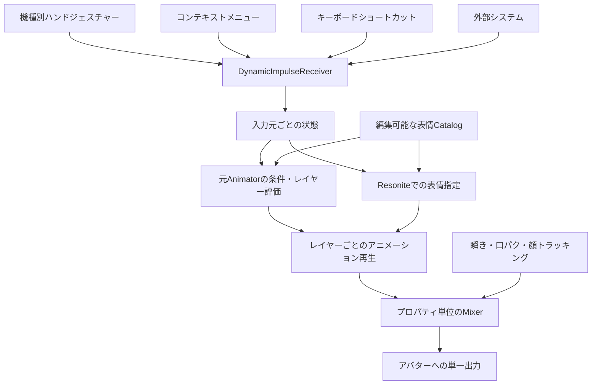

# VRChat表情をResoniteへ取り込むための表情システム設計

設計案。2026-09-14作成。生成するResoniteアバターの構成と、ResoPon側の変換処理を対象とする。
この文書で定義するCore、Catalog、Mixer、各AdapterはSlot／ProtoFluxの論理モジュール名であり、同名の既存Resoniteコンポーネントがあるという意味ではない。
以下は当初の設計を保持している。現在の実装範囲、編集方法、設計との差分、検証結果は
[表情システムの実装](expression-system.md) を参照。

## 1. 基本方針

**入力 → DynamicImpulseReceiver → 状態・条件の評価 → アニメーション再生 → プロパティ単位の合成 → アバターへの出力**に分ける。

- 左手と右手の入力状態を独立して保持する。表情全体を「最後に届いたイベント」で置き換えない。
- VRChatから取り込んだ条件・レイヤー順を保持する。右手、左手、ExpressionMenuの間にVRChat共通の優先順位があるとは扱わない。
- コントローラー固有の判定を、機種ごとに削除できる入力モジュールへ閉じ込める。
- 表情の定義を1表情1Slotにする。表情を追加・削除しても、各入力処理や出力処理の配線を組み直す必要がない構成にする。
- アバター上の各出力フィールドを操作する経路は1つにする。瞬き、口パク、フェイストラッキングとの競合もここで処理する。
- 保存したパッケージは、標準コンポーネントと生成したProtoFluxで動作する。利用者側に独自DLL／Modを要求しない。



VRChatのExpressionMenuはアニメーションを直接保持するものではなく、パラメーターを変更してAnimatorを制御する。そのため、メニュー名から表情Clipを推測するだけでは、左右の組み合わせや表情固定の挙動を再現できない。[VRChat公式: Expressions Menu and Controls](https://creators.vrchat.com/avatars/expression-menu-and-controls/)

## 2. Resonite内の階層

```text
AvatarRoot
└─ Expressions
   ├─ Settings                  所有者、遷移時間、入力の有効化など
   ├─ API
   │  ├─ Receivers              公開DynamicImpulseReceiver
   │  └─ Examples               外部入力用CommandSlotの見本
   ├─ Core
   │  ├─ SourceState            左右の手、メニュー、外部入力の状態
   │  ├─ ParameterState         元Animator用のint / bool / float
   │  ├─ Resolver               条件、優先順位、解除、再評価
   │  ├─ Registry              CatalogとBindingsの参照キャッシュ
   │  └─ Lifecycle              装着・削除・切断・再初期化
   ├─ Catalog
   │  ├─ Smile                  表情定義。表示名で改名可能
   │  ├─ Angry
   │  ├─ Wink
   │  └─ ...
   ├─ Rules
   │  ├─ ImportedAnimator       対応範囲の元状態・遷移・レイヤー
   │  └─ GestureBindings        Resoniteで編集する割り当て
   ├─ Inputs
   │  ├─ HandGestures
   │  │  ├─ Settings            共通の調整値
   │  │  └─ Modules
   │  │     ├─ Touch            左右の検出・正規化・通知
   │  │     ├─ Index
   │  │     ├─ ViveWand
   │  │     ├─ WMR
   │  │     └─ ...              実装・確認済みの機種だけ生成
   │  ├─ ContextMenu            メニュー入口と操作Adapter
   │  ├─ Keyboard               ショートカット設定とAdapter
   │  └─ External               外部入力元の登録設定
   ├─ Runtime
   │  ├─ Playbacks              再生インスタンスと一時値
   │  ├─ Tracking              瞬き・口パク等の一時出力
   │  └─ Transitions           切り替え前の値など
   ├─ Outputs                   対象フィールド、基準値、Mixer、単一Driver
   └─ Diagnostics               選択理由、欠落参照、未対応機能
```

`Modules/Index`を削除しても、Catalog・ルール・出力は残る。入力モジュール間の参照を作らず、各モジュールは共通APIと自分の設定だけを参照する。片手だけ異なるコントローラーも許容する。

## 3. 表情Catalogと追加・削除

各表情Slotには次を保存する。Inspectorで編集できる標準の値／参照コンポーネントと、名前付きDynamic Variableを使う。

| 項目 | 意味 |
| --- | --- |
| ExpressionId | 一意で安定した文字列ID。配列番号や表示名をIDにしない |
| DisplayName / Icon / MenuPath / SortOrder | 表示だけに使う情報 |
| Enabled / ShowInMenu | 表情の使用可否と一覧への表示可否 |
| Clip / Bindings | Animationアセットと、各トラックがどの出力を変更するか |
| PlaybackMode | Pose、Loop、OneShotHold、OneShotRelease |
| FadeIn / FadeOut | Resoniteから直接指定する場合の遷移時間。既定0.1秒 |
| OverrideMask | 直接指定で上書きする範囲。顔全体または指定プロパティ |
| TrackingPolicy | Blink／Viseme／FaceTrackingを範囲別に維持・置換・明示加算 |
| SourceInfo | 元Clip、Controller、state、bindingの情報。診断用 |

Clip内のトラック順とBindingsの順序は必ず一致させる。対象はRenderer名だけで探さず、インポートで解決したオブジェクト識別子とフィールド参照を使う。

Catalogは表情の定義であり、再生時刻を共有する場所にはしない。同じSmileを左右の別レイヤーから使う場合は、Runtime側に別々の再生インスタンスを作る。片方を再開始しても、もう片方の再生時刻は変わらない。

追加は「表情を追加」操作でテンプレートを複製し、新しいIDを発行してClip／Bindingsを設定する。既存表情を手動複製した場合も使えるが、重複IDは診断して選択対象から外し、「ID再発行」で解決する。Bindingの編集UIはトラックと出力の対応を一緒に更新する。

Catalogの子Slot追加・削除、Enabled変更、設定更新時にRegistryを再構築する。直接選択メニュー項目はCatalogから生成し、表示順だけを変えても割り当てはずれない。「再読込」操作も用意する。自動生成したメニュー項目の直接編集ではなく、Catalog側を編集元にする。

使用中の表情が削除・無効化された場合は、その表情の寄与を除いて再評価する。遷移に必要な直前の値はCore側に保持し、削除されたSlotを読み続けない。参照が切れたルールは無効候補として扱い、別の表情へ誤って割り当てない。欠落した元stateの遷移情報は残せるが、その表情の出力寄与はゼロにする。

Outputsには共有の出力定義を置く。新しいBindingsが未知のフィールドを参照した場合は登録時に型・競合を確認し、出力テンプレートから追加する。基準値は接続前に取得する。既に登録済みの出力を再読込しても、現在の笑顔の値などで基準値を上書きしない。最後の利用表情が消えた出力も、基準値へ戻す処理が済むまで維持する。

表情がなくなってもトラッキング入力が残るOutputsは維持する。システムを完全撤去する場合だけ、元のトラッキングDriverを実フィールドへ再接続する。Driverを一時値へ移したまま出力経路を削除しない。

## 4. DynamicImpulseによる共通イベントAPI

公開受信Slotは`Expressions/API/Receivers`とし、外部システムにはこのSlotへの参照を渡す。ワールド全体を探索先にしない。別アバターは同じTagを使っても、それぞれの受信Slotで区別する。

基本入口を以下に統一する。

| 項目 | 値 |
| --- | --- |
| Tag | `ResoPon/Expression/v1/Request` |
| Trigger | `DynamicImpulseTriggerWithObject<Slot>` |
| Receiver | `DynamicImpulseReceiverWithObject<Slot>`（UI上のWith Data、型Slot） |
| TargetHierarchy | 対象アバターの`API/Receivers` |
| ExcludeDisabled | true。受信ノードをこの専用サブツリー内に置く |
| Payload | 送信者ごとのCommandSlot参照 |

このTag・型に対応する公開Receiverは1つにする。同じ宛先階層内に複数の一致Receiverがあれば全部が発火する。`TriggeredCount`は一致Receiver数であり、要求の受理成功を保証しない。

データ付きReceiverはTagとデータ型が一致するイベントを受け取り、データは受信した実行コンテキスト中に使用する。受信処理はその場でCommandSlotを検証・コピーしてCoreの状態へ格納し、Delayの後からpayloadを読み直さない。[Resonite Wiki: Dynamic Impulse Receiver With Data](https://wiki.resonite.com/ProtoFlux:Dynamic_Impulse_Receiver_With_Data)

CommandSlotには共通項目`Version`、`SourceSlot`、`Channel`、`Generation`、`Sequence`、`Operation`を持たせる。SourceSlotは入力元の寿命を表す安定した参照で、使い捨てCommandSlotとは区別する。SourceSlot／Channelごとに状態を保持し、Generationは装着・再登録ごとに更新、Sequenceは各世代で単調増加する。

| Operation | 固有データ | 動作 |
| --- | --- | --- |
| Gesture | Hand、GestureId、GestureWeight、Available | 片手の正規化入力を一括更新する |
| SetParameters | 名前・型・値の一覧 | 元Animator用パラメーターを1トランザクションで更新する |
| Select | ExpressionId、Weight、Mode | 表情をHold／Toggle／OneShotで要求する |
| Renew | 対象要求token、必要なら新しいWeight | leaseや強度だけを更新し、選択順・再生開始時刻は維持する |
| Release | ReleaseGeneration、ReleaseSequence | 対象の要求がまだ有効な場合だけ、そのSource／Channelを解除する |
| Reset | Scope | DirectSelections、ImportedParameters、Allなど明示範囲を初期化する |

Sourceごとの許可Operation・Channel・優先度・lease時間は受信側設定に置く。複数の外部システムには別のSourceSlotを割り当て、共有の1つの「外部表情」欄を奪い合わない。SetParametersの解除は、その入力元の上書きを除き、他の有効入力または元の初期値へ戻す。

入力ごとにCommandSlotを用意し、必要項目を書き終えてからImpulseを発火する。Coreは全項目を検証した後に一括反映する。不正ID・未登録Source・古い世代やSequence・非有限数・範囲外値などは拒否し、現在の表情を壊さず診断へ記録する。受信中に再帰的な評価や再通知はせず、dirtyにして次の評価でまとめて処理する。

例: 外部ツールが登録済みSourceの`face` Channelに対し、`Select(ExpressionId=smile, Mode=Hold, Sequence=12)`を送る。その後の`Release(ReleaseSequence=12)`でそのツールの要求だけが消える。既にSequence=13のAngryへ切り替わっていれば、古いReleaseはAngryを解除しない。

簡単な連携用には、任意で`Select/<ExpressionId>`などの引数なしDynamicImpulseReceiverを自動生成し、専用の簡易Sourceとして同じCoreの処理へ渡す。複数送信元の独立制御や押下・解除を扱う連携にはCommandSlot方式を使う。

DynamicImpulse自体は装着者へのネットワークRPCではない。標準契約は**装着者クライアントでイベントを発火**すること。受信側でも現在の装着者がLocalUserであることを確認する。ワールド／他ユーザー側で発生するイベントを受けたい場合は、別のBridgeが要求を装着者へ届け、装着者側でこのAPIを呼ぶ。Bridgeは別機能として扱い、Impulseを送るだけで他クライアントへ転送されるとは説明しない。

## 5. ハンドジェスチャーモジュール

機種ごとに`ControllerNode`系の入力を読み、共通のGesture状態へ正規化する。元のVRChatパラメーターとの対応は`0=Neutral, 1=Fist, 2=HandOpen, 3=FingerPoint, 4=Victory, 5=RockNRoll, 6=HandGun, 7=ThumbsUp`とする。左右と各GestureWeightも別に保持する。[VRChat公式: Animator Parameters](https://creators.vrchat.com/avatars/animator-parameters/)

| モジュール | 判定に使用する入力の例 |
| --- | --- |
| Touch | Trigger／Grip量、ボタンや親指領域のTouch情報 |
| Index | Touch／Grip／Trigger情報。個別指が必要なら別途FingerPoseから判定 |
| ViveWand | Grip／Trigger／Touchpadの入力組み合わせ |
| WMR等 | 当該機種が公開するTrigger／Grip／ボタン入力 |

機種ごとに実際に取得できる入力を確認して判定表を作る。標準IndexControllerノードには個別指Curl出力がないため、FingerPoseによる指節姿勢の取得と、その取得可否の確認を別途行う。指情報が足りない機種には設定可能なボタン組み合わせを用意し、全8種類を自然な手形だけで識別できるとはしない。判別不能・未接続は内部値`Unavailable`で表す。`GestureId=0`は元Animatorで意味を持ち得るため、入力なしと混同しない。

Coreは片手につき有効なモジュールを1つ選ぶ。明示選択を優先し、自動選択では実機の対応判定・設定優先順位・安定したID順で決定する。同じ手に複数モジュールが反応しても、イベントの到着順で機種を切り替えない。自動選択で不明な機種を無条件にTouch等として扱わない。

切り替えのちらつきを抑える初期設定は判定安定時間50ms、アナログ閾値にヒステリシス、GestureWeightの更新は小さな差分を抑制する。値は機種の実機検証で調整する。モジュールが選ばれた直後は現在状態を通知し、その後は変化時を中心に送信する。

削除・切断への対応はCoreに置く。Module Slotの消失、Enabled=false、機種入力の非アクティブ化で、そのモジュールの左右状態を解除して再選択する。削除されるSlotから最後のReleaseが届くことには依存しない。入力処理の一部だけが消えた場合にも備え、選択中のモジュールは初期値100ms間隔で専用の小さな宛先へ生存通知を送り、500ms途絶したら失効させる。大きなアバター階層へ毎フレームImpulseを送らない。

`Unavailable`時はその手の通常割り当てを無効とする。元Animator互換層には互換値0・Weight=0を供給してdefault側への遷移を評価する。この代替値は診断に表示する。もう片方の手、メニュー、外部入力は維持する。

入力を実行するUserは常に装着者を指定する。`Update.UpdatingUser=wearer`、`SkipIfNull=true`とし、装着者がいない場合は更新を止め、ホストへの暗黙のフォールバックを使わない。アバターを掴んで移動しただけで所有者が変わったとは判定しない。

## 6. 左右・メニュー・外部入力の共存

元VRChatの挙動を再生する層と、Resoniteから直接表情を指定する層を分ける。

**元Animator互換層:** GestureLeft／Right、GestureWeight、ExpressionMenu由来のパラメーターを入力し、対応するstate、遷移、レイヤーを評価する。左右のAND条件や、メニューパラメーターによるジェスチャー抑制もここに含む。左右64通りの表だけでは時間依存遷移やメニュー条件を表現できないので、必要な状態と条件を残す。

左右が別々のレイヤーで動作する場合は両方の寄与を保持する。同じプロパティに書く場合は元のレイヤー順・weight・mask・blend方式に従う。左右が同じレイヤーの条件なら、元の遷移順でstateを選ぶ。Playable Layerも順序を持つため、Clipを一覧に並べるだけでは元の結果にならない。[VRChat公式: Playable Layers](https://creators.vrchat.com/avatars/playable-layers/)

**Resonite直接指定層:** Catalogの任意表情を手動メニュー、キーボード、外部APIから指定する。既定は顔の指定範囲を上書きし、解除すればその時点の元Animator互換層へ戻る。上書き中も左右の入力と互換層の状態を更新し続ける。

| 要求 | 既定の扱い |
| --- | --- |
| 元Animatorから得られる左右・メニュー表情 | 元の評価結果を基礎出力とする |
| Resoniteの直接選択・外部Select | 優先度100。元の評価結果より上に置く |
| 直接指定同士の競合 | 設定優先度が高いSourceを優先。同値ならCoreが受理した最新Select、最後に固定ID順 |
| 別プロパティのみを指定する要求 | 両方を反映できる |
| Heartbeat／Weight更新 | 選択の新しさを更新しない |

手動でジェスチャー割り当てを追加する場合は`Rules/GestureBindings`に1ルール1Slotを追加する。片手条件、両手AND条件、優先度、対象ExpressionIdを持たせる。既定では両手の明示ルールを片手ルールより優先し、左右の同順位競合は設定された固定順で決める。このResonite用ルールを元Animator互換ルールへ無条件に重ねない。対象レイヤーを手動ルールへ置換するか、明示的な追加レイヤーとして配置する。

操作例:

- 右手Smile中に左手Winkが成立し、元データで出力先が別なら両方を反映する。
- 両手が同じ口のShapeを操作するなら元レイヤーの規則を適用する。常に右手が勝つとはしない。
- 直接メニューでAngryを固定してから手を動かしても、固定範囲はAngryのまま。解除すると現在の手の状態に対応する表情へ戻る。
- 一時的な外部Selectを解除しても、保持されている手動Selectは消えない。
- 「自動に戻す」は直接指定を解除する。「ニュートラル固定」は明示の表情要求として手の表情を抑える。Neutralと解除を同じ値で表さない。

## 7. コンテキストメニューとキーボード

`RootContextMenuItem`、`ContextMenuItemSource`、`ContextMenuSubmenu`を使い、ボタン操作を`ButtonDynamicImpulseTrigger`系またはProtoFluxのAdapterから共通APIへ渡す。ボタンから最終BlendShapeへ直接書き込まない。

具体的には`ButtonDynamicImpulseTriggerWithReference<Slot>`から、その項目の操作定義SlotをContextMenu Adapterへ送り、Adapterが最新のGeneration／Sequenceを持つCommandSlotを作って公開Requestへ送る。静的なCommandSlotのSequenceを変えずに再送する構成にしない。各TriggerのTargetは明示し、未指定時のワールドルート探索を使わない。

コンテキストメニューは「インポートしたメニュー」と「表情を直接選択」を分ける。前者は元のパラメーター操作、後者は前節の上書きであり、同じSmileという表示でも意味が異なるため、利用者が選べるようにする。直接選択の一覧・アイコン・順序はCatalogに追従する。

| 元／追加操作 | 変換後の動作 |
| --- | --- |
| 元Toggle | 指定パラメーター値を設定し、OFF時は元のリセット規則で更新する |
| 元Button | 値を一時設定して自動解除。VRChatのネットワーク依存時間は設定可能な約1秒で近似する |
| 元Sub-Menu | 階層を保持。開閉に付随するパラメーター操作があれば保持する |
| 元Puppet | float値の連続入力が必要。専用スライダー等のUIへ接続する拡張対象 |
| 直接選択 | 選択を保持。同じ項目を再選択すると解除するToggleを既定とする |
| 自動に戻す／ニュートラル固定 | 前節の異なる操作として表示する |

Buttonの遅延解除には要求tokenを付け、後から選んだ表情や同じパラメーターへの新しい設定を古いタイマーで消さない。元VRChatのButtonは単純な「押している間」ではなく、クリック後にリセットされる操作である。[VRChat公式: Controls](https://creators.vrchat.com/avatars/expression-menu-and-controls/#types-of-controls)

元メニュー全体を1つのパラメーター書き込みSourceとして扱う。同じパラメーターを使うToggle同士の状態も、その値から判定する。OFF・Button自動reset・Sub-Menu終了は、元の規則の値（通常0）をtoken確認付きで`SetParameters`する操作である。下位入力や初期値へ戻すAPIの`Release`とは区別し、Source消失時などにReleaseを使う。非ゼロ初期値へ戻すことと、0を書くことを混同しない。

キーボードは1ショートカット1設定Slotにし、キー、修飾キー、ExpressionIdまたはパラメーター操作、Hold／Toggle／OneShotを指定する。`KeyPressed`／`KeyReleased`等からイベントを送る。OSのキーリピートでは再発火させない。テキスト入力中は抑制し、フォーカス喪失・入力無効化時はHoldを解除する。既存操作との衝突を避けるため、具体的なキー割り当ては編集可能にして重複を診断する。

メニュー表示は「要求を保持している」と「現在出力に反映されている」を区別できる状態を持たせる。外部入力で隠れている手動指定が、解除済みと誤解されないようにする。

## 8. アニメーション再生と出力

Unity AnimationClipを、変換可能なトラックを持つResonite Animation／AnimXへ変換する。静止表情もPoseとして扱い、時間変化するClipを勝手に先頭フレームの固定値へ変換しない。

BlendShapeカーブの単位変換は対象メッシュの変換と同じ係数を使い、時刻・補間・ループ境界を保持する。補間形式を直接変換できなければ、許容誤差を指定したサンプリングで近似してレポートする。生成したAnimXをアセットとしてパッケージへ含め、外部の一時ファイルだけを参照しない。

再生インスタンスの`Animator.Fields`は、そのインスタンス専用の一時フィールドへ接続する。Animatorはブレンド機構ではなくトラック値を対象へ書く部品として使う。Clipが未ロード・不正な間はそのインスタンスの寄与を無効にし、一時値のゼロが顔へ漏れないようにする。停止したAnimatorでも出力の競合を避けられるよう、実アバターへ直接接続しない。

各出力は次の順に計算する。

1. Prefab／FBXで指定された初期値からBaselineを用意する。Resetを一律0にしない。
2. そのプロパティに対応する自動瞬き・口パク・顔トラッキングから基礎出力Baseを計算する。
3. 元Animatorの有効state／遷移の値をプロパティ単位で合成する。
4. 直接指定層の有効要求を、指定maskと優先順位に従って合成する。
5. Coreの出力Driverから最終フィールドへ反映する。

連続値のOverrideは`result = lerp(lower, sample, weight)`を基本とし、対応するAdditiveは定義された参照姿勢からの差分を加算する。Quaternionは対応する回転補間を使う。boolや参照の切り替えは数値補間せず、元stateの切り替え条件または定義された閾値で離散的に切り替える。

Clipにプロパティがないことと、0を明示していることは区別する。元Clipの未指定値は、解析した規則に従って下位透過・既定値復帰・前stateの値保持を決める。Write Defaultsや遷移履歴の影響を確定できなければ、その依存範囲を自動変換から外す。顔全体を直接上書きする設定では、OverrideMask内の未指定値を基礎出力Baseで補い、下位の手動／元Animator表情を置き換える。これだけで口パク等を止めることはなく、その抑制には別のTrackingPolicyを使う。この補完を元Animatorの各Clipへ無条件に適用しない。

Write Defaultsは、そのstateのMotionがアニメートしていないプロパティへ既定値を書き戻すかを指定する。対応判定ではこの設定も読む。[Unity公式: Animation States](https://docs.unity3d.com/Manual/class-State.html)

Fadeは寄与のweightと元遷移から決め、さらに全出力へ同じSmoothValueを重ねて時間カーブを歪めない。中断された遷移は現在の合成結果から新しい遷移へ移る。Loopは解除までループ、OneShotHoldは終端保持、OneShotReleaseは終了後に自分のtokenを解除する。同じ要求のHeartbeatや再送では再生を開始し直さない。

瞬き・口パクと表情が同じフィールドを使う場合は、既存Driverを入力元別の一時フィールドへ接続し直してMixerへ入力する。Blink／Viseme／FaceTrackingを同じ一時フィールドへ接続しない。それぞれ値と有効性を持ち、同じプロパティでは既定で有効なFaceTracking、Viseme、Blink、Baselineの順に基礎入力を選ぶ。この順序と明示加算はプロパティごとに調整可能にする。

目を閉じる表情は該当まぶたのBlink寄与を抑え、口のShapeを指定しない表情はVisemeを維持する。同じ顔領域に別Shapeで重なる場合もあるので、競合判定は同一fieldだけでなくEyes／Mouth等のmaskで調整可能にする。TrackingPolicyはResolverが採用した寄与とその実効weightから求め、優先度負けで隠れた要求だけでトラッキングを止めない。抑制した自動入力はweightに応じてBaselineへ戻してから表情を合成する。加算は明示設定に限り、常に足し算やmaxで混ぜない。

この接続変更ができない既存Driverとの競合は診断し、同一フィールドの多重driveを生成しない。対象表情を黙って欠落させるのではなく、再現できないbindingと理由を変換レポートへ出す。

## 9. インポート処理と対応範囲

変換側では次の中間表現を作る。

- Parameters: 名前、型、初期値、保存指定、元の同期情報。
- ExpressionDefinitions: Clip、出力Bindings、表示情報。
- Layers／States／Transitions: 有効条件、順序、遷移時間、weight、mask、Write Defaults等。
- MenuActions: 元メニューの階層とパラメーター操作。
- Diagnostics: 未対応機能、未解決対象、近似した箇所と元アセット位置。

DescriptorのPlayable Layersを解析し、Gestureパラメーターが使われている箇所を探す。表情のBlendShapeが入ることの多いFXを主対象にしつつ、「Gestureという名前のレイヤーだけ」を探さない。AnimatorController、参照するClip、ExpressionMenu、ExpressionParametersを関連付け、表情に必要な状態とパラメーター依存を収集する。

初期実装の必須範囲はBlendShapeの静止／時間変化Clip、左右単独・両手条件、int／bool条件、定数レイヤーweight、対応可能なOverride合成、基本state遷移、Toggle／Button／Sub-Menuとする。Releaseや基本的なexit-time遷移も、表情が戻るために必要な範囲で保持する。

BlendTree、連続floatの条件、Puppet、Additive、複雑な遷移中断、Write Defaultsの履歴依存、VRC StateMachineBehaviour／Parameter Driver／Tracking Control、material／object reference／GameObject active／Transformトラックは機能単位で対応を拡張する。実装前に対応済みとして扱わない。materialのpropertyはResonite側のマテリアル変換と対応するものだけを接続する。

未対応機能が表情の成立条件や出力の復元に影響する場合は、その依存範囲を自動変換対象から外す。独立した表情は残し、必要なら「Clipを直接選択する表情」として明示的に採用できるようにする。元の挙動を再現したと表示しながら任意の1フレームへ潰すことはしない。

NDMF／Modular Avatar等のビルド時生成Controllerは、保存済みアセットだけでは得られない場合がある。現在の直接Prefab変換が読む範囲を維持し、未実行のビルド処理による不足を報告する。将来のUnity側エクスポーターでも同じ中間表現を出せる構成にする。

## 10. 所有者・同期・保存

入力とCoreの状態変更は現在の装着者が実行する。離脱・脱衣・再装着時は世代を更新して、旧要求・Hold・タイマー・leaseを無効にする。未装着ではジェスチャー／キー入力を処理しない。

同期対象は有効state／選択ID、weight、再生開始時刻・速度・ループ情報など、再生結果を復元できる状態にする。遷移中は前後の再生インスタンス、遷移開始時刻・長さ・重みも同期する。中断・表情削除時は装着者が確定したプロパティ値のsnapshotを遷移状態に含め、消されたClipやクライアント独自の直前値に依存しない。状態一式に世代とRevisionを持たせ、更新途中の組み合わせを再生しない。

Impulseは状態の保存にも途中参加者の復元にも使わない。各クライアントが同期された状態と共通時刻から再生・合成し、入力判定や共有状態への書き込みを重複実行しない。トラッキングの基礎入力も各標準Driverの同期契約に従い、表情層と基礎入力が同じUserを参照する。Outputsのdrive権限と更新順序は実機で検証する。

保存するものはCatalog・Bindings・設定・元の初期値・必要なアセット。操作中のキーHold、外部要求、接続中機種、lease等は保存せず、読み込み時にRuntimeを再初期化する。元ExpressionParametersのSaved属性は情報として残すが、VRChatのユーザー別保存データが移行されるとは扱わない。

## 11. 既存ResoPonへの接続

調査時点でVRChat経路は`Converter.cs`で`ExpressionMenu = false`を指定しており、VRM用の`ExpressionMenuSetup`は固定プリセットをボタンから`SmoothValue<float>`へ直接設定する方式である。既存Animator解析は主にViseme／Blinkの推定用で、今回の手動表情システム全体は未実装。

実装順序は次を想定する。

1. Catalog、API、単純な直接選択、単一出力とBaseline復元を作る。外部Impulseだけで選択・解除が成立するところを先に確認する。
2. 瞬き・口パクの一時出力化とMixerを導入し、現在のVRMメニューも同じCoreへ接続する。
3. VRChatのClip／Parameters／基本Controller／メニュー解析を追加する。既存の到達可能性・Prefab参照解決を再利用する。
4. コンテキストメニュー、キーボード、機種別Gestureモジュールを接続する。
5. 実機で削除・切断・同期を検証してから、BlendTree等の対応範囲を拡張する。

出力先の解決は、既存のMerge Armature前に確保するface resolverと同じオブジェクト識別情報を使う。最終Prefab初期状態の適用後、Driver接続前にBaselineを確定する。VRM共通モデルへ無理にController情報を押し込まず、表情システム用の中間モデルを別に用意する。

実装分割案は`VrchatExpressionParser`、`ExpressionModel`、`ExpressionSystemSetup`、`ExpressionAnimationConverter`、`ExpressionInputSetup`。これらは追加予定の責務名であり、現在存在するクラスではない。

## 12. 受け入れ条件

| ケース | 確認する結果 |
| --- | --- |
| 左右に別表情、同じShapeの競合、両手AND条件 | 元の条件・レイヤー規則に従う |
| ジェスチャー中に直接メニュー選択→手を変更→解除 | 固定中は維持、解除後は現在の手に追従 |
| Toggle／Buttonと遅延解除、古いRelease | 新しい要求を古いイベントで解除しない |
| 同じパラメーターを共有するToggle、非ゼロ初期値 | 元メニューの0書き込みとSource解除を区別する |
| 同一Clipを別レイヤーで異なる時刻に開始 | 片方の開始がもう片方の時刻を変えない |
| 使用中の機種Slotを削除／コントローラー切断 | 片手・入力元単位で失効し、他の入力は動く |
| 表情の追加、並べ替え、改名、削除 | ID参照が保たれ、一覧が更新され、残留表情がない |
| 非ゼロ初期Shape、欠落トラック、Clipロード待ち | 基準値を保持し、不意のゼロ書き込みがない |
| 笑顔＋口パク、閉眼＋瞬き、顔トラッキング | 設定したmaskと合成規則で競合を解決する |
| 最後の表情削除、顔全体指定で口Shapeが未指定 | 自動トラッキングへの出力経路を維持する |
| キー入力中のテキスト編集・フォーカス喪失 | 誤発火せず、Holdが残らない |
| 同一アバター複製、他ユーザー、途中参加、再装着 | 宛先と装着者が分離され、状態を復元できる |
| パッケージ保存→再読込 | Clip、ProtoFlux、Bindingsが残り、旧一時要求は残らない |
| 未対応Controller機能・未解決binding | 原因をレポートし、誤った自動再現をしない |

設計段階ではコードと公開仕様を照合し、インストール済みDLLのメタデータ／ILでもDynamicImpulse、機種別入力、キー入力、ContextMenu、実行User指定を確認した。確認対象は`FrooxEngine.dll`／`ProtoFlux.Nodes.FrooxEngine.dll`が`2026.9.9.1136`、`ProtoFluxBindings.dll`が`2026.9.9.1137`。特にProtoFluxのパッケージ保存、Animatorの時刻・更新順、DriveRefと同期、機種ごとの入力取得、キーボードの入力抑制は実機での動作検証が残る。

## 13. 調査に用いたローカル実装

- `src/VrmToResonitePackage/ExpressionMenuSetup.cs`: 現行VRMメニューと既存Driver競合時のスキップ。
- `src/VrmToResonitePackage/AvatarSetup.cs`: Blink／Viseme／FaceTracking／表情メニューの構築順。
- `src/VrmToResonitePackage/Converter.cs`: VRChat経路のメニュー無効化、参照解決、初期値適用。
- `src/VrmToResonitePackage/Vrchat/VrchatAnimatorGraph.cs`: Animator到達可能性の共通処理。
- `src/VrmToResonitePackage/Vrchat/VrchatAnimatorFaceParser.cs`: 既存のViseme／Blink推定。
- `src/VrmToResonitePackage/Vrchat/VrchatSceneSetup.cs`: Prefab／FBX初期BlendShapeの適用。
- `../reso-decompile/sources/FrooxEngine/Animator.cs`: Clip、Fieldsとトラック順、値の書き込み。
- `../reso-decompile/sources/ProtoFlux.Runtimes.Execution.Nodes.Actions/DynamicImpulseReceiverWithObject.cs`: 受信データと実行コンテキスト。
- `../reso-decompile/sources/ProtoFlux.Runtimes.Execution.Nodes.FrooxEngine.Slots/SlotChildrenEvents.cs`: 子Slot追加・削除通知と処理User。
- `../reso-decompile/sources/FrooxEngine.ProtoFlux.CoreNodes/ValueFieldDrive.cs`: 出力をdriveする標準ノード。

デコンパイル済みソースは実行対象DLLより古い可能性がある。上記参照は構成を選ぶための根拠とし、実機互換性の保証とはしない。
