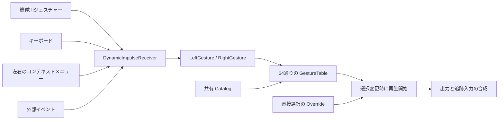

# 表情システムの実装と編集方法

左右それぞれの現在のジェスチャーを 0〜7 の整数で保持し、
`LeftGesture * 8 + RightGesture` で64通りの対応表を引く。
対応表の参照先が変わったときだけアニメーションを切り替える。
VRChat の Animator 条件とレイヤーは変換時に評価し、アバター内には状態機械を生成しない。
標準コンポーネントと ProtoFlux で動作し、利用側に ResoPon の DLL は不要。



## 生成される構成

```text
Expressions/
  Catalog/                         表情ごとの定義と AnimX
  GestureTable/                    64個の Catalog 参照
  Core/                            左右の状態、現在の表情、再生開始時刻
    Logic/                         公開API、対応表の参照、出力、初期化
  Outputs/                         BlendShape ごとのベース入力と最終出力
  Inputs/
    ContextMenu/
    Keyboard/Bindings/             左右8種ずつのショートカット
    HandGestures/Modules/
      Touch|Index|Vive|WindowsMR/   削除できる機種別入力とその Logic
  API/Receivers/Logic/
  API/Examples/                    外部入力用の小さな Command
  API/Templates/                   Catalog に複製する表情テンプレート
  Diagnostics/                     自動設定できなかった理由
```

Core に入力元の一覧・優先順位・有効期限・汎用 Animator パラメーターは持たない。
各手の最後の入力 Command への参照は、削除・切断された入力を解放するためだけに使う。

Flux は1スロット1ノードで、役割別の名前付きグループへ分け、8列のグリッドに配置する。
Resonite の ProtoFlux Tool で `Logic` を Unpack すると保存した位置で表示できる。
共通の定数・読み出しノードは同じグループ内で共用する。

## 入力の動作

ジェスチャー番号は次の対応になる。

| 番号 | 状態 |
|---|---|
| 0 | Neutral |
| 1 | Fist |
| 2 | HandOpen |
| 3 | FingerPoint |
| 4 | Victory |
| 5 | RockNRoll |
| 6 | HandGun |
| 7 | ThumbsUp |

同じ手には最後に届いたイベントを採用し、もう一方の手は変更しない。
キーボードとメニューの指定はラッチする。キーやボタンを離しても戻らず、Neutral を選ぶと0に戻る。
物理入力は安定したジェスチャーが変化したときと接続時にだけ送る。
したがって、手を動かさずにキーボードで設定した状態は維持され、次に物理ジェスチャーが変わると更新される。

- コンテキストメニュー: `Left hand` / `Right hand` に各8項目。
- キーボード: 左手は Ctrl+Alt+1〜8、右手は Ctrl+Alt+Shift+1〜8。数字1が Neutral、8が ThumbsUp。
  `Bindings` の `Key`、`Shift`、`Enabled` を編集できる。
- コントローラー: 不要な `Modules/Touch|Index|Vive|WindowsMR` を削除できる。
  そのモジュールが最後に設定した手だけを0へ戻す。後から別入力が設定した状態は保持する。
  Grip/Trigger の押し込み・解放しきい値と安定待ち時間を機種ごとに編集できる。
  指を個別に取得できない機種の Victory/Rock はボタン操作から判定する。

直接表情を選ぶ `Select expression` は、左右の状態を保持したまま Override する。
`Return to gestures` で現在の左右状態による選択へ戻る。
インポートした ExpressionMenu は、単独のパラメーターで表情を確定できる項目をこの直接選択へ変換する。
元の Button/Toggle の押下期間・パラメーター保存・トグル解除は再現せず、どちらも直接選択としてラッチする。

## 対応表と表情の編集

`GestureTable` の各スロットには `Expr/Pair.N` という DynamicReferenceVariable<Slot> がある。
N は左×8＋右。例えば左1・右2は `Pair.10`。
参照先を `Catalog` の表情スロットへ変更するだけで割り当てを編集できる。
左右の組み合わせごとにアニメーションを複製せず、同じ表情は同じ Catalog エントリーを参照する。

表は変数名で引くので、スロットの並び替え・表示名の変更・別の行の削除で対応がずれることはない。
変数名は固定し、同じ名前を重複させない。削除した行を戻す場合は同じ変数名で再作成する。
行が未設定、参照先が削除・無効化、またはアセットが未ロードなら Outputs のベース入力を使う。
表の参照を編集すると次の更新で反映される。異なる行でも同じ表情を指す場合は再生を継続する。

表情の追加は `API/Templates` または既存の Catalog エントリーを Catalog へ複製し、
`Enabled` を有効にして `Id`、`DisplayName`、`Clip`、`Duration`、`Loop` を設定する。
`FadeIn` / `FadeOut` は切り替え秒数。削除は表情スロットごと行える。
テンプレートから複製したメニューの表示名・有効状態・参照先は複製先に追従する。

AnimX のトラックは Node=`Expression`、Property=出力の `Id` を使う。
既存の出力を使う表情追加では Flux の配線は不要。
新しい BlendShape を操作する場合は Outputs の出力レコードとフィールド接続も必要になる。
`Bindings` は編集時の参照情報であり、AnimX のトラックを自動で書き換えるものではない。

## 外部イベント API v2

アバター装着者のクライアントで `API/Receivers` を対象階層にして発火する。
旧 v1 の SourceState / Sequence / Generation / lease プロトコルは廃止した。
Dynamic Impulse 自体はネットワーク RPC ではない。装着者が最終出力を計算して同期する構成で、
各クライアントが状態だけを受け取って独立再生する方式ではない。

| タグ | 引数 | 動作 |
|---|---|---|
| `ResoPon/Expression/v2/Gesture` | Slot | 指定した手の現在状態を変更 |
| `ResoPon/Expression/v2/Select` | Catalog の Slot | 直接表情を選択 |
| `ResoPon/Expression/v2/Automatic` | なし | Override を解除 |

Gesture の引数は `API/Examples` の Command を複製して使う。
Command は `Expr` の DynamicVariableSpace と次の3項目だけを持つ。

| 変数名 | 型 | 値 |
|---|---|---|
| `Expr/Hand` | int | 0=左、1=右 |
| `Expr/Gesture` | int | 0〜7 |
| `Expr/Available` | bool | 通常 true、切断通知は false |

`DynamicImpulseTriggerWithObject<Slot>` から Command を渡すと、
`DynamicImpulseReceiverWithObject<Slot>` が受け取る。
Command は入力が有効な間保持する。削除・無効化すると、それが最後に設定した手を0へ戻す。
異なる入力元には別の Command を使う。Available=false は同じ Command が最後に設定した手だけを解放する。
範囲外の手・ジェスチャーと装着者以外のクライアントからの実行は無視する。

## 変換時の判定と制限

`GesturePairCompiler` は左右64通りについて、すべての開始状態から遷移をたどる。
元の遷移順序を使い、行き着く状態が一意になる組み合わせだけを割り当てる。
履歴により結果が変わる、または循環する組み合わせは未設定として診断する。

元のレイヤー順と重み、Write Defaults による既定値を使い、選ばれたクリップを変換時に合成する。
同じ結果は再利用する。単一の動画、定数ポーズとの合成、時間・キー配置・補間が一致する動画の合成では
Hermite 曲線を保持する。固定の正の再生速度もキー時刻と接線へ反映する。
ベース値は変換時のアバターの値を用いる。

Exit Time、再生オフセット、左右以外のパラメーター・GestureWeight が必要なレイヤー、
履歴に依存する Write Defaults、解決できない出力は自動割り当ての対象外。
ループや長さが異なる動画の同時合成、合成できないキー配置も診断する。
対応する独立クリップは Catalog に残し、手動で割り当てられる。
パーサー側の制限も継続する。BlendTree、ネスト、AvatarMask、加算レイヤー、StateMachineBehaviour、
遷移中断、Puppet、Sub-Menu の開閉パラメーターは自動再現しない。
材質・物体・Transform のトラック、weighted tangent、イベントを含む Clip も対象外。

実行時は選ばれた表情を1つの時計で再生する。元 Animator の遷移時間、自己遷移による再開始、
レイヤーごとの独立した再生位相は再現しない。表情を切り替えると直前の出力からフェードする。
未ループのアニメーションは終端を保持する。

既存の瞬き・口パク等のドライバーは Outputs の `Base` に接続し直す。
表情にトラックがない出力は Base を使い、ある出力はアニメーション値を使う。
出力ごとの `TrackingWeight`（0〜1）で Base の混合率を調整できる。
複製・再ロード・装着者変更時には左右状態と直接選択を初期化する。
VRM の感情表情も同じ Catalog を使うが、VRChat の条件がないため対応表は未設定から始まる。

## 検証

`dotnet run --project tests/ExpressionSmoke -c Release` で、パーサー、64通りの合成、
履歴依存の除外、実 ProtoFlux の入力・再生・編集・モジュール削除・追跡との接続・
複製とパッケージ再読み込みを検証する。
既知の実アバターは `scripts/test-local-avatar.ps1` で変換と inspect を確認する。
物理コントローラー、デスクトップのキーフォーカス、メニュー操作、複数クライアントの動作確認は
Resonite クライアント上で別途必要。

2026-09-14 の検証では ExpressionSmoke と登録済み LilLeo の変換・inspect が成功した。
比較用の保存パッケージ（同じ3機種の入力を残したもの）の Flux は2,530から892ノードへ減少した。
LilLeo の元の左右レイヤーには従来から未対応の挙動・欠落 BlendShape があり、自動割り当てを省略する。
この実アバターテストは変換の回帰確認であり、その顔表情の完全な取り込みを確認したものではない。
