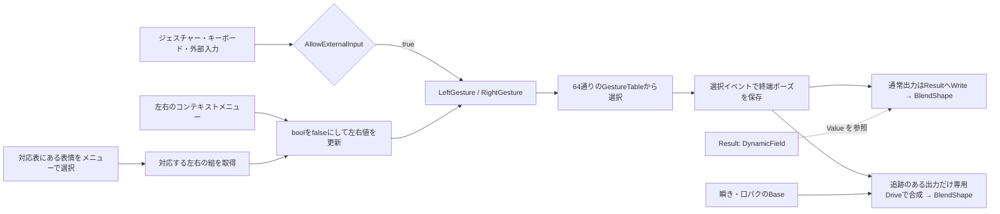

# 表情システムの実装と編集方法

DynamicVariable の型・初期値・更新元・編集用途とグラフ内の定数は、
[変数・定数リファレンス](expression-variables.md)を参照。

左右それぞれの現在のジェスチャーを 0〜7 の整数で保持し、
`LeftGesture * 8 + RightGesture` で64通りの対応表を引く。
対応表で選んだ表情の各トラックの終端値へ即座に切り替え、固定ポーズとして保持する。
VRChat のカスタム FX Animator から、対応する条件とレイヤーを変換時に評価する。
左右64通りへ静的に変換する方式であり、Animator 全体や汎用パラメーターの状態機械は生成しない。
標準コンポーネントと ProtoFlux で動作し、利用側に ResoPon の DLL は不要。

変換済みポーズの格納先である `Catalog` と、選択先を決める `GestureTable` は別である。
対応表に割り当てられない Clip は Catalog に残っていても直接選択メニューでは選べない。
自動割り当てが0/64なら、すべての入力で `CurrentExpression` が null になる。
その場合は `Expressions/Diagnostics` と変換ログのレイヤー・Clip の除外理由を確認する。


```mermaid
flowchart LR
    H[ジェスチャー・キーボード・外部入力] --> G{AllowExternalInput}
    G -->|true| S[LeftGesture / RightGesture]
    M[左右のコンテキストメニュー] --> L[boolをfalseにして左右値を更新]
    D[対応表にある表情をメニューで選択] --> T[対応する左右の組を取得]
    T --> L
    L --> S
    S --> P[64通りのGestureTableから選択]
    P --> R[選択イベントで終端ポーズを保存]
    R --> V[通常出力はResultへWrite → BlendShape]
    R --> Q[追跡のある出力だけ専用Driveで合成 → BlendShape]
    B[瞬き・口パクのBase] --> Q
    Result[Result: DynamicField] -. Value を参照 .-> V
```

## 生成される構成

```text
Expressions/
  Catalog/                         表情ごとの定義と最終値の一覧
  GestureTable/                    64個の Catalog 参照
    Logic/                         メニュー表示に必要な参照・有効状態の変更監視
  Core/                            左右の状態、現在の表情
    Logic/
      Lifecycle/                   初期化、装着状態の変更監視
      Selection/                   対応表からの選択と切り替え
      Playback/                    終端ポーズの取得・通常出力へのWrite
  Outputs/                         BlendShape ごとのベース入力と最終出力
    各 BlendShape/                 出力定義・Base・Result
      Tracking/                    既存の追跡がある出力だけ自動合成するDrive
  Drivers/各 Renderer/            DynamicBlendShapeDriver、必要なシェイプのみ登録
  Inputs/
    ContextMenu/                   対応表にある表情のみメニュー表示
    Keyboard/
      Left|Right/                  各手の共通設定用の変数空間
        DV/                        Tag、Shift、Control、Key.0〜Key.7
        Logic/                     着用・修飾キー・押下成立の変更監視と送信
    HandGestures/Modules/
      Touch|Index|Vive|WindowsMR/   削除できる機種別入力
        Left/Logic/                左手の入力検出・安定化・通知
        Right/Logic/               右手の入力検出・安定化・通知
  API/Receivers/Logic/
    Left/                          左手の int 入力受付
    Right/                         右手の int 入力受付
    MenuLeft/                      メニューから左手を更新し入力を固定
    MenuRight/                     メニューから右手を更新し入力を固定
    Select/                        Catalog IDを対応表の左右値へ変換
    AllowExternalInput/            boolによる通常入力の許可・停止
  API/Examples/                    左右の int イベントを送るボタンの例
  API/Templates/                   Catalog に複製する表情テンプレート
  Diagnostics/                     自動設定できなかった理由
```

Core に入力元の一覧・優先順位・有効期限・汎用 Animator パラメーターは持たない。
入力内容は `ResoPon/Expression/Gesture/Left`／`ResoPon/Expression/Gesture/Right` タグと int 引数で渡す。Core は入力元の Slot 参照を保持しない。
各手は最後に受理した入力値を保持し、コントローラーが切断されても変更しない。更新番号は保持しない。

Flux は1スロット1ノードで、名前付きの節を保持しながらモジュール全体の接続関係で整列する。
データの供給元を左、入力を使うノードを右に置く。Impulse も発火元から呼び出し先へ左から右に配置する。
複数入力はポート順に左側の上から下へ並べ、同じ接続先の入力群の間に別の入力群を挟まない。
入力を使う最初のノードの直前まで列を寄せ、入力側の枝は列ごとの占有範囲を使って詰める。
これにより8キーのような大きな入力群があっても、Tag・送信先などの小さな入力を接続先の近くへ置ける。
ノード固有の幅とポート数から間隔を取り、名前付きの節は階層として保ちつつ配置座標を共有する。
共有入力は最初の接続先を基準に配置する。離れた用途で共有する必要のない定数は独立させる
（キーボードの Match=true と送信の ExcludeDisabled=true）。状態を持つノードは複製しない。
3条件以上をまとめて判定する AND は `AND_Multi_Bool`（AndMulti）1ノードに入力を列挙し、2入力 AND の連結を避ける。
不一致判定は `ValueNotEquals`／`ObjectNotEquals`、null 判定は `IsNull` を使い、Equal と Not や null 定数の組み合わせを避ける。
循環する接続は同じ階層にまとめ、モジュール間には実際の幅に応じた余白を設ける。
ProtoFlux Tool では調べたい `Selection`、`Playback` などのモジュールを個別に Unpack する。
モジュール間では ProtoFlux ノードを直接接続しない。共有値はフィールド経由で参照し、所有者・定数の取得は各モジュール内で完結するため、
1つの入力や再生処理を開くだけで全機種・APIまでつながった巨大なグラフにはならない。

初回起動・装着開始時は `Lifecycle` → `Selection` の順で状態を確定する。
呼び出しには対象モジュールだけを宛先とする同期 Dynamic Impulse を使い、
選択状態をイベント内で確定し、Playback も同期呼び出しして選んだ表情の各トラックの終端値を即時に書き込む。
左右の公開 API は int を受信し、初期化確認 → 片手状態の更新 → Selection → Playback を同期実行する。
同じフレーム内で左右のイベントが連続しても、それぞれの受信時点の両手状態・固定ポーズ・通常出力が確定する。
追跡対象の出力は通常のドライバー更新で反映する。時間補間は行わない。
表の編集・表情の無効化・Bindings参照の変更は、選択結果の変化を監視して反映する。

Version 15 は通常の表情出力を選択イベント内のWriteで更新する。
変換時に各トラックの最後のキー値を Catalog/Bindings の Value に保存する。
Playback は選択時と Bindings 参照の変更時にその値を Outputs の Pose / HasPose へコピーし、
通常出力のResultを一括適用する。LocalUpdate・出力ごとのFireOnLocalChange・出力通知イベントは生成しない。
元から瞬き・口パク等のドライバーがある出力だけTrackingボードを生成し、
保存済みPoseと追跡BaseをValueFieldDriveで合成する。アニメーションの途中値は評価しない。
AnimX・AnimationProvider・AssetLoader・トラック検索・サンプラーも生成しない。
Result は DynamicBlendShapeDriver の Value を参照する DynamicField<float>。
通常出力は装着者だけが値をWriteし、未装着時はホストがBaseを適用する。
追跡対象は各クライアントで同期されたPoseと各自のBaseを合成し、未装着時はBaseを使う。
切り替え補間は行わず、FadeIn / FadeOut / FadeDuration / FadeWeight / Snapshot は生成しない。
連続・ループアニメーションも再生しない。Loop / Duration と Core の再生時計は生成しない。

以前の方式の比較資料は [Animator / Drive への移行設計と検証](expression-playback-drive-design.md) を参照。
これは旧Versionの記録であり、現行の適用方式は本資料の Version 15 に従う。

## 変更監視と実行タイミング

| 処理 | 実行するきっかけ |
|---|---|
| Lifecycle | OnStart とローカル装着状態の変化 |
| Selection | API の同期呼び出し、左右から求めた PairIndex または検証済み表情参照の変化 |
| メニュー表示 | 装着開始、Catalog の項目数、対応表の有効な参照先の変化 |
| キーボード | 左右それぞれの8キーの条件が変化したとき。新しく成立した割当だけ送信 |
| 機種別入力 | 入力受付状態・判定した手形・Grip/Trigger 押下状態・安定待ち成立状態の変化 |
| Playback | 選択イベント内で保存済みValueを即時適用。選択参照・Bindings参照・書き込み権限の変化でも更新。通常出力へ一括Write |
| Outputs | 通常出力にはFluxなし。既存の追跡がある出力だけTrackingのDriveで継続合成。変更監視・通知は置かない |

入力・選択・装着状態の変更監視には FireOnChange 系の `FireOnLocalValueChange<T>`／`FireOnLocalObjectChange<T>` を使う。
比較用の前回値はローカルな実行状態で、DynamicVariable や同期・保存対象の変数には追加しない。
初期値の設定だけでは発火しないため、初回に必要な処理には `OnStart` も使う。
装着者の確認は各処理の入口に残す。

この変更で、無変化時の Impulse 実行・変数への書き込み・メニュー全走査を減らす。
物理入力・時刻・実行時の Source を読む DynamicVariable など、連続変化扱いの入力は検出のための評価が残る。
毎フレームの評価をすべてなくすものではない。監視を独立させるため、グラフのノード数は増える。
対応表の監視は `GestureTable/Logic` に置き、行を削除しても同じキーの再作成を検出できる。

## 入力・列挙ノード

固定参照のうち、読み取り元 Slot とノード自身から同じ名前付き空間へ到達できるものは
`DynamicVariableValueInput<T>`／`DynamicVariableObjectInput<T>` で読む。
間に別名の空間があっても、要求した空間名で祖先を検索する。

- 各手の Candidate・Stable・Since・GripHeld・TriggerHeld：`ExpressionGestureHand`。
- 機種ごとの Grip/Trigger しきい値・StabilitySeconds：親モジュールの `ExpressionGestureSettings`。
- Selection の左右値：`ExpressionCore`。
- Selection の CurrentExpression：`ExpressionCore` の Object Input。
- 各 Output の Id・Base・TrackingWeight・Result：`ExpressionOutput`。

Core の入力ノード化は現行の名前付き空間で再検証し、同一フレームの入力、複製、再装着、
保存再読み込み後の選択・再生を確認した。機種別設定の編集も、両手の入力プロキシが該当する
モジュールの値へ追従し、別機種・複製元と混ざらないことを確認する。
置換により接続先がなくなった固定 Slot 参照ノードは、配線完了後に除去する。

次の読み取りは `ReadDynamicValueVariable<T>`／`ReadDynamicObjectVariable<T>` を維持する。

- API・機種別入力・各 Output からの Core 参照：Core は兄弟階層にあり、入力ノード自身の祖先にはない。
- 切り替え・初期化時の ForEach の出力レコード、選択中の Catalog：実行中に Source Slot が変わる。
- `ExpressionGestureTable/Pair.N`：左右値や走査番号で読み取る変数名が変わる。

入力ノードには Source Slot を渡せないため、これらはそのまま入力ノードに置き換えない。

子 Slot の処理は `Children` → `ForEachObject<IReadOnlyList<Slot>, Slot>`（表示名 ForEach）で列挙する。
すべてのループ本体は列挙中に子 Slot の追加・削除・並べ替えを行わず、元の直下の子の順序を保つ。
装着者は同じアバター配下の各ボードにある `GetActiveUserSelf` で取得する。
各ボードは独立した FluxGroup を維持する。対応表の逆引きとメニュー表示判定には、安定した Pair.0〜63 を数値で走査する For を使い、GetChild は使わない。

## 不具合の調べ方

まず Core の変数を見て、入力・選択・再生のどこで期待とずれたかを分ける。
Inspector 上の Core の変数名には `ExpressionCore/` が付く。他のレコードも定義別の空間名を使う。

| Core の変数 | 確認する内容 |
|---|---|
| `LeftGesture` / `RightGesture` | 各入力から届いた0〜7の状態 |
| `PairIndex` | 左×8＋右で求めた対応表の番号 |
| AllowExternalInput | true=通常入力も許可、false=コンテキストメニューのみ（編集可能） |
| `CurrentExpression` | Selection の検証を通過した再生対象。無効・未割当なら null |

1. 左右の番号が違う場合は、`API/Receivers/Logic/Left`／`Right` と該当入力の `Logic` を調べる。
2. 番号が正しく表情が違う場合は、`PairIndex` に対応する `GestureTable` の参照と `AllowExternalInput` を確認し、`Selection` を調べる。
3. `CurrentExpression` が null の場合は、`GestureTable/Pair.N`（N は PairIndex）の参照があるか確認する。参照がある場合は、参照先の Slot の有効状態、`Enabled`、`Bindings` の有効な参照を確認する。
4. 選択が正しく見た目が違う場合は、`Core/Logic/Playback` と該当出力の `Base`、`TrackingWeight`、`Result`、`Target` を調べる。

`AllowExternalInput` は入力モードの設定。それ以外の状態は読み取り用の診断情報として扱い、再生結果を変えたい場合は公開 API、対応表、Catalog を編集する。
変換時の警告は引き続き `Diagnostics` に残る。
`Diagnostics/Graph modules` の各レコードには `ExpressionGraphModule/Path` と `ExpressionGraphModule/NodeCount` があり、モジュールの場所と規模を確認できる。
Outputs の `Pose` は取得した終端値、`HasPose` は対応するトラックがあるかを示す。再生時計は持たない。
反映が止まっている場合は、アバターの装着状態、該当モジュールの有効状態と `Outputs/Result`・`Target` を確認する。


resoloop を使う場合は、リポジトリ直下から次の読み取り専用スクリプトで Core の状態を一覧にできる。
`-CoreSlot` には対象の正確なパスまたは現在のスロット ID、
`-Url` には ResoniteLink に表示される現在のポートを指定する。

```powershell
powershell -NoProfile -ExecutionPolicy Bypass -File scripts/inspect-expression.ps1 -CoreSlot "Root/Plum/Expressions/Core" -Url "ws://localhost:42038"
```

`-Json` を付けると CoreSlot と Values を持つ JSON を返す。SelectionStatus に基づく Selection 要約は出力しない。
URL を省略した場合は resoloop の環境変数・プロジェクト設定を使う。
参照値は現在の ResoniteLink 接続での ID として表示するため、保存後の固定 ID として使わない。
診断スクリプトは旧 `Expr/` と現行 `ExpressionCore/` の両方を読み取れる。新しい空間名・診断項目の反映には再変換・再インポートが必要。


## Selection と再生対象

Core に保存する表情参照は `CurrentExpression` だけ。`MappedExpression` と `CandidateExpression` は生成しない。
Selection は `GestureTable/Pair.N` を読み、Slot 有効・Enabled=true・Bindings参照先が有効を確認する。
通過した参照（無効なら null）をその更新中のローカル値として確定し、CurrentExpression と比較する。
異なる場合は CurrentExpression を設定する。Playback を同期呼び出しし、終端値を即時にWriteする。
同じ参照なら同じ固定ポーズになる。解除・無効化も補間せず Base へ戻す。
未検証の対応表の参照を調べたい場合は、PairIndex に対応する行を直接見る。
SelectionStatus は生成・計算しない。入力モードは AllowExternalInput、再生対象は CurrentExpression で確認する。
未割当と無効・未ロードはどちらも CurrentExpression=null となり、理由は対応表と参照先を調べる。

## 装着状態と Lifecycle

Selection・Lifecycle・API と機種別入力は PreviousOwner を持たず、「現在の装着者がローカルユーザーか」で更新を制御する。
装着者が存在するかだけでは閲覧者も実行してしまうため、ローカルユーザーとの一致判定は残す。
Lifecycle 内の保存されない `StoredValue<bool>` が初期化済みかを記録する。

- 装着開始・初回起動：必要なら初期化し、Selection とメニュー表示更新を同期実行する。
- 取り外し：初期化済みのクライアントが一度だけ入力・選択状態をクリアし、出力を Base に戻す。初期化済みフラグを解除する。
- 未装着中：選択更新は停止する。通常出力は初期化・権限取得時にホストがBaseをWriteし、追跡対象は専用DriveがBaseに追従する。閲覧者は共有の選択状態を書き換えない。
- 再装着・複製・読み込み：初回に左右値を 0、入力許可を true に戻して再開する。API が先に届いた場合も同じ初期化を行う。

取り外し時に別の装着者が既にいる場合は、終了側は共有値をクリアせずローカルフラグだけを解除する。
装着者の履歴は比較せず、ローカル装着状態の変化を FireOnLocalValueChange で検出する。
変更イベントが処理される前に外して同じユーザーへ戻し、判定結果が変わらなかった場合は連続した装着として扱う。
未装着中の追跡値変化も継続転送せず、終了時の出力を保持する。
既存パッケージへ反映するには再変換・再インポートが必要。

## 入力の動作

ジェスチャー番号は次の対応になる。
各左右メニュー項目は 0〜7 の int を固定値として持ち、`ResoPon/Expression/Menu/Left` または `ResoPon/Expression/Menu/Right` Tag に送る。受信側は bool を false にして該当の手を更新する。
キーボードとコントローラーは Gesture/Left・Gesture/Right の int API を使い、bool が true のときだけ受け付ける。文字列への変換は行わない。
動作確認では `Core/LeftGesture`、`RightGesture`、`CurrentExpression` と対応表の参照先を見る。

| 番号 | 状態 |
|---|---|
| 0 | Neutral |
| 1 | Fist |
| 2 | HandOpen |
| 3 | FingerPoint |
| 4 | Victory |
| 5 | RockNRoll |
| 6 | HandGun |
| 7 | ThumbsUp |

同じ手には最後に受理したイベントを採用し、もう一方の手は変更しない。bool が false の間は、通常入力を受理せず、左右値を維持する。
キーボードとメニューの指定はラッチする。キーやボタンを離しても戻らず、Neutral を選ぶと0に戻る。
物理入力は安定したジェスチャーが変化したときと接続時にだけ送る。
通常入力が許可されている間は、手を動かさずにキーボードで設定した状態を維持し、次の物理ジェスチャー変更で更新する。メニュー専用モードでは機種別の判定状態をリセットし、許可を戻した後は再び安定した手形を検出して送る。

- コンテキストメニュー: `Left hand` / `Right hand` に各8項目。
- キーボード: 左手は Shift+テンキー0〜7（Ctrl なし）、右手は Ctrl+Shift+テンキー0〜7。テンキー0が Neutral、1が Fist、以降は順に7の ThumbsUp まで。
  `Left/DV` と `Right/DV` の `Key.0`〜`Key.7`、共通の `Shift`・`Control`、送信先の `Tag` を編集できる。
  各手は `ExpressionSystem.Input.Keyboard` 空間を持ち、Enabled とキーごとの Gesture は作らない。
  Flux は `Keyboard/Left/Logic` と `Right/Logic` の2つに生成する。
  `modular_avatar/AvatarWornLocal`、修飾キーの一致、8キーのいずれかの押下を AND でまとめ、
  1つの FireOnLocalValueChange<bool> で監視する。条件成立時は最小番号のキーの添字を一度送る。
  条件が成立したまま他のキーを追加・解放しても再送しない。全キーを離すなどして条件を false に戻すと再度送信できる。
  Control・Shift は左右どちらの物理キーでもよい。各手の設定は独立して変更できる。
- コントローラー: 不要な `Modules/Touch|Index|Vive|WindowsMR` を削除できる。
  機器の切断・非アクティブ化では判定状態だけをリセットし、Neutral は送らない。
  最後に受理した左右値を保持し、再接続後に安定した手形を検出すると、その手の値を更新する。
  モジュール自体の削除・無効化でも手の状態は残る。解除したい場合は Neutral を明示的に送る。
  Grip/Trigger の押し込み・解放しきい値と安定待ち時間を機種ごとに編集できる。
  指を個別に取得できない機種の Victory/Rock はボタン操作から判定する。

直接表情を選ぶ `Select expression` と Imported menu は、対応表に存在する有効な表情だけを表示する。
選択すると、現在の対応表を逆引きして該当する左右値を両方更新し、`ExpressionCore/AllowExternalInput=false` にする。
同じ表情に複数の組がある場合は `PairIndex` が最小の組を使う。
Catalog の Slot を固定用に保持する Override 変数は生成しない。

`Allow gestures and keyboard` は bool を true に、`Menu only` は false にする。
モードだけの変更では左右値を変えない。初期値は true。
メニューから表情を選ぶと再び false になるため、通常入力へ戻すには許可をオンにする。
コンテキストメニューの左右項目・直接選択は bool が false でも使える。
元の ExpressionMenu の Button/Toggle は、このメニュー専用選択へ変換する。

### コントローラーのハンドサイン判定

`Inputs/HandGestures/Modules/<機種>/Left|Right/Logic` は全機種共通で次の順に読む。

1. `Shared inputs`: 機種別 Controller と、Grip・Trigger の押下／解放判定。Vive・WindowsMR の Grip は bool を直接使用する。
2. `<機種> input bits`: Touch・Index は親指の3つの接触を1つの `OR_Multi_Bool` にまとめ、Vive・WindowsMR は TouchpadTouch を使う。
   名前付き Relay の `Bit0=GripHeld`、`Bit1=TriggerHeld`、`Bit2=親指接触` を `ComposeBits_byte` へ接続する。
3. `<機種> gesture table`: ビット値を添字にして `ValueMultiplex<int>` の8行から指の形を選ぶ。
4. `<機種> button priority`: `IndexOfFirstValueMatch<bool>` で下表の優先1、優先2、常時 true の順に判定し、
   `ValueMultiplex<int>` の RockNRoll、Victory、指の形から選ぶ。
5. `Stability and dispatch`: 従来どおり安定待ちと入力制限を適用し、変化した手の値だけを送信する。

| 添字 | Thumb / Trigger / Grip | ボタンを押していない場合の結果 |
|---|---|---|
| 0 | 000 | HandOpen (2) |
| 1 | 001 | HandGun (6) |
| 2 | 010 | HandOpen (2) |
| 3 | 011 | ThumbsUp (7) |
| 4 | 100 | HandOpen (2) |
| 5 | 101 | FingerPoint (3) |
| 6 | 110 | HandOpen (2) |
| 7 | 111 | Fist (1) |

機種ごとの入力と優先順位は次のとおり。どちらにも一致しない場合に指形状表を使う。

| 機種 | Grip | 親指接触 | 優先1: RockNRoll (5) | 優先2: Victory (4) |
|---|---|---|---|---|
| Touch | float・ヒステリシス | JoystickTouch / ButtonXA_Touch / ButtonYB_Touch の OR | B/Y 押下 | A/X 押下 |
| Index | float・ヒステリシス | JoystickTouch / ButtonA_Touch / ButtonB_Touch の OR | B 押下 | A 押下 |
| Vive | bool | TouchpadTouch | TouchpadClick かつ Grip | TouchpadClick かつ Grip なし |
| WindowsMR | bool | TouchpadTouch | TouchpadClick かつ Grip | TouchpadClick かつ Grip なし |

Touch・Index で両ボタンを押した場合は RockNRoll。Trigger は全機種で float のヒステリシス判定を使う。
`ExpressionGestureInputSetup.cs` の共通処理で、全機種の指形状表とボタン優先表を生成する。
入力は接続先の左隣に上からポート順で配置し、8行の定数を共有しないことで対応する入力行の近くに置く。
入力 Relay と定数の Slot 名に、ビットの意味・ビット値・ジェスチャー名を付ける。
判定条件と既定のしきい値（押下0.55／解放0.45）、安定待ち0.05秒は変更していない。
公開変数と保存形式も同じため、Version は10を維持する。

参考にした実物は `AvatarAddonSystem/AddonTarget.System/AddonTarget.Space/<color=red>ModuleTree</color>/<color=red>AddonList</color>/ハンドサイン表情 (改行) Touch V1.4.3`。
2026-09-21 に ResoLoop の読み取りで確認した。参照実装は B/Y接触・A/X接触・GripClick・JoystickTouch・TriggerClick を
下位5ビットにまとめ、各 Driver の ValueEqualityDriver<byte> で照合する。StandardController は Strength の取得に使う。
このビット化と照合を分ける構成を参考にしたが、ユーザー指定により ResoPon の既存の判定条件を維持している。
参照実装の生のビット値・Click 判定・接触だけでの Victory 判定は移植していない。

## 対応表と表情の編集

`GestureTable` の各スロットには `ExpressionGestureTable/Pair.N` という DynamicReferenceVariable<Slot> がある。
N は左×8＋右。例えば左1・右2は `Pair.10`。
参照先を `Catalog` の表情スロットへ変更するだけで割り当てを編集できる。
左右の組み合わせごとにアニメーションを複製せず、同じ表情は同じ Catalog エントリーを参照する。

表は変数名で引くので、スロットの並び替え・表示名の変更・別の行の削除で対応がずれることはない。
変数名は固定し、同じ名前を重複させない。削除した行を戻す場合は同じ変数名で再作成する。
行が未設定、参照先が削除・無効化、またはBindings参照先が無効なら Outputs のベース入力を使う。
表の参照を編集すると次の更新で反映される。異なる行でも同じ表情を指す場合は同じ固定値を適用する。

表情の追加は `API/Templates` または既存の Catalog エントリーを Catalog へ複製し、
`Enabled` を有効にして `Id`、`DisplayName`、`Bindings` を設定する。Bindings はその表情の値一覧への Slot 参照。
`Id` は空でない一意の文字列にする。外部からの直接選択にはこの ID を使う。
直接選択メニューに表示するには、GestureTable の少なくとも1組へ参照を割り当てる。対応表の編集はメニュー表示にも次の更新で反映する。切り替えは即時に反映する。削除は表情スロットごと行える。
テンプレートから複製したメニューの表示名・有効状態・送信する ID は複製先の変数に追従する。

Bindings の子には ExpressionBinding 空間を置き、Output に対応する Outputs レコード、
Value に固定値を設定する。変換時は元カーブの最後のキー値を保存する。
新しいシェイプを追加する場合は、対応する Outputs とメッシュへの接続も用意する。
Value・子レコードを編集した後は、表情を再選択して適用する。
Bindings の参照自体を変更した場合は、その変更を監視して適用する。

## 外部イベント API（Version 15、Tag・引数は Version 4 と共通）

アバター装着者のクライアントで `Expressions/API/Receivers` を対象階層にして発火する。
左右の通常入力・メニュー入力は `DynamicImpulseReceiverWithValue<int>` で受ける。

| Tag | 引数 | 動作 |
|---|---|---|
| `ResoPon/Expression/Gesture/Left` | int 0〜7 | bool が true のとき左手を更新 |
| `ResoPon/Expression/Gesture/Right` | int 0〜7 | bool が true のとき右手を更新 |
| `ResoPon/Expression/Menu/Left` | int 0〜7 | bool を false にして左手を更新 |
| `ResoPon/Expression/Menu/Right` | int 0〜7 | bool を false にして右手を更新 |
| `ResoPon/Expression/Menu/Select` | string: Catalog の `ExpressionClip/Id` | 対応表を逆引きし、bool を false にして両手を更新 |
| `ResoPon/Expression/AllowExternalInput` | bool | 通常入力を許可するか設定。左右値は維持 |

0=Neutral、1=Fist、2=HandOpen、3=FingerPoint、4=Victory、5=RockNRoll、6=HandGun、7=ThumbsUp。
Tag は大文字・小文字を含めて完全一致。範囲外の int、引数型違い、無効・未割当の ID は入力状態を変更しない。
固定したいときは Menu 側の Tag を使い、手入力など固定しない送信元は Gesture 側を使う。
メニューの送信にも専用の Tag を使うため、通常入力を無効にしてもメニューは操作できる。

左右メニューは bool と片手の値、直接選択メニューは bool と両手の値を同じ Impulse 内で更新する。
その後、通常と同じ `Selection` を同期実行し、Playback が固定ポーズと通常出力を同期更新する。追跡対象は通常のドライバー更新で反映する。
bool を false にしただけでは左右値は変えず、表情は対応表から引き続き決定する。
初期化は入力許可の判定より前に行い、複製・再ロード・再装着時には bool=true、左右=0 に戻す。
Dynamic Impulse はネットワーク RPC ではなく、装着者以外のクライアントからの実行は無視する。

旧 `ResoPon/Expression/v3/Select` と `v3/Automatic` は生成しない。
旧 Select 送信側は Menu/Select へ変更し、通常入力を再開する操作は AllowExternalInput に true を送る。

## 変換時の判定と制限

`GesturePairCompiler` は左右64通りについて、すべての開始状態から遷移をたどる。
元の遷移順序を使い、行き着く状態が一意になる組み合わせだけを割り当てる。
履歴により結果が変わる、または循環する組み合わせは未設定として診断する。

元のレイヤー順と重み、Write Defaults による既定値を使い、選ばれたクリップを変換時に合成する。
同じ結果は再利用する。単一の動画、定数ポーズとの合成、時間・キー配置・補間が一致する動画の合成では
Hermite 曲線を保持する。固定の正の再生速度もキー時刻と接線へ反映する。
ベース値は変換時のアバターの値を用いる。
上位レイヤーの空 Motion や、その状態でアニメーションされない出力は下位レイヤーの値を引き継ぐ。
右手が Neutral のときに、左手の表情を既定値で上書きしない。

ハンドサイン選択に追加条件がある場合は、宣言された int/bool/float パラメーターの初期値へ固定して
デフォルトモードの対応表を生成する。メニューへの掲載は条件にしない。
コントローラーの初期値を読み、VRC Expression Parameters の指定を優先する。例えば Plum の
`FacialSet=0`、NoraMiaree の `Face_Emote=1` / `Face_Negative=0` がそのまま選ばれる。
使用した固定値は Diagnostics と変換ログへ記録し、実行時の表情セット切り替えは生成しない。
未宣言、非有限値、Trigger の初期値は推測しない。ハンドサインを参照しない衣装などのレイヤーを
この規則だけでハンドサインへ追加することもない。
`GestureLeftWeight` / `GestureRightWeight` が Motion Time に使われる場合は、
8種類の離散入力向けに最大値1の位置を固定ポーズとして取り込む。握り込みの連続変化は再現しない。
元クリップに対応する固定ポーズは Catalog に残す。対応表へ割り当てた表情だけをメニューから選択できる。

Exit Time、再生オフセット、上記の固定化で扱えないパラメーター・GestureWeight 条件が必要なレイヤー、
履歴に依存する Write Defaults、解決できない出力は自動割り当ての対象外。
ループや長さが異なる動画の同時合成、合成できないキー配置も診断する。
対応する独立クリップは Catalog に残し、手動で割り当てられる。
パーサー側では BlendTree、ネスト、加算レイヤー、Puppet、Sub-Menu の開閉パラメーターを自動再現しない。
AvatarMask、StateMachineBehaviour、Exit や遷移中断も一般には対象外だが、空の振り分けステートと
完全な顔ポーズ、または平坦な Entry/Exit 選択器は、経路を検証できる場合に限り対応表へ投影する。
後者では Transform を含まないマスクと既知の眼・口 Tracking Control、選択条件を書き換えない
既知の Parameter Driver を許容する。AFK は false へ固定し、履歴保持や Behaviour の副作用、
追跡切り替え、元の遷移時間は再現しない。詳細と検証条件は後述の回帰事例を参照。
材質・物体・Transform のトラックやイベントを含む Clip は対象外。
重み付き接線は検証して、正規化したシェイプ値の誤差1e-5以内の折れ線へ変換する。
表現できないカーブや、解決できない出力を含む Clip は全体を除外するため、
その Clip を参照するレイヤーも自動割り当てから外れる場合がある。

実行時は各トラックの最後のキーを固定ポーズとして使う。元 Animator の遷移時間、
自己遷移による再開始、連続再生、ループ、再生位相は再現しない。
最後に開始姿勢へ戻るループ素材は、その戻った姿勢を採用する。途中の最大値や任意フレームは推測しない。
変換後は出力先と最終値だけを保存する。元カーブ・キー列・接線・AnimXは含めない。

Playback は選択イベント・表情参照または Bindings 参照の変化時に、全出力の HasPose をfalseにし、
Bindings の各 Output へ Value をコピーして HasPose=true にする。記録の順序には依存せず、欠落時はBaseを使う。
続いて通常出力を合成し、Resultと違う場合だけ書き込む。追跡用Driveの対象にはWriteしない。
無変化時の全出力巡回も出力ごとの変更監視もない。通常出力のBase・TrackingWeight・BlinkMode編集は再選択で適用する。
Bindings/Valueの編集も再選択で適用する。表情選択・初期化・権限取得で固定ポーズと通常出力を更新する。
装着者または未装着時のホストだけが共有Writerを実行する。追跡用Driveは全クライアントでローカル評価する。
未装着時は、保存・複製で選択状態が残っていてもResultはBaseとなる。

既存の瞬き・口パク等のドライバーは Outputs の `Base` に接続し直す。
表情にトラックがない出力は Base を使い、ある出力は選択時に保存した固定値を使う。
出力ごとの `TrackingWeight`（0〜1）で Base の混合率を調整できる。
瞬きは `BlinkMode` で別に合成する。0は通常の混合、1は表情値と Base の最大値、2は最小値を採用する。
生成時に既存の `EyeLinearDriver.Eyes[].OpenCloseTarget` を検出した出力だけ、閉じる方向に合わせて1または2に初期化する。
開いている表情でも瞬きが通り、閉じている表情は瞬きが終わっても開かない。切り替え時も瞬きの振幅を減らさない。
口パク・視線などの他のドライバーにはこの合成を自動適用しない。
既存のTrackingボードがある出力で瞬きの接続を変更する場合は、OpenCloseTarget を該当 `Outputs/シェイプキー` の `Base` の Value フィールドへ接続し、
`BlinkMode=1`（大きいほど閉じる通常の設定）にする。小さいほど閉じる設定では2にする。`TrackingWeight` は0のままでよい。
Trackingのない出力に後から追跡を加える場合は、追跡元を設定して表情システムを再生成する必要がある。Baseへの接続だけでは自動追従しない。
元の BlendShape フィールドは DynamicBlendShapeDriver が Drive するため、OpenCloseTarget を直接重ねて接続しない。
既存パッケージをこの方式にするには再変換が必要。瞬き binding がないアバターは、再変換だけで Eyes の接続先が増えるわけではない。
複製・再ロード・再装着時には左右状態を0に、AllowExternalInput を true に初期化する。
VRM の感情表情も同じ Catalog を使うが、VRChat の条件がないため対応表は未設定から始まる。

DynamicBlendShapeDriver は Expressions/Drivers 以下に SkinnedMeshRenderer ごとに1つ生成し、
表情で使用するシェイプだけを登録する。同名 renderer は名前ではなく Component の同一性で区別する。
Output と Drivers の同名 Slot には連番を付け、診断パスの重複も避ける。binding の Id・Path・Shape は変更しない。
VRM の binding は数値インデックスの場合があるため、登録名は解決済みメッシュフィールドから実メッシュ名を取得する。
各 Output の Result は対応する BlendShapes[].Value への DynamicField で、値を二重に保存・コピーしない。
Playback は通常出力の ExpressionOutput/Result を読み、値が変わる場合だけWriteする。追跡対象のResultはTrackingのDriveが駆動する。

## 検証

`dotnet run --project tests/ExpressionSmoke -c Release` で、パーサー、64通りの合成、
履歴依存の除外、実 ProtoFlux の入力・再生・編集・モジュール削除・追跡との接続・
複製とパッケージ再読み込みを検証する。
既知の実アバターは `scripts/test-local-avatar.ps1` で変換と inspect を確認する。
物理コントローラー、デスクトップのキーフォーカス、メニュー操作、複数クライアントの動作確認は
Resonite クライアント上で別途必要。

2026-09-14 の検証では ExpressionSmoke と登録済み LilLeo の変換・inspect が成功した。
比較用の保存パッケージ（同じ3機種の入力を残したもの）の Flux は2,530から892ノードへ減少した。
LilLeo の元の左右レイヤーには従来から未対応の挙動・欠落 BlendShape があり、自動割り当てを省略する。
この実アバターテストは変換の回帰確認であり、その顔表情の完全な取り込みを確認したものではない。

2026-09-15: Plum v1.0.1 で左右の表情レイヤーが Motion Time と表情セット条件のために除外される問題を修正した。
保存パッケージを実エンジンへ読み込み、メニューの ButtonDynamicImpulseTrigger を Command 未変更のまま呼び出し、
左右64通り・102出力を検査して8種類の表情を確認した。
空／別プロパティだけを持つ上位レイヤーが下位の値を保持する挙動は、Unity 2022.3.22f1 の
SkinnedMeshRenderer と2レイヤーの Animator を使った再現でも確認した。

2026-09-15 のモジュール分割では、既存 Plum パッケージの1グループ・1,098ノードに対し、
再変換後は15グループ・合計1,174ノード、最大グループ106ノードとなった。
所有者や時刻の取得をモジュールごとに持たせるため総数は増えるが、API・Core・機種別左右の間で
FluxGroupを共有しない。Core は Lifecycle 59、Selection 101、Playback 60ノード。
この構造上の境界は、見出しや座標だけでなく実際の FluxGroup で検査している。

Plum の旧・新パッケージで29クリップの全 AnimX 内容、Catalog設定、出力binding・基準値・追跡混合率、
64通りの割り当てを比較し、一致を確認した。保存パッケージのメニューボタンを実際に発火する試験でも、
64通り・102出力・8種類の表情が成功した。
ExpressionSmoke はフェード、診断値のローカル駆動、入力拒否、所有者の離脱・再装着、
複製と保存再読み込みも検査する。PrefabInputSmoke、PrefabSceneSmoke、Plum の変換・inspect も成功した。

2026-09-15 の旧 API v3 の文字列化では、16種類の完全一致・不正文字列／引数型の拒否・同一更新内の左右イベント、
初回装着時の同期初期化、同じジェスチャーの再送、切断時の更新番号、複製・保存再読み込みを検査する。
左から右への配置は実ノードのデータ入力・参照入力・Impulse 出力から接続をたどって検査し、
循環成分以外の接続が逆向きなら失敗する。今回の生成グラフに循環成分はない。
Plum は15グループ・合計1,444ノード、最大グループ130ノード。
API/Gesture は104、Core は Lifecycle 65、Selection 86、Playback 60ノード。
全1,939データ／参照接続と324 Impulse 接続の方向を検査した。
今回の変更は変換器の生成処理へ適用される。既存ワールド内の変換済みアバターへ反映するには、
新しい ResoPon で再変換したパッケージを再インポートする。

2026-09-19: 左右入力を `ResoPon/Expression/Gesture/Left`／`ResoPon/Expression/Gesture/Right` の `DynamicImpulseReceiverWithValue<int>` に変更。
メニュー・キーボード・機種別入力は 0〜7 を直接送り、文字列化とデコードを除去した。
ExpressionSmoke で各手の全8値、範囲外（int.MinValue、-1、8、255、int.MaxValue）、
型違い・旧 Tag の拒否、同一更新内の左右入力、複製と保存再読み込みが成功した。
Plum の再変換・inspect、および保存済みメニューボタンによる64通り・102出力・8種類の表情の検証も成功。
旧パッケージと Catalog、全 AnimX 曲線、出力binding、64通りの表情割り当てが一致した。
Plum の Flux は1,444から1,235ノードへ減少。左右 Receiver は各31ノード、16グループ、最大109ノード。
接続中ワールドの Plum は旧 string 構成として読み取り確認し、ワールド内の置き換えは行っていない。

2026-09-19 の入力・列挙ノード整理後、Plum の DynamicVariableValueInput は44、
DynamicVariableObjectInput は8、Children／ForEach は各6、GetActiveUserSelf は16。
For、GetChild、GetActiveUser は生成グラフからなくなり、総ノード数は1,235から1,213へ減少した。
ReadDynamicValueVariable は63、ReadDynamicObjectVariable は12を残す。
ExpressionSmoke の複製・所有者変更・保存再読み込み、および再変換した Plum の
旧版との表情データ比較と64通り・102出力・8表情の実行検証が成功した。

2026-09-19 の入力モード変更では、固定用の Override を廃止し、Core の `Expr/AllowExternalInput` と通常の左右値へ統一した。
ExpressionSmoke でメニュー専用時の通常入力・更新番号の保護、再許可、対応表に応じたメニュー表示、複製・再装着・保存再読み込みを確認した。
Plum の再変換・inspect と旧版との全表情データ比較が成功し、保存済みメニューボタンによる64通り・102出力・8表情に加え、
対応表にある8個の直接選択ボタンと入力許可・停止の両ボタンを実行検証した。
生成グラフは1,377ノード・19グループ、最大111ノードで、ボードをまたぐグループは0。
For は安定した Pair.0～63 の逆引き・メニュー表示判定に使う数値ループ2個だけで、GetChild は0。

2026-09-20: Version 5 では共通の Expr 空間を廃止し、変数定義ごとに11種類の名前を付けた。
空間名と変数パス、ProtoFlux の参照、テンプレート、診断スクリプトを更新した。公開イベント Tag・引数は変更していない。
ExpressionSmoke で生成時・保存再読み込み後の全レコードの空間名と変数接頭辞、旧 Expr 書き込みの拒否を確認した。
Plum の再変換・inspect、新旧パッケージの Catalog・AnimX・出力定義・64通りの割り当て比較が成功し、
保存済みメニューによる64通り・102出力・8表情、直接選択と入力モードの動作も確認した。
診断スクリプトは新 ExpressionCore と旧 Expr の模擬応答で読み取りを検証した。

2026-09-20: 空間名を指定して祖先を検索するよう入力ノードの適用条件を拡張し、機種別設定と
Core の固定読み取りを DynamicVariableValueInput／DynamicVariableObjectInput に置換した。
Core の一律除外を廃止し、配線先のなくなった固定 Slot 参照も除去した。
テスト用アバターで ReadDynamicValueVariable は78→41、ReadDynamicObjectVariable は10→8、
DynamicVariableValueInput は44→81、DynamicVariableObjectInput は0→2。
総ノードは1,332→1,284、19グループを維持し、最大グループは106→100、ボードをまたぐグループは0。
ExpressionSmoke で機種別設定の編集、Core 参照の結合、同一フレームの左右入力、
複製・再装着・保存再読み込み後の再生を確認した。Plum の再変換・inspect、旧版との全表情データ比較、
保存済みメニューの64通り・102出力・8表情、直接選択と入力モードの実行検証も成功した。

2026-09-21: ResoLoop で Plum の左手キーボード Flux を読み取り、Version 6 に反映した。
左右別の DV 設定、AvatarWornLocal、共通修飾キー、最初の一致キーを送る bool 変更検出へ移行。
同時押し・押下中のキー追加の動作も実ワールドの配線に合わせ、右手へ同じ生成処理を適用する。

2026-09-21: Version 7 は各 Output にサンプリング・混合・フェードの Logic を配置し、Result を ValueFieldDrive で駆動する。
Playback の LocalUpdate、再生用内部 Impulse、Lifecycle の Result 直接書き込みを削除した。
ExpressionSmoke で短いクリップのフェード、途中切り替え、欠落・並べ替えトラック、ループ周期編集、追跡入力、複製・保存再読込を検証した。
Plum v1.0.1 は102出力・左右64通りを再生確認し、旧パッケージと Catalog・全 AnimX カーブ・出力接続・対応表が一致した。

2026-09-21: Version 8 は AnimationTime と FadeWeight を Playback で一度計算し、各 Output から ValueSource で参照する。
ValueSource はフィールド変更を伝播するが、独立した FluxGroup の評価順を保証しない。
切替直後に新しい表情へ古いフェード率が適用される回帰を再現したため、計算対象の開始時刻・表情参照を照合し、更新待ちは Snapshot を維持する。
ExpressionSmoke は共有ドライバーの入力差し替え、切替の最初の更新、ループ周期編集、短い Clip のフェード、複製・保存再読込を検証する。
Plum の再変換・inspect、左右64通り・102出力・8表情の再生、v7 パッケージとの全 AnimX・Catalog・出力接続・対応表の比較も成功した。
Plum の総ノード数は5,973から5,167へ減り、130ボード・最大95ノードとボード間の独立性を維持した。

2026-09-21: Version 9 は EyeLinearDriver の OpenCloseTarget を Base へ移した出力に BlinkMode を設定し、フェード後に閉じる側を合成する。
Base に瞬きが届いても、Clip が同じトラックを持ち TrackingWeight=0 なら従来の混合では使われなかった。
実 DLL の EyeLinearDriver.UpdateTarget は OpenState／ClosedState へ値を写すため、閉じるほど小さい設定では min が必要。
ExpressionSmoke は実 EyeManager／EyeLinearDriver で開眼・閉眼・左右別入力・逆方向・フェード中の瞬きと、複製・保存再読込を検証した。
Plum の再変換・inspect、左右64通り・102出力・8表情の再生、v8 パッケージとの Catalog・全 AnimX・対応表の比較も成功した。

2026-09-21: Version 10 はメッシュごとの DynamicBlendShapeDriver に必要なシェイプをまとめ、Result を DynamicField へ変更した。
実 DLL の DynamicBlendShapeDriver は Renderer 変更時または Inspector の Update BlendShape Targets で名前を解決する。
既存 Renderer にエントリを追加しただけでは再解決しないため、生成時には各 _drive を明示的にリンクする。
これにより Catalog のアセット書き出しを await した後に増えたシェイプも正しく接続する。
実メッシュ2個で数値 binding・同名 Slot/シェイプ・未使用シェイプの保持・DynamicField 読取・Snapshot・瞬き合成・複製・保存再読込を検証した。
Plum の再変換・inspect と保存パッケージの左右64通り・102出力・8表情の再生も成功し、v9 の Catalog・全 AnimX・対応表と一致した。
パッケージ読込ではフィールド参照の復元がメッシュロードより先に完了するため、実メッシュ名との照合はロード完了後に行う。

2026-09-21: Touch 入力は AvatarAddonSystem の Touch V1.4.3 を読み取り調査し、ビット化・指形状表・ボタン優先表に整理した。
既存の条件としきい値を維持し、左右各128通りの入力・ヒステリシス・安定待ち・再接続・手動入力保持を ExpressionSmoke で検証した。
入力を左隣のポート順に配置する検証は複製・保存再読込でも成功。Plum の変換・inspect・左右64通りの再生と変更前の全 AnimX・Catalog・対応表の比較も成功した。

2026-09-21: 同じ判定構成を Index・Vive・WindowsMR に展開し、全4機種で生成処理を共通化した。
機種固有の接触入力、B/A の優先順位、パッドクリックと Grip の組み合わせ、アナログ／bool の Grip の違いは維持する。
ExpressionSmoke は左右合計576通りの入力と各機種の安定待ち・ヒステリシス・再接続・入力制限・手動入力保持を検証した。
全機種の入力配置と複製・保存再読込の検証、Plum の再変換・inspect も成功した。

### 空の振り分けステートを使うジェスチャー表情

Kipfel 1.2.0 の Face レイヤーは、空 Clip の初期ステートから条件順に表情へ進み、
各表情から Exit へ戻る。表情ステートは Write Defaults が無効だが、同じ292個の
顔 BlendShape をすべて書く。空の振り分けステートまで通常のポーズとして比較すると、
未設定値の履歴依存と判定され、Parameter Driver・Exit と合わせてレイヤー全体が除外されていた。

`VrchatGestureRouter` は通常の解析で除外されたレイヤーに対し、次を検証して対応表へ投影する。

- 初期ステートは有効な空 Clip、経路は左右 Gesture の条件のみで、64通りすべてを覆う。
- 各遷移先は同じ BlendShape 集合を持つ完全な表情で、戻り先は時間待ちのない Exit のみ。
- マスク・ネスト・混在 Write Defaults・未対応の再生設定などは従来どおり拒否する。
- 既知の VRC Parameter Driver だけを許容し、当該レイヤーの選択条件を書き換える場合は拒否する。
- Any State が Gesture を参照する場合は拒否する。接触など外部入力の割り込みは投影対象外。

対応表は毎回初期ステートの遷移順から選ぶ。VRChat で先に入った表情を維持する履歴依存の
挙動、接触反応、耳・尻尾などへの Parameter Driver の副作用、遷移割り込みの時間経過は再現しない。
この近似は変換ログと Expressions/Diagnostics に明示する。名前による表情の推測や、
未対応レイヤー全般の検証緩和は行わない。合成テストは全64通り、条件順、欠けた経路、
部分的なポーズ、選択を書き換える Driver、未知 Behaviour、Gesture の Any State を検証する。

Kipfel ではさらに `eye_highlight_main_small`、`mouth_tooth_gizagiza`、
`eye_highlight_uruuru_big` が元FBXに存在する一方、ModelImporter に除去される。
名前参照だけの表情には従来の番号参照向け補修が適用されず、3つの参照が未解決となって
表情 Clip 全体が除外されていた。`VrchatBlendShapeRepair` は Descriptor ルートからの
一意な Renderer パスと、その Renderer の元FBXシェイプ一覧を照合し、表情から参照される
欠落シェイプだけを空 Frame として末尾へ復元する。番号参照が必要な場合は先に既存の
順序補修を行う。既存シェイプの値は名前ごとに保持し、元FBXにない名前、未参照の空シェイプ、
別パスの同名 Renderer、曖昧なパスは補修しない。

### Entry/Exit ジェスチャーと FBX チャンネル名（LuciferDevil V2.00）

LuciferDevil の左右 Gesture レイヤーは Entry から条件付きで8状態へ進み、ジェスチャー変更時に
Exit へ戻る。Idle/Fist は空の Motion、残り6状態は同じ225個の BlendShape を書く。
`VrchatEntryGestureRouter` は64組すべてについて、選択状態だけが安定し、それ以外の全状態が
Exit へ進むことを検証して対応表へ投影する。Any State、待ち時間、割り込み、部分的なポーズ、
未解決 Motion、未知の Behaviour、身体の TrackingControl、Transform マスクは拒否する。
Transform 要素が空の Humanoid マスクと、既知の目・口のみの TrackingControl は許容する。

空状態の Write Defaults=false による過去の値の保持は再現せず、下位レイヤーまたは Base へ戻す。
この例外は検証済みレイヤーの `EmptyStatesUseBaseStream` に限定する。TrackingControl による
目・口の追跡切替と遷移時間も再現せず、ResoPon の瞬き・リップシンク合成を使う。
近似内容はログと Diagnostics に記録する。Facial パラメーターによる別レイヤーの状態遷移は
引き続き自動対応表の対象外で、対応可能な Clip は直接選択用 Catalog に残す。
[VRChat のレイヤーとマスク](https://creators.vrchat.com/avatars/playable-layers/) および
[TrackingControl](https://creators.vrchat.com/avatars/state-behaviors/) も参照。

このモデルはさらに、FBX の BlendShapeChannel 名が `eye.blink` / `vrc.v_aa`、接続先の Shape
Geometry 名が `blink` / `v_aa` と異なる。複数マテリアル時の
[Assimp FBXConverter](https://github.com/assimp/assimp/blob/master/code/AssetLib/FBX/FBXConverter.cpp)
は Shape Geometry 名を使用する経路があり、Unity の Clip と Descriptor が参照する名前を失う。
`UnityFbxBlendShapeDefaults` は実際の Shape → Channel 接続を読み、FBX GUID と Renderer パスを
限定した一意な別名対応を生成する。名前の接尾辞からは推測しない。複数 Shape のチャンネル、
曖昧な接続、既存名との衝突は変更しない。元のチャンネル名と完全一致する名前を優先する。
`VrchatBlendShapeRepair` は欠落シェイプ補完より先に名前を戻し、頂点差分、法線、接線、
フレーム重量と現在のシェイプ値を保持する。これにより実形状を空シェイプで置換しない。

回帰検証は合成 FBX の接続順・共有 Geometry・同名 Renderer、全64組の Entry/Exit 選択、
危険な遷移の拒否、名前復元時の形状と値の保持を含む。実 LuciferDevil の変換・inspect と
保存パッケージの64組・226出力・13ポーズ再生を確認した。
### Fyuett の CurrentExpression 未選択

Fyuett_All_Hina の Face_Right / Face_Left (Priority) は AFK 条件付き Entry/Exit 選択器で、
左手が0以外なら右手側を Idle に戻す。さらに R Gun / L Thumbsup の Clip が重み付き接線を
含むため、従来はレイヤー全体を除外し、CurrentExpression が参照する対応表が0/64だった。
Entry/Exit の検証では AFK=false の通常状態を明示的に投影する。Gesture/AFK を変更しない
既知の Parameter Driver だけを許容し、その副作用は取り込まないことを Diagnostics に残す。
未知の条件パラメーター、選択を変更する Driver、循環・ラッチ・時間待ちは引き続き拒否する。
Write Defaults が全状態で有効なら異なる binding 集合を許容し、未指定の曲線は従来の
下位レイヤー/Base 合成を使う。無効な場合は空状態以外の完全な binding 集合を要求する。

重み付き接線は [Unity Keyframe](https://docs.unity.com/en-us/engine/6000.3/script-reference/unityengine/keyframe)
の Bezier 補間として読む。無効側の重みは1/3、有効側は0〜1の有限値だけを許容する。
`UnityWeightedExpressionCurve` は de Casteljau 分割と制御点の垂直誤差によって、正規化した
シェイプ値で誤差1e-5以内の折れ線へ変換し、既存の Hermite/AnimX 経路へ渡す。
重みなし区間とステップ区間はそのまま保持する。分割上限やfloat時刻の精度で表現できない
特異なカーブは、元データを変更せず拒否する。独立したパラメトリック Bezier の数万点と
中間モデル・AnimX の両方を比較する回帰テストを設ける。

実 Fyuett_All_Hina の変換・inspect と、保存後の全64組の CurrentExpression・685出力の再生を確認した。
直接選択メニュー15件と入力モード切替も動作する。LuciferDevil の再変換・保存後再生・
Catalog/全AnimX/出力binding/対応表の変更前比較も一致した。

### NoraMiaree の未割り当て調査

NoraMiaree v1.0.0 の既存ログでは37 Clip・207出力が生成される一方、対応表は0/64だった。
Face / Face Negative レイヤーは `Face_Emote` / `Face_Negative` で制御され、
初期 State → Empty の振り分け → 顔ポーズ → `Face_Changing` の中継状態という経路を持つ。
Parameter Driver が `Face_Changing=1` を設定するため、現在の単純な振り分け・Entry/Exit
投影の対象にはならない。Clip の読み込みと選択条件の移植が別であることを示す未対応事例であり、
このログは NoraMiaree の自動表情選択が動作した検証結果ではない。

### デフォルト条件でのハンドサイン検出

`VrchatDefaultGestureRouter` は追加条件を持つ平坦なハンドサインレイヤーを、各組み合わせで
Entry / Default State から元の遷移順序に従って評価する。Any State、複数の空の中継状態、Exit から
Entry への復帰をたどり、デフォルト条件で到達する安定状態の Clip を対応表へ割り当てる。
前の表情に依存する保持値は持ち込まず、足りない曲線は下位レイヤーまたは Base に戻す。
非ハンドサインの Parameter Driver は初期値を変更せず、副作用を省略したことを診断する。
手のパラメーターを変更する Driver、未知 Behaviour、選択経路上の時間待ち・循環・未対応 Motion は拒否する。
未選択モードにある未対応 Clip は、選択可能なデフォルトモードの割り当てを妨げない。

解析したコントローラーのレイヤー順を保持して、VRC Expression Parameters を読み終えた後に評価する。
これにより、初期値0という決め打ちや、コントローラー側の古い値で先に表を作ることを避ける。
既存のハンドサイン専用投影は維持し、追加条件付きではこのデフォルト評価を優先する。

NoraMiaree の前項の未対応事例は、この処理によってデフォルトモードの64/64割り当てに対応した。
保存後の全64組で CurrentExpression と207出力が一致し、15件の表情選択メニューも動作した。
モード切替や髪などへの Parameter Driver の副作用は再現対象外である。

### Siska の通常モーション欠落と Any State ハンド選択

Siska v1.03 は Left Hand / Right Hand の Any State から0〜7の状態へ直接遷移する。
通常状態 `Idle2` の外部 Motion はパッケージに存在せず、従来はこの参照欠落と TrackingControl、
Write Defaults off の組み合わせで両レイヤー全体が除外され、7 Clip が読めても割り当ては0/64だった。

既存の専用投影で処理できなかったハンドサイン専用レイヤーにも、デフォルト評価を適用する。
追加条件がない場合の追加対応は、Entry 遷移のない平坦な Any State セレクターに限定する。
状態の遷移は Exit のみ許可し、別状態への遷移は追加対応しない（Ricorine の両手選択も参照）。
既存の Entry/Exit の循環・ラッチ検証を迂回してはいけない。

外部 GUID のアセット自体が存在しない Motion に限り、選択状態が元の Default State で、
そのレイヤーが参照する手の値がすべて0の場合、空 Motion として下位レイヤー／Baseへ戻す。
この条件は状態キャッシュ後も64組それぞれで検証する。通常状態に手動で戻る不足ルートを
有効なハンド表情として扱わない。欠落 GUID と代替処理は Diagnostics に記録する。
存在する未対応 Clip、未解決ローカル Motion、通常状態以外の欠落はこの代替処理の対象外。
元の欠落アニメーションを復元したわけではなく、以前の表情の保持も再現しない。

元のレイヤー順を保つため、両手が有効なら右手が優先され、右手0なら左手、両手0ならBaseに戻る。
実 Siska の変換・inspect と保存後再生で64/64組、171出力、8種類の表情、8件の直接選択メニューを確認した。
合成テストでも全64組の出力値、優先順位、欠落した有効表情・既存の未対応Clipの拒否を検証する。

### Ricorine の無作用トラックと両手専用表情

Ricorine v1.0.1 の `Empty.anim` は空の Clip ではなく、存在しない `Dummy` の
GameObject `m_IsActive` だけをアニメーションする。従来はこのトラックを理由に Clip を拒否し、
Facial LeftHand / RightHand / BothHand がすべて除外されていた。ファイル名から空とは推測しない。

`VrchatAvatarParser` は合成後PrefabのGameObject名、FBX内部の全ノード名、名前の上書きを集め、
アニメーション対象になり得る名前の集合をパーサーへ渡す。パス末尾の名前がこの集合にない場合だけ、
GameObject有効化トラックを無作用として読み飛ばし、対象パスを診断に記録する。
同名オブジェクトが別階層にあれば保守的に除外しない。未解決Prefab・FBX、FBX解析失敗、
階層情報なし、実在する対象、空／不正なパスではこの処理を適用しない。
アニメーションイベントや他の未対応トラックの拒否は維持する。

BothHand は左右が同じサインのとき Any State から専用表情へ入り、どちらかが変わると Exit する。
この平坦な Any State + Exit の構成もデフォルト状態からの64組の評価対象にする。
元のレイヤー順で左右表情に両手表情を重ねる。Idle / Open、両手 Fist などの実質空 Motion は
下位レイヤーを引き継ぎ、専用表情がない組み合わせでも CurrentExpression の対応表を生成する。
耳などに対する Parameter Driver の副作用や前の状態の保持値は従来どおり再現しない。

再現テストでは、階層情報なし・実在対象・他コンポーネント・イベントを含む Clip の拒否、
左右と両手専用表情の全64組の出力、Open の下位レイヤー引き継ぎを検証する。

実 Ricorine_03_Albiflora の通常EXEによる変換・inspectと保存後再生で、64/64組、375出力、
47種類の表情、47件の直接選択メニューを確認した。同梱6バリエーションも元の左右・両手状態と
全64組の対応表が一致する。これはハンドサイン表情の検証であり、別モードの Basic / Advanced に
含まれる未解決の歯シェイプ参照など、追加メニューの全表情を対応済みにするものではない。

### Version 11: 共有Writeと即時切り替え

2026-09-22: 出力ごとのDriveサンプラーを廃止し、1つの共有Writeループへ集約した。
切り替え時のSnapshotとフェードを削除し、選択APIのイベント中に全出力を反映する。
再生時計とアセットは更新内で共通化し、同じResultへの書き込みは省略する。
装着者だけが再生値を書き込み、未装着状態のBase復帰はホストが担当する。
閲覧者ごとの再計算を止める代わりに、変化するアニメーション値は装着者から同期される。
標準DynamicBlendShapeDriverはメッシュの名前対応を維持するために残している。
更新には既存パッケージの再変換・再インポートが必要。

Ricorine_03_Albiflora（375出力）ではFluxノードが18,253→1,804、再生用の個別ボードが375→0に減った。
通常EXEで変換・inspectし、保存後の64組・47種類の表情・375出力、旧版との全AnimX・Catalog・
出力binding・対応表の一致を検証した（意図的に削除したフェード設定は比較対象外）。
即時切り替え、連続／ループ再生、瞬き、追跡混合、解除、複製・未装着・再装着・保存再読込の回帰も通る。

負荷比較は同じヘッドレスWorldへ旧版・新版を順番に読み込み、左右4を選択、表情ルートの無効／有効を
2巡して行った。各区間は90更新のウォームアップ後に240更新のWorld.LastUpdateTimeを記録する。
有効時の中央値2回の平均は新版が旧版より約64%小さかった。これは単一クライアントでのエンジン更新時間の
比較であり、GPU描画FPSや多人数接続時の通信負荷を測った結果ではない。ノード数だけでFPS改善を断定しない。

### Version 12: アニメーション再生を廃止して終端ポーズを即時適用

2026-09-22: 各トラックの最後のキーを選択イベント内で取得し、Pose / HasPose に保持する。
再生時計、Loop / Duration の生成、毎フレームの検索とサンプリングを廃止した。
ループ素材も非ループ素材も同じ規則で固定し、欠落トラックは現在の Base に戻す。
追跡・瞬きの合成用の共有 LocalUpdate は残る。表情値の時間変化は発生しない。
アセットを差し替えた場合はロード完了・参照変更を監視してポーズを更新する。
既存の Version 11 パッケージには再変換・再インポートが必要。
ExpressionSmoke で即時終端値、ループ素材の固定、長さが違うトラック、欠落トラック、
アセット差し替え・無効化・復帰、追跡混合、瞬き、未装着コピーを検証する。
Ricorine の実変換・inspect・保存後適用では64通りの対応表と375出力、47種類のポーズを確認した。
AnimX の全キー・接線、出力binding、対応表は Version 11 から維持し、廃止した再生設定だけを比較から除外する。

### Version 13: AnimXを廃止し最終値だけを保存

変換時にコンパイル済みカーブの最後のキー値を取り出し、各表情の Bindings に Output参照とValueを保存する。
AnimXファイルの生成・LocalDBへの登録・AnimationProvider・AssetLoader・実行時サンプラーを削除した。
CatalogのClip参照をBindingsのSlot参照へ置き換え、アセットのロード待ちも不要になった。
変換前の中間カーブはAnimatorレイヤーの合成に使うが、変換後のパッケージには出力しない。
既存パッケージを新方式へ更新するには再変換が必要。公開イベントTag・引数は変更しない。
回帰テストでは最終値、即時切り替え、値一覧の差し替え・編集後の再選択、
瞬き・追跡・複製・保存再読込、アニメーション部品が生成されないことを確認する。

### Version 14: LocalUpdateを廃止して出力変更時だけWrite

各Outputs/ChangesのFireOnLocalValueChangeがBase・TrackingWeight・BlinkMode・Pose・HasPoseを監視し、
内部のSlot引数付きイベントで変更した出力をCore/Logic/Playbackへ渡す。
出力の合成処理は共通化し、各監視ボードには計算・Writeを複製しない。
表情の選択と初期化は引き続き同期適用する。書き込み権限の取得時にも状態を適用し、
未装着でホストが変わった場合のBaseを引き継ぐ。初期値の設定にはOnStartを使う。
変更検出のための入力評価は残るが、LocalUpdateによる全出力の巡回・再合成は行わない。
Resultそのものは監視対象外のため、外部からResultを変更しても入力イベントが来るまで再適用しない。
回帰では無変化時の出力保持、別出力への波及がないこと、瞬き・設定編集・複製・保存再読込を確認する。
既存パッケージの更新には再変換が必要。

### Version 15: 表情選択時のWriteと追跡専用Driveを分離

出力ごとの5つのFireOnLocalValueChangeとSlot通知を廃止した。
通常出力は選択処理で一括Writeし、それ以外では再適用しない。出力数に比例する変更監視はない。
元からドライバーがある出力だけ、TrackingボードのValueFieldDriveでPoseとBaseを合成する。
Pose・HasPoseは選択イベントで同期更新し、実際の追跡出力は通常のドライバー更新で反映する。
瞬きの最大値／最小値、TrackingWeightの0〜1制限、トラック欠落時のBase追従を維持する。
LifecycleはHasPoseを解除し、通常出力だけBaseをWriteする。追跡のDriveとは競合しない。
通常出力の設定変更は再選択で適用する。追跡出力のBase・混合設定は自動追従する。
以前のパッケージを更新するには再変換が必要。公開イベントAPIは維持する。
回帰では通常出力の同期切り替え・無操作時の非書込、追跡による他出力への波及がないこと、
実EyeLinearDriverの通常／反転瞬き、口パクとの混合、複製・保存再読込を検証する。

### 間接的なハンド入力: 重み0のSetドライバーと入れ子Entry

Legnia 4Pでは、重み0のInput LeftHand／Input RightHandレイヤーのStateMachineBehaviourが
FaceMorphへ定数をSetし、重み1のFace Morphレイヤーが入れ子のEntryで表情を選ぶ。
従来は入力レイヤーを重み0として読み飛ばし、表情側もnested state machineとして除外したため、
Catalogに22件あってもGestureTableが0/64となり、CurrentExpressionを選択できなかった。

VrchatIndirectGestureRouterはモデル名やFaceMorphという名前に依存せず、次の範囲を静的に変換する。

- 各入力レイヤーは片手の0〜7からEntryで8状態を選び、モーションは空。状態の出口は固定入力で成立しないExitのみ。
- 各状態のBehaviourは既知のVRCAvatarParameterDriverが1つで、宣言済みfloat/intへの定数Setが1件。
  Add・Random・Copy・手パラメーターの書換え・別の不明な書込元がある経路は対象外。
- 消費側はEntryから所有する子ステートマシンを再帰的に選び、固定入力で遷移しない表情状態へ到達する。
  Any State・Behaviour・循環・階層外への参照・成立するExitや時間依存遷移はこの経路では扱わない。
- その他の条件はExpressionParameters優先の初期値で固定する。GestureLeftWeight／GestureRightWeightは
  既存のフルウェイト評価を使う。未選択分岐のモーションまで推測して補完しない。

左右64組に対する固定の規則として、非Neutralの手をNeutralより優先し、両手が非Neutralなら
コントローラー内で後に並ぶ入力レイヤーを優先する。Legniaでは右手が優先される。
共通パラメーターを最後に書き込んだ手に依存する実行履歴は再現しない。この制約は変換ログにも出す。
変換後にパラメータードライバーやAnimatorを実行する処理は追加しない。
表情の最終値Writeと瞬き・口パクの追従方式はVersion 15のまま。

回帰テストはゼロウェイト入力、記述と異なるExpressionParametersの初期値、入れ子Entry、左右64組、
上記の不正・未対応経路の拒否を確認する。実Legniaコントローラーでも64組の選択状態を元の割り当てと照合する。

Legnia 4Pの実変換では23件のCatalog・139出力・64/64割り当てを確認した。保存済みパッケージを
読み戻したメニュー操作でも全64組のCurrentExpressionと出力値、8種類のポーズを検証した。
表情値の比較時は外部追跡入力だけを固定し、ライブ瞬き・口パクは別の合成テストで検証する。

### Eku: ハンドウェイトで位置を指定する停止モーション

Eku PC 1.2.0のLeft Hand / RockNRollは `m_Speed: 0` と
`m_TimeParameterActive: 1` / `GestureLeftWeight` を併用する。
従来は停止速度を一律に不正とみなし、Left Hand全体を除外していた。
Right Handは読み込めるため、GestureTableが64/64でも左手だけでは表情が変化しない。
割り当て数だけで成功とせず、各手の選択状態・最終出力を確認する必要がある。

`ExpressionState.SupportsSpeed` は、既知の `GestureLeftWeight` / `GestureRightWeight`
で位置を指定するモーションに限り、有限の0・負速度も受理する。コンパイラーは既存仕様どおり
フルウェイト位置の値を定数化し、速度で除算する時間計算には入れない。
パーサー・既定条件ルーター・間接パラメータールーター・コンパイラーで同じ判定を使う。
NaN・無限大、未知の時間パラメーター、位置指定のない停止・逆再生は引き続き受理しない。
再生・ループ・補間・毎フレーム処理は追加しない。

合成テストでは既定条件ルーターの両手ウェイトと停止速度、実際に値が変化するカーブの
最終値、通常再生との区別、不正速度の拒否を検証する。実Ekuの通常・Dressup・NoTaktの
3種類のFXコントローラーでも、各手の0〜7の状態と全64組の割り当てを照合する。

Eku_Anotherの実変換・inspectと、保存パッケージのメニュー操作による全64組・367出力の
照合を確認した。左手単独でもIdleを含む8種類の姿勢を選択でき、公開用EXEでも再検査が成功した。
