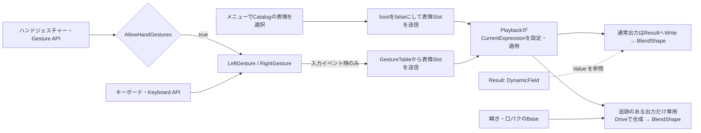

# 表情システムの実装と編集方法

DynamicVariable の型・初期値・更新元・編集用途とグラフ内の定数は、
[変数・定数リファレンス](expression-variables.md)を参照。

左右それぞれの現在のジェスチャーを int で保持し、
`GestureTable.L{LeftGesture}R{RightGesture}` の名前で対応表を直接引く。生成時は64通りで、外部から行を追加できる。
対応表で選んだ表情の各トラックの終端値へ即座に切り替え、固定ポーズとして保持する。
VRChatのカスタムFXからFaceEmo基準で最初の表情パターンを読み取り、対応表へ変換する。
左右64通りへ静的に変換する方式であり、Animator 全体や汎用パラメーターの状態機械は生成しない。
標準コンポーネントと ProtoFlux で動作し、利用側に ResoPon の DLL は不要。

変換済みポーズの格納先である `Catalog` と、選択先を決める `GestureTable` は別である。
Version 23ではメニューからCatalogの表情を直接選択できる。GestureTableへの割り当ては不要。
自動割り当てが0/64なら左右入力では `CurrentExpression` が null になるが、メニューからは有効なCatalog表情を選択できる。
その場合は 変換ログのレイヤー・Clip の除外理由を確認する。


```mermaid
flowchart LR
    H[ハンドジェスチャー・Gesture API] --> G{AllowHandGestures}
    G -->|true| S[LeftGesture / RightGesture]
    K[キーボード・Keyboard API] --> S
    D[メニューでCatalogの表情を選択] --> T[boolをfalseにして表情Slotを送信]
    T --> R
    S -->|入力イベント時のみ| P[GestureTableから表情Slotを送信]
    P --> R[PlaybackがCurrentExpressionを設定・適用]
    R --> V[通常出力はResultへWrite → BlendShape]
    R --> Q[追跡のある出力だけ専用Driveで合成 → BlendShape]
    B[瞬き・口パクのBase] --> Q
    Result[Result: DynamicField] -. Value を参照 .-> V
```

## 生成される構成

```text
Expressions/
  DV/                              システム共通の変数（1変数1子 Slot）
    Core.*                         左右の状態、現在の表情
    GestureTable/                  対応表の変数をまとめるスロット
      L0R0〜L7R7                   64個の Catalog 参照
    Version・Receiver・Catalog      バージョンと入口への参照
    References.*                   内部Slotの共有参照（Noneはnull）
  Catalog/                         表情ごとの定義と最終値の一覧
    各表情/DV/                     Clip空間の変数
      Id・DisplayName・Enabled     表情の設定
      Binding/                    シェイプごとの変数スロット
        Binding.Body.Smile         Body.Smileの固定値（float）
  Core/                            入力・選択・再生ロジック
    Logic/
      Lifecycle/                   初期化、装着状態の変更監視
      Selection/                   対応表からの選択と切り替え
      Playback/                    終端ポーズの取得・通常出力へのWrite
  Outputs/                         BlendShape ごとのベース入力と最終出力
    各 BlendShape/                 出力定義・Base・Result
      Tracking/                    既存の追跡がある出力だけ自動合成するDrive
  Drivers/各 Renderer/            DynamicBlendShapeDriver、必要なシェイプのみ登録
    各シェイプ/                   SmoothValue<float>、TargetValue → BlendShapes[].Value
  Inputs/
    ContextMenu/                   表情の直接選択・入力許可（項目の自動選択可否制御なし）
    Keyboard/
      Left|Right/                  各手の共通設定用の変数空間
        DV/                        Tag、Shift、Control、Key.0〜Key.9
        Logic/                     着用・修飾キー・押下成立の変更監視と送信
    HandGestures/Modules/
      Touch|Index|Vive|WindowsMR|Cosmos/   削除できる機種別入力
        Left/Logic/                左手の入力検出・安定化・通知
        Right/Logic/               右手の入力検出・安定化・通知
  API/Receivers/Logic/
    Left/                          左手の int 入力受付
    Right/                         右手の int 入力受付
    KeyboardLeft|KeyboardRight/    キーボード用int入力（フラグに依存しない）
    Select/                        表情Slotを検証してPlaybackへ送信
    AllowHandGestures/            boolによるハンドジェスチャーの許可・停止
  API/Examples/                    左右の int イベントを送るボタンの例
  API/Templates/                   Catalog に複製する表情テンプレート
```

Core に入力元の一覧・優先順位・有効期限・汎用 Animator パラメーターは持たない。
入力内容は `ResoPon/Expression/Gesture/Left`／`ResoPon/Expression/Gesture/Right` タグと int 引数で渡す。Core は入力元の Slot 参照を保持しない。
各手は最後に受理した入力値を保持し、コントローラーが切断されても変更しない。更新番号は保持しない。

Flux は1スロット1ノードで、各モジュール直下にノードを置き、モジュール全体の接続関係で整列する。
可読性のための番号付きセクションスロットは生成しない。
データの供給元を左、入力を使うノードを右に置く。Impulse も発火元から呼び出し先へ左から右に配置する。
複数入力はポート順に左側の上から下へ並べ、同じ接続先の入力群の間に別の入力群を挟まない。
入力を使う最初のノードの直前まで列を寄せ、入力側の枝は列ごとの占有範囲を使って詰める。
これにより10キーのような大きな入力群があっても、Tag・送信先などの小さな入力を接続先の近くへ置ける。
ノード固有の幅とポート数から間隔を取る。定数と変数入力はモジュール単位で共有する。
共有入力は最初の接続先を基準に配置する。離れた用途で共有する必要のない定数は独立させる
（キーボードの Match=true と送信の ExcludeDisabled=true）。状態を持つノードは複製しない。
3条件以上をまとめて判定する AND は `AND_Multi_Bool`（AndMulti）1ノードに入力を列挙し、2入力 AND の連結を避ける。
不一致判定は `ValueNotEquals`／`ObjectNotEquals`、null 判定は `IsNull` を使い、Equal と Not や null 定数の組み合わせを避ける。
循環する接続は同じ階層にまとめ、モジュール間には実際の幅に応じた余白を設ける。
ProtoFlux Tool では調べたい `Selection`、`Playback` などのモジュールを個別に Unpack する。
モジュール間では ProtoFlux ノードを直接接続しない。共有値はフィールド経由で参照し、所有者・定数の取得は各モジュール内で完結するため、
1つの入力や再生処理を開くだけで全機種・APIまでつながった巨大なグラフにはならない。

初回起動・装着開始時は `Lifecycle` が左右値と選択状態を初期化する。Selection は左右の入力イベントを受理したときだけ実行する。
呼び出しには対象モジュールだけを宛先とする同期 Dynamic Impulse を使い、
選択状態をイベント内で確定し、Playback も同期呼び出しして選んだ表情の各トラックの終端値を即時に書き込む。
左右の公開 API は int を受信し、初期化確認 → 片手状態の更新 → Selection → Playback を同期実行する。
同じフレーム内で左右のイベントが連続しても、それぞれの受信時点の両手状態・固定ポーズ・出力目標が確定する。
追跡対象の出力目標は通常のドライバー更新で反映する。メッシュの実ウェイトはSmoothValueで補間する。
表情Slotを引数としてResoPon/Expression/Internal/Playbackを送る。PlaybackがCurrentExpressionを設定して通常出力へ適用する。参照のFireOnLocalObjectChangeは生成しない。表情の有効性は選択時に判定する。

Version 38 は通常の表情出力の目標を選択イベント内のWriteで更新し、各シェイプをSmoothValueで補間する。
変換時に各トラックの最後のキー値を 各CatalogエントリーのDV/Binding/Binding.*変数 に保存する。
Playbackは表情Slot付きDynamicImpulseを受信し、CurrentExpressionへ設定してからOutputsを走査する。Binding.と各出力のIdを連結した名前のfloat変数を読み、
通常出力のResultを一括適用する。LocalUpdate・出力ごとのFireOnLocalChange・出力通知イベントは生成しない。
元から瞬き・口パク等のドライバーがある出力だけTrackingボードを生成し、
CurrentExpressionの名前付き変数と追跡BaseをValueFieldDriveで合成する。アニメーションの途中値は評価しない。
AnimX・AnimationProvider・AssetLoader・トラック検索・サンプラーも生成しない。
メッシュ出力のResultはSmoothValue<float>.TargetValueを参照するDynamicField<float>。
SmoothValue.ValueがDynamicBlendShapeDriverのBlendShapes[].ValueをDriveし、標準ドライバーが実メッシュへ反映する。
通常出力は装着者だけが値をWriteし、未装着時はホストがBaseを適用する。
追跡対象は各クライアントで選択中の表情の名前付き変数と各自のBaseを合成し、未装着時はBaseを使う。
切り替え補間はSmoothValueに任せ、FadeIn / FadeOut / FadeDuration / FadeWeight / Snapshot は生成しない。
連続・ループアニメーションも再生しない。Loop / Duration と Core の再生時計は生成しない。

以前の方式の比較資料は [Animator / Drive への移行設計と検証](expression-playback-drive-design.md) を参照。
これは旧Versionの記録であり、現行の適用方式は本資料の Version 38 に従う。

## 変更監視と実行タイミング

| 処理 | 実行するきっかけ |
|---|---|
| Lifecycle | OnStart とローカル装着状態の変化 |
| Selection | 受理した左右のGesture APIイベントからの同期呼び出しのみ |
| キーボード | 左右それぞれの10キーの条件が変化したとき。新しく成立した割当だけ送信 |
| 機種別入力 | 入力受付状態・判定した手形・Grip/Trigger 押下状態・安定待ち成立状態の変化 |
| Playback | 選択イベント内で保存済みValueを即時適用。初期化・リセットはnullを同期送信。OnStartと書き込み権限の変化でも更新。通常出力へ一括Write |
| Outputs | 通常出力にはFluxなし。既存の追跡がある出力だけTrackingのDriveで継続合成。変更監視・通知は置かない |

入力・装着状態の変更監視には FireOnChange 系の `FireOnLocalValueChange<T>`／`FireOnLocalObjectChange<T>` を使う。
比較用の前回値はローカルな実行状態で、DynamicVariable や同期・保存対象の変数には追加しない。
初期値の設定だけでは発火しないため、初回に必要な処理には `OnStart` も使う。
装着者の確認は各処理の入口に残す。

この構成で、無変化時の Impulse 実行・変数への書き込みを減らす。メニュー全走査は行わない。
物理入力・時刻・実行時の Source を読む DynamicVariable など、連続変化扱いの入力は検出のための評価が残る。
毎フレームの評価をすべてなくすものではない。監視を独立させるため、グラフのノード数は増える。
Version 21では `GestureTable/Logic` のメニュー用監視を生成しない。
現在の組み合わせの選択更新は `Core/Logic/Selection` が担当する。

## 入力・列挙ノード

固定参照のうち、読み取り元 Slot とノード自身から同じ名前付き空間へ到達できるものは
`DynamicVariableValueInput<T>`／`DynamicVariableObjectInput<T>` で読む。
間に別名の空間があっても、要求した空間名で祖先を検索する。

- 各手の Candidate・Stable・Since：`ExpressionSystem.Input.HandGestures.Hand`。
- 機種ごとの Grip/Trigger しきい値・StabilitySeconds：親モジュールの `ExpressionSystem.Input.HandGestures`。
- Selection の左右値：`ExpressionSystem/Core.LeftGesture`・`ExpressionSystem/Core.RightGesture`。
- Playback の CurrentExpression：`ExpressionSystem/Core.CurrentExpression` の Object Input。
- 各 Output の Id・Base・TrackingWeight・Result：`ExpressionSystem.Output`。

API・機種別入力・各 Output からも、Core.* は祖先の ExpressionSystem 空間へ入力ノードでバインドする。
Core の入力ノード化は現行の名前付き空間で再検証し、同一フレームの入力、複製、再装着、
保存再読み込み後の選択・再生を確認した。機種別設定の編集も、両手の入力プロキシが該当する
モジュールの値へ追従し、別機種・複製元と混ざらないことを確認する。
置換により接続先がなくなった固定 Slot 参照ノードは、配線完了後に除去する。

次の読み取りは `ReadDynamicValueVariable<T>`／`ReadDynamicObjectVariable<T>` を維持する。

- 切り替え・初期化時の ForEach の出力レコード、選択中の Catalog：実行中に Source Slot が変わる。
- `ExpressionSystem/GestureTable.LnRm`：左右の値を含むキーで読み取る変数名が変わる。

入力ノードには Source Slot を渡せないため、これらはそのまま入力ノードに置き換えない。

子 Slot の処理は `Children` → `ForEachObject<IReadOnlyList<Slot>, Slot>`（表示名 ForEach）で列挙する。
すべてのループ本体は列挙中に子 Slot の追加・削除・並べ替えを行わず、元の直下の子の順序を保つ。
表情システムの装着判定は、Avatar Root Identification が公開する `modular_avatar/AvatarWorn` と
`modular_avatar/AvatarWornLocal` を各ボードの DynamicVariableValueInput<bool> で読み取る。
User が必要なコントローラー・UserFingerPoseSource だけは `GetActiveUserSelf` を直接参照する。
装着判定にはこのUserを使わず、入力受付は引き続き `AvatarWornLocal` で制御する。
各ボードは独立した FluxGroup を維持する。直接選択は受信Slotの親がCatalogかを確認し、Catalogを列挙しない。GestureTableの逆引きは行わない。

## 不具合の調べ方

まず Expressions/DV の Core.* 変数を見て、入力・選択・再生のどこで期待とずれたかを分ける。
各 Space の Slot 直下に DV を置き、値・参照・DynamicField を含め1変数1子 Slotで生成する。
Inspector 上の Core の変数名には `ExpressionSystem/Core.` が付く。GestureTable も同じ ExpressionSystem 空間に GestureTable.* として登録する。複数インスタンスを持つレコードだけに、階層をドットで表す別の空間名を使う。

| Core の変数 | 確認する内容 |
|---|---|
| `LeftGesture` / `RightGesture` | 各入力から届いた int の状態（範囲制限なし） |
| `PairKey` | `L{左}R{右}` 形式の対応表キー（例：L1R2） |
| AllowHandGestures | true=ハンドジェスチャーを許可、false=停止。キーボード・表情メニューは常に使用可能 |
| `CurrentExpression` | Selection の検証を通過した再生対象。無効・未割当なら null |

1. 左右の番号が違う場合は、`API/Receivers/Logic/Left`／`Right` と該当入力の `Logic` を調べる。
2. キーが正しく表情が違う場合は、`PairKey` に対応する `GestureTable` の参照と `AllowHandGestures` を確認し、`Selection` を調べる。
3. `CurrentExpression` が null の場合は、`Expressions/DV/GestureTable/LnRm`（末尾の LnRm は PairKey）の参照があるか確認する。参照がある場合は、参照先の Slot の有効状態、`Enabled`を確認する。
4. 選択が正しく見た目が違う場合は、`Core/Logic/Playback` と該当出力の `Base`、`TrackingWeight`、`Result` と、Resultの参照先からメッシュまでの駆動接続を調べる。

`AllowHandGestures` は入力モードの設定。それ以外の状態は読み取り用の診断情報として扱い、再生結果を変えたい場合は公開 API、対応表、Catalog を編集する。
変換時の警告・案内はログの `Expression diagnostics:` に記録する。
`Expression graph:` にはボードの相対パスとノード数を記録する。アバター内にはDiagnosticsを生成しない。
Outputs の `Id` はメッシュ名.BlendShape名から作る変数キー。選択表情に対応するfloat変数がなければBaseを使う。Binding参照・Pose・HasPose・再生時計は持たない。
反映が止まっている場合は、アバターの装着状態、該当モジュールの有効状態と `Outputs/Result`と、その参照先からメッシュまでの駆動接続を確認する。


resoloop を使う場合は、リポジトリ直下から次の読み取り専用スクリプトで Core の状態を一覧にできる。
`-CoreSlot` には `Expressions/DV`（旧パッケージは `Expressions/Core`）の正確なパスまたは現在のスロット ID、
`-Url` には ResoniteLink に表示される現在のポートを指定する。

```powershell
powershell -NoProfile -ExecutionPolicy Bypass -File scripts/inspect-expression.ps1 -CoreSlot "Root/Plum/Expressions/DV" -Url "ws://localhost:42038"
```

`-Json` を付けると CoreSlot と Values を持つ JSON を返す。SelectionStatus に基づく Selection 要約は出力しない。
URL を省略した場合は resoloop の環境変数・プロジェクト設定を使う。
参照値は現在の ResoniteLink 接続での ID として表示するため、保存後の固定 ID として使わない。
診断スクリプトは旧 `Expr/`・`ExpressionCore/` と現行 `ExpressionSystem/Core.` を読み取れる。新しい空間名・診断項目の反映には再変換・再インポートが必要。


## Selection と再生対象

Core に保存する表情参照は `CurrentExpression` だけ。`MappedExpression` と `CandidateExpression` は生成しない。
Selection は受理した左右入力イベントのときだけ実行する。左右値や表の編集・装着・入力許可の変更だけでは再評価しない。
Selection は左・右を文字列化して `L{左}R{右}` を組み立て、`Expressions/DV/GestureTable/LnRm` を読み、Slot 有効・Enabled=trueを確認する。
通過した参照（無効ならnull）をその更新中のローカル値として確定し、Playbackへ同期送信する。
PlaybackがCurrentExpressionへ設定し、終端値を即時にWriteする。同じ表情でも再適用する。
同じ参照なら同じ固定ポーズになる。解除・無効化も補間せず Base へ戻す。
未検証の対応表の参照を調べたい場合は、PairKey に対応する行を直接見る。
SelectionStatus は生成・計算しない。入力モードは AllowHandGestures、再生対象は CurrentExpression で確認する。
未割当と無効・未ロードはどちらも CurrentExpression=null となり、理由は対応表と参照先を調べる。

## 装着状態と Lifecycle

Selection・Lifecycle・API・キーボード・機種別入力は `AvatarWornLocal` で更新を制御する。
`AvatarWorn` は誰かが装着中かの判定に使い、取り外し時のクリア、未装着時のホストによるBase適用、各クライアントの追跡合成を切り替える。
UserRoot配下への配置だけでは装着とみなさない。AvatarUserReferenceAssigner の装着通知と階層からIdentificationが算出した値を共通の判定元とする。
Lifecycle 内の保存されない `StoredValue<bool>` が初期化済みかを記録する。

- 装着開始・初回起動：AvatarWornLocal=true になれば初期化する。入力イベントがなければ CurrentExpression=null のままにする。
- 取り外し：初期化済みのクライアントが一度だけ入力・選択状態をクリアし、出力を Base に戻す。初期化済みフラグを解除する。
- 未装着中：選択更新は停止する。通常出力は初期化・権限取得時にホストがBaseをWriteし、追跡対象は専用DriveがBaseに追従する。閲覧者は共有の選択状態を書き換えない。
- 再装着・複製・読み込み：初回に左右値を 0、入力許可を true に戻して再開する。API が先に届いた場合も同じ初期化を行う。

取り外し時はローカルDriveと共有AvatarWornの反映順が異なるため、Driveと変数通知が反映される2更新後に両フラグを再確認して終了処理を行う。再装着済みならクリアせず、別の装着者が既にいる場合は共有値をクリアせずローカルの初期化済みフラグだけを解除する。
装着者の履歴は比較せず、AvatarWorn／AvatarWornLocal の変化を FireOnLocalValueChange で検出する。API は受信時点の AvatarWornLocal が true の場合だけ処理する。
変更イベントが処理される前に外して同じユーザーへ戻し、判定結果が変わらなかった場合は連続した装着として扱う。
未装着中も追跡用Driveは各クライアントのBaseに追従する。
既存パッケージへ反映するには再変換・再インポートが必要。

## 入力の動作

Version 24では `ExpressionSystem/Core.AllowExternalInput` を `ExpressionSystem/Core.AllowHandGestures` へ変更した。
bool APIも `ResoPon/Expression/AllowHandGestures` に変更する。旧変数名・旧Tagは生成しないため、外部連携は更新が必要。
キーボードは専用の `ResoPon/Expression/Keyboard/Left`・`Right` を使い、ハンドジェスチャー停止中も入力できる。


ジェスチャー番号は次の対応になる。
Version 23では左右ジェスチャーのコンテキストメニューと専用のMenu/Left・Menu/Right APIを生成しない。
コントローラーはGesture/Left・Gesture/Rightを使い、AllowHandGestures=trueのときだけ受け付ける。
キーボードはKeyboard/Left・Keyboard/Rightのint APIを使い、フラグに関係なく受け付ける。どちらも装着者限定で、受理したイベントごとに左右値から表情を選ぶ。
動作確認では `Core/LeftGesture`、`RightGesture`、`CurrentExpression` と対応表の参照先を見る。

| 番号 | 状態 |
|---|---|
| 0 | Neutral |
| 1 | Fist |
| 2 | HandOpen |
| 3 | FingerPoint |
| 4 | Victory |
| 5 | RockNRoll |
| 6 | HandGun |
| 7 | ThumbsUp |

同じ手には最後に受理したイベントを採用し、もう一方の手は変更しない。boolがfalseの間はGesture APIだけを拒否する。キーボード入力では左右値と表情を更新するが、フラグは変更しない。
キーボードの指定はラッチする。キーを離しても戻らず、Neutral を送ると0に戻る。
物理入力は安定したジェスチャーが変化したときと接続時にだけ送る。
ハンドジェスチャーが許可されている間は、手を動かさずにキーボードで設定した状態を維持し、次の物理ジェスチャー変更で更新する。ハンドジェスチャー停止中は機種別の判定状態をリセットし、許可を戻した後は再び安定した手形を検出して送る。

- コンテキストメニュー: Catalogの表情を直接選択。左右値は変更しない。
- キーボード: 表情の優先順位が高い手は Shift+テンキー0〜9（Ctrl なし）、もう一方は Ctrl+Shift+テンキー0〜9。
  Version 27ではテンキー0〜9をそれぞれジェスチャー値0〜9として送信する。
  0が Neutral、1が Fist、7が ThumbsUp。8・9は拡張用で、対応するGestureTableの行があればその表情を選び、未割り当てなら表情を解除する。
  自動生成するジェスチャー表は引き続き左右0〜7の64組。8・9を含む割り当ては同じ命名規則（例: `GestureTable.L8R9`）で追加できる。
  `ExpressionHandPriority` は変換後の64組の固定ポーズを比較する。両手それぞれがNeutralと異なる別の表情を持つとき、
  両手入力の結果がどちらの片手入力と一致するかを数え、採用回数が多い手をShift側にする。
  Clip IDが別でも全出力の最終値が同じなら同じ表情として扱う。両手専用表情・同じ表情・未解決の組は勝敗に数えない。
  同数なら片手で選べる異なる非Neutralポーズが多い手、それも同数なら左手を採用する。
  これは生成時のキー設定であり、Catalog・GestureTable・元FXの読み込み規則は変更しない。
  優先側は変換ログに記録する。保存後にGestureTableを編集してもショートカットは自動変更しない。
  `Left/DV` と `Right/DV` の `Key.0`〜`Key.9`、共通の `Shift`・`Control`、送信先の `Tag` を編集できる。
  各手は `ExpressionSystem.Input.Keyboard` 空間を持ち、Enabled とキーごとの Gesture は作らない。
  Flux は `Keyboard/Left/Logic` と `Right/Logic` の2つに生成する。
  `modular_avatar/AvatarWornLocal`、修飾キーの一致、10キーのいずれかの押下を AND でまとめ、
  1つの FireOnLocalValueChange<bool> で監視する。条件成立時は最小番号のキーの添字を一度送る。
  条件が成立したまま他のキーを追加・解放しても再送しない。全キーを離すなどして条件を false に戻すと再度送信できる。
  Control・Shift は左右どちらの物理キーでもよい。各手の設定は独立して変更できる。
- コントローラー: 不要な `Modules/Touch|Index|Vive|WindowsMR` を削除できる。
  機器の切断・非アクティブ化では判定状態だけをリセットし、Neutral は送らない。
  最後に受理した左右値を保持し、再接続後に安定した手形を検出すると、その手の値を更新する。
  モジュール自体の削除・無効化でも手の状態は残る。解除したい場合は Neutral を明示的に送る。
  Grip/Trigger の押し込み・解放しきい値と安定待ち時間を機種ごとに編集できる。
  指を個別に取得できない機種の Victory/Rock はボタン操作から判定する。

直接表情を選ぶ `Select expression` はCatalogの表情を一覧にする。項目のEnabledを自動制御しない。
押下時にButtonDynamicImpulseTriggerWithReference<Slot>が表情SlotをSelect APIへ送る。自身のCatalog直下で有効な表情かを検証し、PlaybackがCurrentExpressionへ設定して適用する。
AllowHandGestures=falseにするが、LeftGesture・RightGesture・PairKeyは変更しない。GestureTable未割り当てでも選択できる。
同じ表情の再選択でもPlaybackを実行するため、名前付きfloat変数の編集も反映できる。
表情項目のColorは `ReferenceOptionDescriptionDriver<Slot>` が `Core.CurrentExpression` を参照して駆動する。
Catalog・Imported menuともに選択中の表情は緑、それ以外は白。null用の白いOptionを先頭に置き、
参照先の表情を削除した項目が未選択状態で緑にならないようにする。
ジェスチャー許可トグルのColorは `ValueOptionDescriptionDriver<bool>` が `Core.AllowHandGestures` を読み、
有効（true）なら緑、無効（false）なら赤にする。両DriverともLabel・Spriteは駆動せず、Enabledの自動制御も追加しない。
参照はアバター複製時に複製先へ再対応し、Catalogテンプレートを複製した項目は自分自身の表情を比較対象にする。
Catalog の Slot を固定用に保持する Override 変数は生成しない。

Version 26の `Hand gestures` は単一のトグル項目で、押すたびに現在のboolを反転する。
モードだけの変更では左右値・CurrentExpressionを変えない。初期値は true。
メニューから表情を選ぶと再び false になるため、ハンドジェスチャーへ戻すには許可をオンにする。キーボードはそのまま使える。
直接選択は bool が false でも使える。ハンドジェスチャーを再許可した後も、次の左右入力イベントまでは直接選択を保持する。
元のExpression MenuのButton/Toggleは読み込まない。

### コントローラーのハンドサイン判定

Version 19ではAvatar Expression Editor v1.12.1の機種別判定を採用する。
Touchは接触・Clickの5ビット、Indexは5本の指の近位関節角度、Cosmosは4ビットの完全一致を使う。
一致しない手形はNeutralへ戻す。Vive・WindowsMRはTouchpadの8方向を編集可能な
`Direction.0`〜`Direction.7`でジェスチャーへ割り当てる。左右は独立して扱う。
安定待ち・装着者限定・入力停止・切断時の保持は共通の送信処理で管理する。
判定表、元ツールとの差、検証範囲は[コントローラー別ジェスチャー判定](controller-gestures.md)を参照。

## 対応表と表情の編集

Version 28では空の `Expressions/GestureTable` を廃止し、対応表を `Expressions/DV/GestureTable` に集約した。
変数名は `ExpressionSystem/GestureTable.LnRm` に変更した。既存パッケージは再変換で更新する。

`Expressions/DV/GestureTable/LnRm` の各スロットには `ExpressionSystem/GestureTable.LnRm` という DynamicReferenceVariable<Slot> がある。
n は左、m は右の int 値。ResoPon が生成するのは各0〜7で、例えば左1・右2は `L1R2`。
外部で `Expressions/DV/GestureTable/L8R255` に変数名 `ExpressionSystem/GestureTable.L8R255`
という DynamicReferenceVariable<Slot> を追加すれば、左右 API に8と255を送って選択できる。
左右のGesture APIは負数も含む int 全域を受理する。対応行がなければ入力値を保持し、ベース入力へ戻る。
Select APIは表情Slotを直接受け取るため、ジェスチャーの値・表の行数には依存しない。
参照先を `Catalog` の表情スロットへ変更するだけで割り当てを編集できる。
左右の組み合わせごとにアニメーションを複製せず、同じ表情は同じ Catalog エントリーを参照する。

表は変数名で引くので、スロットの並び替え・表示名の変更・別の行の削除で対応がずれることはない。
変数名は固定し、同じ名前を重複させない。削除した行を戻す場合は同じ変数名で再作成する。
行が未設定、または表情の参照先が削除・無効化されている場合は Outputs のベース入力を使う。
表の参照の編集は次の左右入力イベントで反映される。異なる行でも同じ表情を指す場合は同じ固定値を適用する。

表情の追加は `API/Templates` または既存の Catalog エントリーを Catalog へ複製し、
`Enabled` を有効にして `Id`、`DisplayName`、`Binding.*`の値を設定する。
Idは記録用で、選択条件ではない。外部からの直接選択には表情Slotを送る。
直接選択ボタンからの適用にGestureTableの割り当ては不要。対応表の編集でメニュー項目の Enabled は変更しない。直接選択は即時に反映する。削除は表情スロットごと行える。
テンプレートから複製したメニューの表示名は複製先の変数に追従し、送信するSlot参照は複製先自身へリマップされる。項目の Enabled は駆動しない。

各表情のExpressionSystem.Catalog.Clip空間のDV/Binding配下にBinding.*のfloat変数スロットを並べる。
VariableNameはExpressionSystem.Catalog.Clip/Binding.と対応するOutput.Idを連結した名前、値は元カーブの最後のキー値。
例：ExpressionSystem.Catalog.Clip/Binding.Body.Smile。独立したBinding空間やBindings参照は生成しない。
新しいシェイプを追加する場合は、対応する Outputs とメッシュへの接続も用意する。
通常出力の名前付き変数・子レコードの編集後は表情を再選択する。追跡出力の名前付き変数の編集は自動反映する。
外部から直接適用する場合は、PlaybackスロットへResoPon/Expression/Internal/Playbackを表情Slot付きで送る。CurrentExpressionを先に編集する必要はない。

## 外部イベント API（Version 37）

Selectの引数は表情Slot。旧string ID送信は受理しない。内部PlaybackもSlot引数を必要とし、解除時はnullを送る。

アバター装着者のクライアントで `Expressions/API/Receivers` を対象階層にして発火する。
左右のGesture入力は `DynamicImpulseReceiverWithValue<int>` で受ける。

| Tag | 引数 | 動作 |
|---|---|---|
| `ResoPon/Expression/Gesture/Left` | int（範囲制限なし） | bool が true のとき左手を更新 |
| `ResoPon/Expression/Gesture/Right` | int（範囲制限なし） | bool が true のとき右手を更新 |
| `ResoPon/Expression/Keyboard/Left` | int（範囲制限なし） | フラグに関係なく左手を更新。フラグ自体は維持 |
| `ResoPon/Expression/Keyboard/Right` | int（範囲制限なし） | フラグに関係なく右手を更新。フラグ自体は維持 |
| `ResoPon/Expression/Menu/Select` | Slot: 自身のCatalog直下の表情 | 有効性を検証し、boolをfalseにしてPlaybackへ送信 |
| `ResoPon/Expression/AllowHandGestures` | bool | ハンドジェスチャーを許可するか設定。左右値・表情は維持 |
| `ResoPon/Expression/ToggleHandGestures` | なし | 現在のハンドジェスチャー許可を反転。左右値・表情は維持 |
| `ResoPon/Expression/Reset` | なし | 表情を解除してBaseへ戻し、左右を0、ジェスチャー入力を有効にする |

0=Neutral、1=Fist、2=HandOpen、3=FingerPoint、4=Victory、5=RockNRoll、6=HandGun、7=ThumbsUp。
Tag は大文字・小文字を含めて完全一致。引数型違い、無効・存在しない ID は入力状態を変更しない。
固定したいときは Menu 側の Tag を使い、手入力など固定しない送信元は Gesture 側を使う。
メニューの送信にも専用の Tag を使うため、ハンドジェスチャーを無効にしてもメニューは操作できる。

左右入力は片手の値を更新してSelectionを実行する。直接選択メニューはboolとCurrentExpressionを同じImpulse内で更新する。
直接選択ではSelectionを経由せず、Playbackが固定ポーズと通常出力を同期更新する。追跡対象は通常のドライバー更新で反映する。
boolの変更だけでは左右値も表情も変更しない。
Version 25のコンテキストメニュー「Reset settings」は引数なしのReset APIを送る。
CurrentExpression=null、左右のGesture=0、PairKey=L0R0、AllowHandGestures=trueへ一括で戻し、各出力にBaseを反映する。
GestureTableの割り当てやCatalog、キー設定は変更しない。L0R0に表情が割り当てられていてもリセットでは再選択せず、次の左右入力イベントで再評価する。
Resetもローカル装着者限定で、ジェスチャー無効時にも受け付ける。
初期化は入力許可の判定より前に行い、複製・再ロード・再装着時には bool=true、左右=0 に戻す。
Dynamic Impulse はネットワーク RPC ではなく、装着者以外のクライアントからの実行は無視する。

旧 `ResoPon/Expression/v3/Select` と `v3/Automatic` は生成しない。
旧 Select 送信側は Menu/Select へ変更し、ハンドジェスチャーを再開する操作は AllowHandGestures に true を送る。

## FaceEmo に合わせた表情候補の検出

VRChatの表情読み込みは `VrchatFaceEmoExpressionImporter` に一本化している。
`VrchatExpressionParser` は顔カーブとFX入力を読み、候補検出を統一Importerへ渡す。従来のEntry/Exit投影、
既定パラメーター固定、Setドライバー連鎖、入れ子バンクの専用ルーターは削除した。
Expression Menu、Expression Parameters、MA Parametersから表情セットを選ぶ処理もない。
ハンド割り当ては、FaceEmoでCatalogを確定した後、後述のグラフ解析でその中から選択する。
MA Absolute/Appendは入力FXを順番に並べるためだけに使い、追加FXも同じFaceEmo基準で読む。
VRMの規格上の表情定義と、変換後のResonite側の入力・出力グラフは別の責務として維持する。
参照したFaceEmoの実装は [既存表情検出の調査](face-emo-expression-import.md) を参照。

顔はDescriptorのViseme用メッシュ、Blendshapesのまぶた用メッシュ、ルート直下の `Body` の
順に選ぶ。追加顔メッシュ・FaceEmo設定のExcludedBlendShapesは未対応。
`BlendshapeResolver.ExpressionFaceValues` が実Rendererの同一性と曲線のパスを照合する。
DescriptorのViseme名と既知の `vrc.v_*` 名を除外し、まばたきは含める。
アバターに設定された初期ウェイトは追跡ドライバーの設定前に保存する。
メッシュ照合前の `--vrchat-dump` は仮の結果で、最初のセットの確定と後続クリップの削除は
`VrchatExpressionDetection.FilterFaceCurves` で行う。比較にはUnityのApproximately相当を使う。

### 通常形式の最初の表情セット

FaceEmoの `ImportNormal` / `GetBranches` / `GetBranch` / `DivideMode` に合わせて読む。

- 各FXレイヤーのDefault、Entry、Any State、各Stateの遷移先と子StateMachineを調べる。
  muteされた遷移、直接Stateを指さない遷移、顔Motionを持たない分岐は除く。
- 条件は左右GestureのEqualsだけを残す。片手Neutral条件には反対の手のNeutralも加える。
  ジェスチャー条件がなければbool条件だけのトグル、Contact、PhysBone由来の分岐を除く。
- レイヤー内では最初の条件の手（左→右）とジェスチャー番号で安定ソートし、
  レイヤー間では後ろのFXを優先する。元のウェイト・マスク・Write Defaultsは評価しない。
- 顔の初期値との差分がない通常分岐は除外する。各左右組合せで最初に一致する分岐を選び、
  全組合せで隠れる条件付き分岐は後続パターンに相当するため出力しない。
- 条件なしの表情はFaceEmoと同様、アニメーションの同一性で重複を除いて第1パターンの
  Catalog候補に残す。条件なし分岐はハンドサインのフォールバックにはならない。

最初のパターンだけをResoPonの表情セットにする。通常形式の分岐数は必ずしも14ではない。
未一致のジェスチャーはアバターの初期姿勢に戻す。元クリップの名前を使うので、
PlumとSanatiaでCatalogの項目名が同じになるわけではない。

### ジェスチャー入力から検出済みCatalogを選択する

候補検出と入力の割り当てを分離する。まず `VrchatFaceEmoExpressionImporter` が顔Renderer・初期値との差分・
FaceEmoの分岐順序から先頭セットのCatalog候補を確定する。その後 `FaceEmoGestureConditions` が左右64通りの
入力についてAnimatorの到達先を解析し、既に選ばれた候補のClip IDと照合する。解析器自身はClipを読み込んで
Catalogへ追加しない。状態名やパラメーター名、アバター名、固定の番号対応は判定に使わない。

- Parameter Driverは必須ではない。Entry／Default、Any State、通常のState遷移、子StateMachineへの進入、
  Exitと親の明示的なStateMachine遷移を辿る。比較条件、リスト順、Mute／Solo、Any Stateの自己遷移設定を読む。
  状態数、遷移段数、Driverの位置を特定の8状態構造へ固定しない。
- DriverはStateまたはStateMachineへの進入時に評価し、親から子への順序を保つ。
  Set、既知値のCopy（範囲変換なし）、既知値へのAddに対応し、複数書き込み・途中状態の連鎖も扱う。
  条件に必要なパラメーターを書き込むレイヤーを依存関係として集め、追加FXやウェイト0のレイヤーも含める。
  同じControllerを複数回参照した場合も、FX入力の各インスタンスを別に識別する。
- 各組の計算はNeutralで初期化して収束させ、そこから左右の入力を同時に変更して再び収束させる。
  各反復では元のレイヤー順に処理する。Neutralのままの状態は再進入しないため、Legniaでは非Neutralの手の
  Setが有効になり、両手が変わる場合は後ろの右手入力が優先される。任意の実行履歴や入力時刻差は保存しない。
- 初期値として与えるのは左右GestureとWeightだけ。非ハンドのトグルなどを既定値で固定して推測しない。
  ただしAND条件に既知のfalseがあれば、その遷移は未知の条件が残っていても不成立と確定できる。
- 1D BlendTreeはしきい値に一致する子、または範囲外の端の子を選べる場合だけClip IDを返す。
  補間中の姿勢や2D／Direct BlendTreeから新たな表情を生成しない。Fistは該当する手のWeightを1として扱う。

到達先を確定できたレイヤーでは、途中で通過した表情を採用しない。空MotionやCatalog外のClipに到達した場合は
そのレイヤーを通過して下の候補を調べる。後続FaceEmoセットやbool専用候補をグラフ解析によって追加しない。
未解決のレイヤーには元の直接Gesture条件によるFaceEmo割り当てを残し、確定済みの下位レイヤーより優先順位を
下げない。最終的にどの候補にも一致しなければ、従来どおりアバターの初期姿勢に戻す。

未解決になる例は、未知の条件値、未宣言または所有元不明の書き込み、Random／範囲変換Copy、同期レイヤー、
未知のBehaviour、実行対象の時間待ち・割り込み、Animatorパラメーターを書き換えるAnimation、Animation Event、
未接続の親Exit、循環・非収束など。解析は256反復とEntry／Exitの256段で打ち切る。
未知のBehaviourやAnimation Eventを実際に実行することはない。

FaceEmo候補の保持と既存の直接割り当てへのフォールバックは、このグラフ解析の成否と独立している。
ログにはCatalog内で解決できた組数と、未解決のレイヤー・理由を残す。CACは従来の先頭14表情セットを使う。

### CAC形式の最初の表情セット

FaceEmoの `GetCacLayer` と同じく、子StateMachineのEntry条件が `SYNC_EM_EMOTE` を参照する
最初のレイヤーを見つけたら通常形式の収集を置き換える。
単一条件・直接State・未muteの遷移を番号順に並べ、`(番号 - 1) / 14` ごとにセットを作る。
入力の健全性確認としてEqualsと正の整数番号を要求する。顔Motionを含む最初のセットだけを使い、
1〜7を右手、8〜14を左手のFist〜ThumbsUpへ割り当てる。右手が優先で、欠番は後続セットで補わない。
CACではFaceEmo同様、顔Motionがあるが初期値との差分がない分岐も初期姿勢として有効にする。
Sanatia 1.11はこの形式で、第1セットの左右7種類は同じ姿勢、初期姿勢を含めた見た目は8種類。

両形式とも、後続セットと無関係なFX・メニュー由来のクリップはCatalogに混ぜない。
採用したセット・ジェスチャー分岐数・手動候補数は `FaceEmo normal:` / `FaceEmo CAC:` に残す。
元クリップとコンパイルした固定ポーズが両方Catalogに存在することはある。
Version 21では対応表への割り当てによるメニュー項目の自動選択可否制御を行わない。

SanatiaにはDescriptorと同じVRCSDK3A.dllのGUIDを持つ音声コンポーネントも含まれる。
アバター候補はGUIDとScriptのfileIDを確認する。DLL内Descriptorは542108242、単独MonoScriptは
11500000を認め、SDK差異用のDescriptor固有フィールド判定も維持する。

## 変換時の判定と制限

選ばれたFaceEmo分岐を、順序付き条件と初期姿勢だけを持つ単一レイヤーへ正規化する。
`GesturePairCompiler` はこのレイヤーから64通りの固定ポーズを作る。同じ結果は再利用する。
これは元Animatorのグラフ・履歴・ドライバー副作用・既定値を再現する処理ではない。

FaceEmoのIsFaceMotionに合わせ、BlendTreeの候補判定は直下の最初と最後のAnimationClipを使う。
採用する通常ポーズは末尾の子を辿る。FistかつMotion Time有効の分岐では先頭と末尾も調べ、
離散ハンドサイン用の姿勢には握り切った末尾値を使う。Motion Timeのパラメーター名は限定しない。
連続的な握り込み、動的セット変更、表情ごとの追跡制御は再現せず、既存のResonite追跡方式を使う。

材質・物体・Transform・参照値・イベント・再生設定が混在していても有効な顔カーブを取り込む。
顔以外の処理は実行しない。空Motionや顔のないMotionを表情と推測しない。
不正な顔binding・非有限キー値・重複bindingは除外する。重み付き接線は既存の検証・正規化を通す。
顔の初期値と同じカーブは独立候補から省くが、固定ポーズのリセット用には保持する。

実行時は各トラックの最後のキーを固定ポーズとして使う。元 Animator の遷移時間、
自己遷移による再開始、連続再生、ループ、再生位相は再現しない。
最後に開始姿勢へ戻るループ素材は、その戻った姿勢を採用する。途中の最大値や任意フレームは推測しない。
変換後は出力先と最終値だけを保存する。元カーブ・キー列・接線・AnimXは含めない。

Playback は選択イベント・表情参照の変化時に、Outputsを1回走査する。
Binding.と各OutputのIdから変数名を組み立て、CurrentExpressionのClip空間からfloat値を直接読む。FoundValue=falseの場合だけBaseを使い、0の値は有効な表情値として適用する。
表情値の子スロットの走査やOutput参照との比較はない。同名変数を同一空間に複数作ると値を共有するため、生成時に衝突しない名前を割り当てる。
続いて通常出力を合成し、Resultと違う場合だけ書き込む。追跡用Driveの対象にはWriteしない。
無変化時の全出力巡回も出力ごとの変更監視もない。通常出力のBase・TrackingWeight・BlinkMode編集は再選択で適用する。
通常出力のBinding.*変数の編集も再選択で適用する。追跡出力は名前で直接読むため、値・名前・変数の追加削除は自動反映する。表情選択・初期化・権限取得で固定ポーズと通常出力を更新する。
装着者または未装着時のホストだけが共有Writerを実行する。追跡用Driveは全クライアントでローカル評価する。
未装着時は、保存・複製で選択状態が残っていてもResultはBaseとなる。

既存の瞬き・口パク等のドライバーは Outputs の `Base` に接続し直す。
表情にトラックがない出力は Base を使い、ある出力はBinding.<Output.Id>名の変数の固定値を使う。
出力ごとの `TrackingWeight`（0〜1）で Base の混合率を調整できる。
瞬きは `BlinkMode` で別に合成する。0は通常の混合、1は表情値と Base の最大値、2は最小値を採用する。
生成時に既存の `EyeLinearDriver.Eyes[].OpenCloseTarget` を検出した出力だけ、閉じる方向に合わせて1または2に初期化する。
開いている表情でも瞬きが通り、閉じている表情は瞬きが終わっても開かない。切り替え時も瞬きの振幅を減らさない。
口パク・視線などの他のドライバーにはこの合成を自動適用しない。
既存のTrackingボードがある出力で瞬きの接続を変更する場合は、OpenCloseTarget を該当 `Outputs/シェイプキー` の `Base` の Value フィールドへ接続し、
`BlinkMode=1`（大きいほど閉じる通常の設定）にする。小さいほど閉じる設定では2にする。`TrackingWeight` は0のままでよい。
Trackingのない出力に後から追跡を加える場合は、追跡元を設定して表情システムを再生成する必要がある。Baseへの接続だけでは自動追従しない。
元の BlendShape フィールドは DynamicBlendShapeDriver が Drive するため、OpenCloseTarget を直接重ねて接続しない。
既存パッケージをこの方式にするには再変換が必要。瞬き binding がないアバターは、再変換だけで Eyes の接続先が増えるわけではない。
複製・再ロード・再装着時には左右状態を0に、AllowHandGestures を true に初期化する。
VRM の感情表情も同じ Catalog を使うが、VRChat の条件がないため対応表は未設定から始まる。

DynamicBlendShapeDriver は Expressions/Drivers 以下に SkinnedMeshRenderer ごとに1つ生成し、
表情で使用するシェイプだけを登録する。同名 renderer は名前ではなく Component の同一性で区別する。
Output と Drivers の同名 Slot には連番を付け、診断パスの重複も避ける。binding の Id・Path・Shape は変更しない。
VRM の binding は数値インデックスの場合があるため、登録名は解決済みメッシュフィールドから実メッシュ名を取得する。
各OutputのResultは対応するSmoothValue.TargetValueへのDynamicFieldで、目標値を重複保存しない。
SmoothValueは各Rendererの子にシェイプ名で1つずつ生成する。初期目標とBlendShapes[].Valueは解決済みフィールドの現在値で初期化し、
Speedの初期値は10、WriteBack=falseでValueをBlendShapes[].ValueへTryLinkする。補間途中の値をTargetValueへ書き戻さない。
Version 20では `Expressions/DV/SmoothingSpeed` の `ExpressionSystem/SmoothingSpeed`（float、初期値10）を共通設定にする。
各SmoothValueのSpeedは同じSlotのDynamicValueVariableDriver<float>でこの変数へ接続し、未解決時も10を使う。
共通変数のValueを変えると、すべてのRendererの表情用SmoothValueへ反映される。
Speedは秒数ではなく追従速度。小さくするとゆっくり、大きくすると速くなる。
複製したアバターや保存再読込後も各アバター内で完結する。
連続して表情を変えた場合は現在の補間値から新しい目標へ追従する。未装着・未割り当て時のBase復帰にも同じ補間を使う。
瞬き・口パクの混合は従来どおりTargetValueを追従更新し、その結果にも同じスムージングがかかる。
非メッシュの汎用フィールド出力は直接書き込む。
Playback は通常出力の ExpressionSystem.Output/Result を読み、値が変わる場合だけWriteする。追跡対象のResultはTrackingのDriveが駆動する。

2026-09-27: Version 16の実メッシュ検証では、選択直後のTargetValue更新、実ウェイトの中間値、
遷移途中の再選択、瞬き合成、複製・保存再読込を確認した。Legniaの実変換・inspectでは138個の
SmoothValueを確認し、保存後の全64組・138出力が変更前と同じ最終値へ収束した。
Catalog・固定ポーズ値・出力binding・ジェスチャー対応表はVersion 15と一致する。

## 検証

`dotnet run --project tests/ExpressionSmoke -c Release` で、パーサー、64通りの合成、
FaceEmoの第1パターン選択、実ProtoFluxの入力・再生・編集・モジュール削除・追跡との接続・
複製とパッケージ再読み込みを検証する。
既知の実アバターは `scripts/test-local-avatar.ps1` で変換と inspect を確認する。
2026-09-26の統一時にはPlum 1.0.1とSanatia 1.11で変換・inspect・保存後の64組再生が成功した。
Plumは元FXの順序と元Clip終端値による独立照合で154出力×64組（9,856項目）が一致した。
第1セットの割り当てはF_blink、F_smile_1、F_doya_2、F_joy_1、F_guruguru_1、
F_marushiro_1、F_shiitake_1の7ポーズと初期姿勢。条件なしのviseme_resetもFaceEmoの候補として残る。
Sanatiaは31出力×64組の再生が成功し、統一前の第1セットとCatalog・値・対応表が一致した。
旧ルーター専用の期待値は `NormalExpressionPatternChecks` に置き換え、同じ入力上の
既定値・Behaviour・Entry/Exit・入れ子・再生指定をFaceEmoが評価しないことを検証する。
物理コントローラー、デスクトップのキーフォーカス、メニュー操作、複数クライアントの動作確認は
Resonite クライアント上で別途必要。

2026-09-14 の検証では ExpressionSmoke と登録済み LilLeo の変換・inspect が成功した。
比較用の保存パッケージ（同じ3機種の入力を残したもの）の Flux は2,530から892ノードへ減少した。
LilLeo の元の左右レイヤーには従来から未対応の挙動・欠落 BlendShape があり、自動割り当てを省略する。
この実アバターテストは変換の回帰確認であり、その顔表情の完全な取り込みを確認したものではない。

2026-09-15: Plum v1.0.1 で左右の表情レイヤーが Motion Time と表情セット条件のために除外される問題を修正した。
保存パッケージを実エンジンへ読み込み、メニューの ButtonDynamicImpulseTrigger を Command 未変更のまま呼び出し、
左右64通り・102出力を検査して8種類の表情を確認した。
空／別プロパティだけを持つ上位レイヤーが下位の値を保持する挙動は、Unity 2022.3.22f1 の
SkinnedMeshRenderer と2レイヤーの Animator を使った再現でも確認した。

2026-09-15 のモジュール分割では、既存 Plum パッケージの1グループ・1,098ノードに対し、
再変換後は15グループ・合計1,174ノード、最大グループ106ノードとなった。
所有者や時刻の取得をモジュールごとに持たせるため総数は増えるが、API・Core・機種別左右の間で
FluxGroupを共有しない。Core は Lifecycle 59、Selection 101、Playback 60ノード。
この構造上の境界は、見出しや座標だけでなく実際の FluxGroup で検査している。

Plum の旧・新パッケージで29クリップの全 AnimX 内容、Catalog設定、出力binding・基準値・追跡混合率、
64通りの割り当てを比較し、一致を確認した。保存パッケージのメニューボタンを実際に発火する試験でも、
64通り・102出力・8種類の表情が成功した。
ExpressionSmoke はフェード、診断値のローカル駆動、入力拒否、所有者の離脱・再装着、
複製と保存再読み込みも検査する。PrefabInputSmoke、PrefabSceneSmoke、Plum の変換・inspect も成功した。

2026-09-15 の旧 API v3 の文字列化では、16種類の完全一致・不正文字列／引数型の拒否・同一更新内の左右イベント、
初回装着時の同期初期化、同じジェスチャーの再送、切断時の更新番号、複製・保存再読み込みを検査する。
左から右への配置は実ノードのデータ入力・参照入力・Impulse 出力から接続をたどって検査し、
循環成分以外の接続が逆向きなら失敗する。今回の生成グラフに循環成分はない。
Plum は15グループ・合計1,444ノード、最大グループ130ノード。
API/Gesture は104、Core は Lifecycle 65、Selection 86、Playback 60ノード。
全1,939データ／参照接続と324 Impulse 接続の方向を検査した。
今回の変更は変換器の生成処理へ適用される。既存ワールド内の変換済みアバターへ反映するには、
新しい ResoPon で再変換したパッケージを再インポートする。

2026-09-19: 左右入力を `ResoPon/Expression/Gesture/Left`／`ResoPon/Expression/Gesture/Right` の `DynamicImpulseReceiverWithValue<int>` に変更。
メニュー・キーボード・機種別入力は 0〜7 を直接送り、文字列化とデコードを除去した。
ExpressionSmoke で各手の全8値、範囲外（int.MinValue、-1、8、255、int.MaxValue）、
型違い・旧 Tag の拒否、同一更新内の左右入力、複製と保存再読み込みが成功した。
Plum の再変換・inspect、および保存済みメニューボタンによる64通り・102出力・8種類の表情の検証も成功。
旧パッケージと Catalog、全 AnimX 曲線、出力binding、64通りの表情割り当てが一致した。
Plum の Flux は1,444から1,235ノードへ減少。左右 Receiver は各31ノード、16グループ、最大109ノード。
接続中ワールドの Plum は旧 string 構成として読み取り確認し、ワールド内の置き換えは行っていない。

2026-09-19 の入力・列挙ノード整理後、Plum の DynamicVariableValueInput は44、
DynamicVariableObjectInput は8、Children／ForEach は各6、GetActiveUserSelf は16。
For、GetChild、GetActiveUser は生成グラフからなくなり、総ノード数は1,235から1,213へ減少した。
ReadDynamicValueVariable は63、ReadDynamicObjectVariable は12を残す。
ExpressionSmoke の複製・所有者変更・保存再読み込み、および再変換した Plum の
旧版との表情データ比較と64通り・102出力・8表情の実行検証が成功した。

2026-09-19 の入力モード変更では、固定用の Override を廃止し、Core の `Expr/AllowExternalInput` と通常の左右値へ統一した。
ExpressionSmoke でメニュー専用時の通常入力・更新番号の保護、再許可、対応表に応じたメニュー表示、複製・再装着・保存再読み込みを確認した。
Plum の再変換・inspect と旧版との全表情データ比較が成功し、保存済みメニューボタンによる64通り・102出力・8表情に加え、
対応表にある8個の直接選択ボタンと入力許可・停止の両ボタンを実行検証した。
生成グラフは1,377ノード・19グループ、最大111ノードで、ボードをまたぐグループは0。
For は安定した Pair.0～63 の逆引き・メニュー表示判定に使う数値ループ2個だけで、GetChild は0。

2026-09-20: Version 5 では共通の Expr 空間を廃止し、変数定義ごとに11種類の名前を付けた。
空間名と変数パス、ProtoFlux の参照、テンプレート、診断スクリプトを更新した。公開イベント Tag・引数は変更していない。
ExpressionSmoke で生成時・保存再読み込み後の全レコードの空間名と変数接頭辞、旧 Expr 書き込みの拒否を確認した。
Plum の再変換・inspect、新旧パッケージの Catalog・AnimX・出力定義・64通りの割り当て比較が成功し、
保存済みメニューによる64通り・102出力・8表情、直接選択と入力モードの動作も確認した。
診断スクリプトは新 ExpressionCore と旧 Expr の模擬応答で読み取りを検証した。

2026-09-20: 空間名を指定して祖先を検索するよう入力ノードの適用条件を拡張し、機種別設定と
Core の固定読み取りを DynamicVariableValueInput／DynamicVariableObjectInput に置換した。
Core の一律除外を廃止し、配線先のなくなった固定 Slot 参照も除去した。
テスト用アバターで ReadDynamicValueVariable は78→41、ReadDynamicObjectVariable は10→8、
DynamicVariableValueInput は44→81、DynamicVariableObjectInput は0→2。
総ノードは1,332→1,284、19グループを維持し、最大グループは106→100、ボードをまたぐグループは0。
ExpressionSmoke で機種別設定の編集、Core 参照の結合、同一フレームの左右入力、
複製・再装着・保存再読み込み後の再生を確認した。Plum の再変換・inspect、旧版との全表情データ比較、
保存済みメニューの64通り・102出力・8表情、直接選択と入力モードの実行検証も成功した。

2026-09-21: ResoLoop で Plum の左手キーボード Flux を読み取り、Version 6 に反映した。
左右別の DV 設定、AvatarWornLocal、共通修飾キー、最初の一致キーを送る bool 変更検出へ移行。
同時押し・押下中のキー追加の動作も実ワールドの配線に合わせ、右手へ同じ生成処理を適用する。

2026-09-21: Version 7 は各 Output にサンプリング・混合・フェードの Logic を配置し、Result を ValueFieldDrive で駆動する。
Playback の LocalUpdate、再生用内部 Impulse、Lifecycle の Result 直接書き込みを削除した。
ExpressionSmoke で短いクリップのフェード、途中切り替え、欠落・並べ替えトラック、ループ周期編集、追跡入力、複製・保存再読込を検証した。
Plum v1.0.1 は102出力・左右64通りを再生確認し、旧パッケージと Catalog・全 AnimX カーブ・出力接続・対応表が一致した。

2026-09-21: Version 8 は AnimationTime と FadeWeight を Playback で一度計算し、各 Output から ValueSource で参照する。
ValueSource はフィールド変更を伝播するが、独立した FluxGroup の評価順を保証しない。
切替直後に新しい表情へ古いフェード率が適用される回帰を再現したため、計算対象の開始時刻・表情参照を照合し、更新待ちは Snapshot を維持する。
ExpressionSmoke は共有ドライバーの入力差し替え、切替の最初の更新、ループ周期編集、短い Clip のフェード、複製・保存再読込を検証する。
Plum の再変換・inspect、左右64通り・102出力・8表情の再生、v7 パッケージとの全 AnimX・Catalog・出力接続・対応表の比較も成功した。
Plum の総ノード数は5,973から5,167へ減り、130ボード・最大95ノードとボード間の独立性を維持した。

2026-09-21: Version 9 は EyeLinearDriver の OpenCloseTarget を Base へ移した出力に BlinkMode を設定し、フェード後に閉じる側を合成する。
Base に瞬きが届いても、Clip が同じトラックを持ち TrackingWeight=0 なら従来の混合では使われなかった。
実 DLL の EyeLinearDriver.UpdateTarget は OpenState／ClosedState へ値を写すため、閉じるほど小さい設定では min が必要。
ExpressionSmoke は実 EyeManager／EyeLinearDriver で開眼・閉眼・左右別入力・逆方向・フェード中の瞬きと、複製・保存再読込を検証した。
Plum の再変換・inspect、左右64通り・102出力・8表情の再生、v8 パッケージとの Catalog・全 AnimX・対応表の比較も成功した。

2026-09-21: Version 10 はメッシュごとの DynamicBlendShapeDriver に必要なシェイプをまとめ、Result を DynamicField へ変更した。
実 DLL の DynamicBlendShapeDriver は Renderer 変更時または Inspector の Update BlendShape Targets で名前を解決する。
既存 Renderer にエントリを追加しただけでは再解決しないため、生成時には各 _drive を明示的にリンクする。
これにより Catalog のアセット書き出しを await した後に増えたシェイプも正しく接続する。
実メッシュ2個で数値 binding・同名 Slot/シェイプ・未使用シェイプの保持・DynamicField 読取・Snapshot・瞬き合成・複製・保存再読込を検証した。
Plum の再変換・inspect と保存パッケージの左右64通り・102出力・8表情の再生も成功し、v9 の Catalog・全 AnimX・対応表と一致した。
パッケージ読込ではフィールド参照の復元がメッシュロードより先に完了するため、実メッシュ名との照合はロード完了後に行う。

2026-09-21: Touch 入力は AvatarAddonSystem の Touch V1.4.3 を読み取り調査し、ビット化・指形状表・ボタン優先表に整理した。
既存の条件としきい値を維持し、左右各128通りの入力・ヒステリシス・安定待ち・再接続・手動入力保持を ExpressionSmoke で検証した。
入力を左隣のポート順に配置する検証は複製・保存再読込でも成功。Plum の変換・inspect・左右64通りの再生と変更前の全 AnimX・Catalog・対応表の比較も成功した。

2026-09-21: 同じ判定構成を Index・Vive・WindowsMR に展開し、全4機種で生成処理を共通化した。
機種固有の接触入力、B/A の優先順位、パッドクリックと Grip の組み合わせ、アナログ／bool の Grip の違いは維持する。
ExpressionSmoke は左右合計576通りの入力と各機種の安定待ち・ヒステリシス・再接続・入力制限・手動入力保持を検証した。
全機種の入力配置と複製・保存再読込の検証、Plum の再変換・inspect も成功した。

### Legnia 1.21: FaceMorphからハンド割り当てを復元する

FaceEmo統一直後のcommit `550f18e` では、Legnia 4Pの候補検出は成功するがハンド割り当ては0/64だった。
Catalogは17表情とNeutral、Outputsは138シェイプ。保存後の18件のSelectと64組の入力でも出力は初期値のままだった。
ユーザーによるUnity上の確認でも、FaceEmoは表情を認識するが各ハンドジェスチャーへ割り当てられていなかった。

元FXは `GestureLeft/Right` → Parameter Driverで `FaceMorph` をSet → 入れ子の
`Face Set 1-8` / `9-16` / `17-24` / `25-32` のEntry条件でClipを選ぶ構造。
左は0〜7、右はNeutralが0で他は9〜15を書き込む。同梱の通常・2P・着せ替え・Side Dの7種類のFXにも
FaceMorph条件があり、CAC用の `SYNC_EM_EMOTE` はない。状態名のLeft/Rightや番号からCAC扱いしてはいけない。

FaceEmoの `ImportNormal` は直接Gesture Equals以外を条件なし候補にする。
`Branch.IsMatched` はそれをハンドサインに一致させないが、`FxGenerator.GenerateEmoteSelectMenuRecursive`
は全BranchesをEmote Selectへ追加する。表情の検出とハンド割り当ては異なる処理である。

2026-09-26: commit `a51655f` で定数Parameter Driver条件補完を追加し、Legniaの間接ハンド割り当てを復元した。
Legniaでは後ろの右手入力レイヤーが優先され、右がNeutralのとき左を使い、両手Neutralは初期姿勢に戻る。
最初のセットを採用するルール、顔カーブの選別、追加の手動候補は維持している。
実アバターの変換・inspect・保存後の全64組と8種類の姿勢の実再生が成功。
元FXのDriver値・入れ子Entry・元Clipの最終キーを独立に読んだ照合でも、138出力×64組（8,832項目）が一致した。
PlumとSanatiaも再変換・inspect・保存後64組の実再生に成功し、変更前のCatalog・固定ポーズ値・出力binding・対応表と一致した。
合成テストでは番号やパラメーター名の変更、入力レイヤー順序、両手Fist、未知の親条件、別FXの書き込み、
Add/Random/Copy、動かない入力状態、顔以外のカーブを持つ入力Motionについても確認する。

続いて候補検出と割り当てを分離し、上記のグラフ解析へ置き換えた。Parameter Driverなしの複数段遷移、
Any State、Entry、入れ子Exit、途中状態のSet→Copy→Add、別FX、親子Behaviour順序、重複FXを合成テストで確認する。
Legniaは従来の正常なCatalog・固定ポーズ値・対応表と一致し、元データとの8,832項目の照合も一致した。

当時は条件を補完できない手動候補の選択制限が残っていたが、Version 23ではCatalogからの直接選択に変更した。
Version 21ではメニュー項目の自動選択可否制御と `GestureTable/Logic` の監視を削除した。
対応表の参照有無や表情の Active・Enabled に応じたメニューの Enabled 更新は行わない。
Version 23の `ExpressionApiSetup.BuildSelectReceiver` はCatalogから表情IDを検索し、CurrentExpressionを直接更新する。
これによりGestureTable未割り当ての有効なCatalog候補も直接再生できる。

### 12B 1.0.0: 元FaceEmo設定とCAC再インポートの割り当ての違い

12Bはアバター配下のFaceEmoPrefabにあるMA Merge Animator（FX、Absolute、Append）から
FaceEmo生成FXを取り込む。DescriptorのFXだけを調べると、この表情コントローラーを見落とす。
`Not AFK` のEntryは `SYNC_EM_EMOTE` を参照するため、FaceEmoと同じCAC経路で読み込む。

このパッケージの番号0・1は空Motion、2〜7だけに顔Clipがあり、8〜14は存在しない。
現行のCAC再インポートで「最初の14表情セット」の番号を固定対応に当てはめると、右2=ほほえみ、3=しいたけ目、4=笑顔、
5=笑顔B、6=うな、7=照れるとなる。右0・1は初期姿勢で、左だけの変更では表情は変わらない。
空スロットを詰めたり、左へ自動複製したり、後続セットから補充したりしない。

2026-09-26の調査では、現行ソースと報告時の配布版（2026.09.26.2226）で生成された
保存パッケージの両方にCatalogと割り当てが存在した。実メニュー入力による64組・11出力の検証で
初期姿勢を含む7種類のポーズを確認し、両パッケージの表情データも一致した。
これはヘッドレス実行による確認であり、ユーザーのVR装着環境での入力は未確認。
後続調査で、これは元の割り当ての正しさを保証していないことが判明した。
同梱のFaceEmoバックアップの条件はすべて `Hand.Left`。左1=ほほえみ、左2=空、左3〜7が残りの表情で、右は選択に使わない。
生成FXでも `L1 R0` と `L1 R7` は `SYNC_EM_EMOTE=2`、`L0 R1` は0をSetしている。
したがって「元のアバターが右手だけに対応する」という解釈は誤り。CACの固定番号による再割り当てと
元FXのジェスチャー経路を区別する必要がある。この元割り当ての復元は未対応であり、
キーボードの優先側自動選択は現在の変換後の対応表に従う。

`CacExpressionChecks` は空の先頭BlendTreeと右2〜7だけのセットを合成し、全64組、初期姿勢、
番号の保持、左への複製禁止、後続セットの混入禁止を検証する。
実アバター再生検証では `RESOPON_TEST_EXPECTED_DISTINCT_POSES=7` を指定する。

### 旧Animator読み込みの調査記録

以下のモデル固有のルーター調査・当時の検証結果は履歴として残す。
`Vrchat*GestureRouter` と `VrchatExpressionMask` はFaceEmo統一時に削除済みであり、
下記の既定値固定・履歴評価・経路拒否条件は現在の仕様ではない。
現在の表情検出・セット選択には上記FaceEmo基準を使い、そのCatalogの中からグラフ解析でハンド割り当てを選ぶ。
FBX名修復、出力グラフ、保存形式についての記録は各実装を参照する。

### 空の振り分けステートを使うジェスチャー表情

Kipfel 1.2.0 の Face レイヤーは、空 Clip の初期ステートから条件順に表情へ進み、
各表情から Exit へ戻る。表情ステートは Write Defaults が無効だが、同じ292個の
顔 BlendShape をすべて書く。空の振り分けステートまで通常のポーズとして比較すると、
未設定値の履歴依存と判定され、Parameter Driver・Exit と合わせてレイヤー全体が除外されていた。

`VrchatGestureRouter` は通常の解析で除外されたレイヤーに対し、次を検証して対応表へ投影する。

- 初期ステートは有効な空 Clip、経路は左右 Gesture の条件のみで、64通りすべてを覆う。
- 各遷移先は同じ BlendShape 集合を持つ完全な表情で、戻り先は時間待ちのない Exit のみ。
- マスク・ネスト・混在 Write Defaults・未対応の再生設定などは従来どおり拒否する。
- 既知の VRC Parameter Driver だけを許容し、当該レイヤーの選択条件を書き換える場合は拒否する。
- Any State が Gesture を参照する場合は拒否する。接触など外部入力の割り込みは投影対象外。

対応表は毎回初期ステートの遷移順から選ぶ。VRChat で先に入った表情を維持する履歴依存の
挙動、接触反応、耳・尻尾などへの Parameter Driver の副作用、遷移割り込みの時間経過は再現しない。
この近似は変換ログに明示する。名前による表情の推測や、
未対応レイヤー全般の検証緩和は行わない。合成テストは全64通り、条件順、欠けた経路、
部分的なポーズ、選択を書き換える Driver、未知 Behaviour、Gesture の Any State を検証する。

Kipfel ではさらに `eye_highlight_main_small`、`mouth_tooth_gizagiza`、
`eye_highlight_uruuru_big` が元FBXに存在する一方、ModelImporter に除去される。
名前参照だけの表情には従来の番号参照向け補修が適用されず、3つの参照が未解決となって
表情 Clip 全体が除外されていた。`VrchatBlendShapeRepair` は Descriptor ルートからの
一意な Renderer パスと、その Renderer の元FBXシェイプ一覧を照合し、表情から参照される
欠落シェイプだけを空 Frame として末尾へ復元する。番号参照が必要な場合は先に既存の
順序補修を行う。既存シェイプの値は名前ごとに保持し、元FBXにない名前、未参照の空シェイプ、
別パスの同名 Renderer、曖昧なパスは補修しない。

### Entry/Exit ジェスチャーと FBX チャンネル名（LuciferDevil V2.00）

LuciferDevil の左右 Gesture レイヤーは Entry から条件付きで8状態へ進み、ジェスチャー変更時に
Exit へ戻る。Idle/Fist は空の Motion、残り6状態は同じ225個の BlendShape を書く。
`VrchatEntryGestureRouter` は64組すべてについて、選択状態だけが安定し、それ以外の全状態が
Exit へ進むことを検証して対応表へ投影する。Any State、待ち時間、割り込み、部分的なポーズ、
未解決 Motion、未知の Behaviour、身体の TrackingControl、Transform マスクは拒否する。
Transform 要素が空の Humanoid マスクと、既知の目・口のみの TrackingControl は許容する。

空状態の Write Defaults=false による過去の値の保持は再現せず、下位レイヤーまたは Base へ戻す。
この例外は検証済みレイヤーの `EmptyStatesUseBaseStream` に限定する。TrackingControl による
目・口の追跡切替と遷移時間も再現せず、ResoPon の瞬き・リップシンク合成を使う。
近似内容は変換ログに記録する。Facial パラメーターによる別レイヤーの状態遷移は
引き続き自動対応表の対象外で、対応可能な Clip は直接選択用 Catalog に残す。
[VRChat のレイヤーとマスク](https://creators.vrchat.com/avatars/playable-layers/) および
[TrackingControl](https://creators.vrchat.com/avatars/state-behaviors/) も参照。

このモデルはさらに、FBX の BlendShapeChannel 名が `eye.blink` / `vrc.v_aa`、接続先の Shape
Geometry 名が `blink` / `v_aa` と異なる。複数マテリアル時の
[Assimp FBXConverter](https://github.com/assimp/assimp/blob/master/code/AssetLib/FBX/FBXConverter.cpp)
は Shape Geometry 名を使用する経路があり、Unity の Clip と Descriptor が参照する名前を失う。
`UnityFbxBlendShapeDefaults` は実際の Shape → Channel 接続を読み、FBX GUID と Renderer パスを
限定した一意な別名対応を生成する。名前の接尾辞からは推測しない。複数 Shape のチャンネル、
曖昧な接続、既存名との衝突は変更しない。元のチャンネル名と完全一致する名前を優先する。
`VrchatBlendShapeRepair` は欠落シェイプ補完より先に名前を戻し、頂点差分、法線、接線、
フレーム重量と現在のシェイプ値を保持する。これにより実形状を空シェイプで置換しない。

回帰検証は合成 FBX の接続順・共有 Geometry・同名 Renderer、全64組の Entry/Exit 選択、
危険な遷移の拒否、名前復元時の形状と値の保持を含む。実 LuciferDevil の変換・inspect と
保存パッケージの64組・226出力・13ポーズ再生を確認した。
### Fyuett の CurrentExpression 未選択

Fyuett_All_Hina の Face_Right / Face_Left (Priority) は AFK 条件付き Entry/Exit 選択器で、
左手が0以外なら右手側を Idle に戻す。さらに R Gun / L Thumbsup の Clip が重み付き接線を
含むため、従来はレイヤー全体を除外し、CurrentExpression が参照する対応表が0/64だった。
Entry/Exit の検証では AFK=false の通常状態を明示的に投影する。Gesture/AFK を変更しない
既知の Parameter Driver だけを許容し、その副作用は取り込まないことを 変換ログに残す。
未知の条件パラメーター、選択を変更する Driver、循環・ラッチ・時間待ちは引き続き拒否する。
Write Defaults が全状態で有効なら異なる binding 集合を許容し、未指定の曲線は従来の
下位レイヤー/Base 合成を使う。無効な場合は空状態以外の完全な binding 集合を要求する。

重み付き接線は [Unity Keyframe](https://docs.unity.com/en-us/engine/6000.3/script-reference/unityengine/keyframe)
の Bezier 補間として読む。無効側の重みは1/3、有効側は0〜1の有限値だけを許容する。
`UnityWeightedExpressionCurve` は de Casteljau 分割と制御点の垂直誤差によって、正規化した
シェイプ値で誤差1e-5以内の折れ線へ変換し、既存の Hermite/AnimX 経路へ渡す。
重みなし区間とステップ区間はそのまま保持する。分割上限やfloat時刻の精度で表現できない
特異なカーブは、元データを変更せず拒否する。独立したパラメトリック Bezier の数万点と
中間モデル・AnimX の両方を比較する回帰テストを設ける。

実 Fyuett_All_Hina の変換・inspect と、保存後の全64組の CurrentExpression・685出力の再生を確認した。
直接選択メニュー15件と入力モード切替も動作する。LuciferDevil の再変換・保存後再生・
Catalog/全AnimX/出力binding/対応表の変更前比較も一致した。

### NoraMiaree の未割り当て調査

NoraMiaree v1.0.0 の既存ログでは37 Clip・207出力が生成される一方、対応表は0/64だった。
Face / Face Negative レイヤーは `Face_Emote` / `Face_Negative` で制御され、
初期 State → Empty の振り分け → 顔ポーズ → `Face_Changing` の中継状態という経路を持つ。
Parameter Driver が `Face_Changing=1` を設定するため、現在の単純な振り分け・Entry/Exit
投影の対象にはならない。Clip の読み込みと選択条件の移植が別であることを示す未対応事例であり、
このログは NoraMiaree の自動表情選択が動作した検証結果ではない。

### デフォルト条件でのハンドサイン検出

`VrchatDefaultGestureRouter` は追加条件を持つ平坦なハンドサインレイヤーを、各組み合わせで
Entry / Default State から元の遷移順序に従って評価する。Any State、複数の空の中継状態、Exit から
Entry への復帰をたどり、デフォルト条件で到達する安定状態の Clip を対応表へ割り当てる。
前の表情に依存する保持値は持ち込まず、足りない曲線は下位レイヤーまたは Base に戻す。
非ハンドサインの Parameter Driver は初期値を変更せず、副作用を省略したことを診断する。
手のパラメーターを変更する Driver、未知 Behaviour、選択経路上の時間待ち・未対応 Motion は拒否する。
未選択モードにある未対応 Clip は、選択可能なデフォルトモードの割り当てを妨げない。

手だけで選ぶ平坦なレイヤーは、状態数や特定の往復分岐の形では判定しない。左右64組それぞれについて、
Entry と構造上到達可能な全状態から元の遷移順でたどり、同じ Clip・再生指定へ収束することを確認する。
複数の手番号で同じ表情を共有する構成や、複数の空中継状態も扱える。開始状態によって別の表情が残る
ラッチは拒否する。追加条件があるレイヤーは従来どおり既定値に固定し、Entry から評価する近似である。
循環内が同じ Clip・再生指定の顔ポーズと空中継だけなら、その顔ポーズを静的に抽出する。
異なる Clip・再生指定、未知 Motion を含む循環や、空状態だけの循環は拒否する。
抽出した循環は 変換ログに記録し、再入場時のアニメーション再開始や遷移時間を再現しない。

解析したコントローラーのレイヤー順を保持して、VRC Expression Parameters を読み終えた後に評価する。
これにより、初期値0という決め打ちや、コントローラー側の古い値で先に表を作ることを避ける。
既存のハンドサイン専用投影は維持し、追加条件付きではこのデフォルト評価を優先する。

NoraMiaree の前項の未対応事例は、この処理によってデフォルトモードの64/64割り当てに対応した。
保存後の全64組で CurrentExpression と207出力が一致し、15件の表情選択メニューも動作した。
モード切替や髪などへの Parameter Driver の副作用は再現対象外である。

### Siska の通常モーション欠落と Any State ハンド選択

Siska v1.03 は Left Hand / Right Hand の Any State から0〜7の状態へ直接遷移する。
通常状態 `Idle2` の外部 Motion はパッケージに存在せず、従来はこの参照欠落と TrackingControl、
Write Defaults off の組み合わせで両レイヤー全体が除外され、7 Clip が読めても割り当ては0/64だった。

既存の専用投影で処理できなかったハンドサイン専用レイヤーにも、デフォルト評価を適用する。
当初は Entry 遷移のない平坦な Any State セレクターと Exit のみに限定していた。
現在は前項の全開始状態での収束検証を使い、状態数や遷移先の形への依存をなくしている。
異なる表情を保持するラッチや複数ポーズの循環は引き続き拒否する。

外部 GUID のアセット自体が存在しない Motion に限り、選択状態が元の Default State で、
そのレイヤーが参照する手の値がすべて0の場合、空 Motion として下位レイヤー／Baseへ戻す。
この条件は状態キャッシュ後も64組それぞれで検証する。通常状態に手動で戻る不足ルートを
有効なハンド表情として扱わない。欠落 GUID と代替処理は 変換ログに記録する。
存在する未対応 Clip、未解決ローカル Motion、通常状態以外の欠落はこの代替処理の対象外。
元の欠落アニメーションを復元したわけではなく、以前の表情の保持も再現しない。

元のレイヤー順を保つため、両手が有効なら右手が優先され、右手0なら左手、両手0ならBaseに戻る。
実 Siska の変換・inspect と保存後再生で64/64組、171出力、8種類の表情、8件の直接選択メニューを確認した。
合成テストでも全64組の出力値、優先順位、欠落した有効表情・既存の未対応Clipの拒否を検証する。

### Ricorine の無作用トラックと両手専用表情

Ricorine v1.0.1 の `Empty.anim` は空の Clip ではなく、存在しない `Dummy` の
GameObject `m_IsActive` だけをアニメーションする。従来はこのトラックを理由に Clip を拒否し、
Facial LeftHand / RightHand / BothHand がすべて除外されていた。ファイル名から空とは推測しない。

`VrchatAvatarParser` は合成後PrefabのGameObject名、FBX内部の全ノード名、名前の上書きを集め、
アニメーション対象になり得る名前の集合をパーサーへ渡す。パス末尾の名前がこの集合にない場合だけ、
GameObject有効化トラックを無作用として読み飛ばし、対象パスを診断に記録する。
同名オブジェクトが別階層にあれば保守的に除外しない。未解決Prefab・FBX、FBX解析失敗、
階層情報なし、実在する対象、空／不正なパスではこの処理を適用しない。
アニメーションイベントや他の未対応トラックの拒否は維持する。

BothHand は左右が同じサインのとき Any State から専用表情へ入り、どちらかが変わると Exit する。
この平坦な Any State + Exit の構成もデフォルト状態からの64組の評価対象にする。
元のレイヤー順で左右表情に両手表情を重ねる。Idle / Open、両手 Fist などの実質空 Motion は
下位レイヤーを引き継ぎ、専用表情がない組み合わせでも CurrentExpression の対応表を生成する。
耳などに対する Parameter Driver の副作用や前の状態の保持値は従来どおり再現しない。

再現テストでは、階層情報なし・実在対象・他コンポーネント・イベントを含む Clip の拒否、
左右と両手専用表情の全64組の出力、Open の下位レイヤー引き継ぎを検証する。

実 Ricorine_03_Albiflora の通常EXEによる変換・inspectと保存後再生で、64/64組、375出力、
47種類の表情、47件の直接選択メニューを確認した。同梱6バリエーションも元の左右・両手状態と
全64組の対応表が一致する。これはハンドサイン表情の検証であり、別モードの Basic / Advanced に
含まれる未解決の歯シェイプ参照など、追加メニューの全表情を対応済みにするものではない。

### Version 11: 共有Writeと即時切り替え

2026-09-22: 出力ごとのDriveサンプラーを廃止し、1つの共有Writeループへ集約した。
切り替え時のSnapshotとフェードを削除し、選択APIのイベント中に全出力を反映する。
再生時計とアセットは更新内で共通化し、同じResultへの書き込みは省略する。
装着者だけが再生値を書き込み、未装着状態のBase復帰はホストが担当する。
閲覧者ごとの再計算を止める代わりに、変化するアニメーション値は装着者から同期される。
標準DynamicBlendShapeDriverはメッシュの名前対応を維持するために残している。
更新には既存パッケージの再変換・再インポートが必要。

Ricorine_03_Albiflora（375出力）ではFluxノードが18,253→1,804、再生用の個別ボードが375→0に減った。
通常EXEで変換・inspectし、保存後の64組・47種類の表情・375出力、旧版との全AnimX・Catalog・
出力binding・対応表の一致を検証した（意図的に削除したフェード設定は比較対象外）。
即時切り替え、連続／ループ再生、瞬き、追跡混合、解除、複製・未装着・再装着・保存再読込の回帰も通る。

負荷比較は同じヘッドレスWorldへ旧版・新版を順番に読み込み、左右4を選択、表情ルートの無効／有効を
2巡して行った。各区間は90更新のウォームアップ後に240更新のWorld.LastUpdateTimeを記録する。
有効時の中央値2回の平均は新版が旧版より約64%小さかった。これは単一クライアントでのエンジン更新時間の
比較であり、GPU描画FPSや多人数接続時の通信負荷を測った結果ではない。ノード数だけでFPS改善を断定しない。

### Version 12: アニメーション再生を廃止して終端ポーズを即時適用

2026-09-22: 各トラックの最後のキーを選択イベント内で取得し、Pose / HasPose に保持する。
再生時計、Loop / Duration の生成、毎フレームの検索とサンプリングを廃止した。
ループ素材も非ループ素材も同じ規則で固定し、欠落トラックは現在の Base に戻す。
追跡・瞬きの合成用の共有 LocalUpdate は残る。表情値の時間変化は発生しない。
アセットを差し替えた場合はロード完了・参照変更を監視してポーズを更新する。
既存の Version 11 パッケージには再変換・再インポートが必要。
ExpressionSmoke で即時終端値、ループ素材の固定、長さが違うトラック、欠落トラック、
アセット差し替え・無効化・復帰、追跡混合、瞬き、未装着コピーを検証する。
Ricorine の実変換・inspect・保存後適用では64通りの対応表と375出力、47種類のポーズを確認した。
AnimX の全キー・接線、出力binding、対応表は Version 11 から維持し、廃止した再生設定だけを比較から除外する。

### Version 13: AnimXを廃止し最終値だけを保存

変換時にコンパイル済みカーブの最後のキー値を取り出し、各表情の Bindings に Output参照とValueを保存する。
AnimXファイルの生成・LocalDBへの登録・AnimationProvider・AssetLoader・実行時サンプラーを削除した。
CatalogのClip参照をBindingsのSlot参照へ置き換え、アセットのロード待ちも不要になった。
変換前の中間カーブはAnimatorレイヤーの合成に使うが、変換後のパッケージには出力しない。
既存パッケージを新方式へ更新するには再変換が必要。公開イベントTag・引数は変更しない。
回帰テストでは最終値、即時切り替え、値一覧の差し替え・編集後の再選択、
瞬き・追跡・複製・保存再読込、アニメーション部品が生成されないことを確認する。

### Version 14: LocalUpdateを廃止して出力変更時だけWrite

各Outputs/ChangesのFireOnLocalValueChangeがBase・TrackingWeight・BlinkMode・Pose・HasPoseを監視し、
内部のSlot引数付きイベントで変更した出力をCore/Logic/Playbackへ渡す。
出力の合成処理は共通化し、各監視ボードには計算・Writeを複製しない。
表情の選択と初期化は引き続き同期適用する。書き込み権限の取得時にも状態を適用し、
未装着でホストが変わった場合のBaseを引き継ぐ。初期値の設定にはOnStartを使う。
変更検出のための入力評価は残るが、LocalUpdateによる全出力の巡回・再合成は行わない。
Resultそのものは監視対象外のため、外部からResultを変更しても入力イベントが来るまで再適用しない。
回帰では無変化時の出力保持、別出力への波及がないこと、瞬き・設定編集・複製・保存再読込を確認する。
既存パッケージの更新には再変換が必要。

### Version 15: 表情選択時のWriteと追跡専用Driveを分離

出力ごとの5つのFireOnLocalValueChangeとSlot通知を廃止した。
通常出力は選択処理で一括Writeし、それ以外では再適用しない。出力数に比例する変更監視はない。
元からドライバーがある出力だけ、TrackingボードのValueFieldDriveでPoseとBaseを合成する。
Pose・HasPoseは選択イベントで同期更新し、実際の追跡出力は通常のドライバー更新で反映する。
瞬きの最大値／最小値、TrackingWeightの0〜1制限、トラック欠落時のBase追従を維持する。
LifecycleはHasPoseを解除し、通常出力だけBaseをWriteする。追跡のDriveとは競合しない。
通常出力の設定変更は再選択で適用する。追跡出力のBase・混合設定は自動追従する。
以前のパッケージを更新するには再変換が必要。公開イベントAPIは維持する。
回帰では通常出力の同期切り替え・無操作時の非書込、追跡による他出力への波及がないこと、
実EyeLinearDriverの通常／反転瞬き、口パクとの混合、複製・保存再読込を検証する。

### 間接的なハンド入力: 重み0のSetドライバーと入れ子Entry

Legnia 4Pでは、重み0のInput LeftHand／Input RightHandレイヤーのStateMachineBehaviourが
FaceMorphへ定数をSetし、重み1のFace Morphレイヤーが入れ子のEntryで表情を選ぶ。
従来は入力レイヤーを重み0として読み飛ばし、表情側もnested state machineとして除外したため、
Catalogに22件あってもGestureTableが0/64となり、CurrentExpressionを選択できなかった。

VrchatIndirectGestureRouterはモデル名やFaceMorphという名前に依存せず、次の範囲を静的に変換する。

- 各入力レイヤーは片手の0〜7からEntryで8状態を選び、モーションは空。状態の出口は固定入力で成立しないExitのみ。
- 各状態のBehaviourは既知のVRCAvatarParameterDriverが1つで、宣言済みfloat/intへの定数Setが1件。
  Add・Random・Copy・手パラメーターの書換え・別の不明な書込元がある経路は対象外。
- 消費側はEntryから所有する子ステートマシンを再帰的に選び、固定入力で遷移しない表情状態へ到達する。
  Any State・Behaviour・循環・階層外への参照・成立するExitや時間依存遷移はこの経路では扱わない。
- その他の条件はExpressionParameters優先の初期値で固定する。GestureLeftWeight／GestureRightWeightは
  既存のフルウェイト評価を使う。未選択分岐のモーションまで推測して補完しない。

左右64組に対する固定の規則として、非Neutralの手をNeutralより優先し、両手が非Neutralなら
コントローラー内で後に並ぶ入力レイヤーを優先する。Legniaでは右手が優先される。
共通パラメーターを最後に書き込んだ手に依存する実行履歴は再現しない。この制約は変換ログにも出す。
変換後にパラメータードライバーやAnimatorを実行する処理は追加しない。
表情の最終値Writeと瞬き・口パクの追従方式はVersion 15のまま。

回帰テストはゼロウェイト入力、記述と異なるExpressionParametersの初期値、入れ子Entry、左右64組、
上記の不正・未対応経路の拒否を確認する。実Legniaコントローラーでも64組の選択状態を元の割り当てと照合する。

Legnia 4Pの実変換では23件のCatalog・139出力・64/64割り当てを確認した。保存済みパッケージを
読み戻したメニュー操作でも全64組のCurrentExpressionと出力値、8種類のポーズを検証した。
表情値の比較時は外部追跡入力だけを固定し、ライブ瞬き・口パクは別の合成テストで検証する。

### Eku: ハンドウェイトで位置を指定する停止モーション

Eku PC 1.2.0のLeft Hand / RockNRollは `m_Speed: 0` と
`m_TimeParameterActive: 1` / `GestureLeftWeight` を併用する。
従来は停止速度を一律に不正とみなし、Left Hand全体を除外していた。
Right Handは読み込めるため、GestureTableが64/64でも左手だけでは表情が変化しない。
割り当て数だけで成功とせず、各手の選択状態・最終出力を確認する必要がある。

`ExpressionState.SupportsSpeed` は、既知の `GestureLeftWeight` / `GestureRightWeight`
で位置を指定するモーションに限り、有限の0・負速度も受理する。コンパイラーは既存仕様どおり
フルウェイト位置の値を定数化し、速度で除算する時間計算には入れない。
パーサー・既定条件ルーター・間接パラメータールーター・コンパイラーで同じ判定を使う。
NaN・無限大、未知の時間パラメーター、位置指定のない停止・逆再生は引き続き受理しない。
再生・ループ・補間・毎フレーム処理は追加しない。

合成テストでは既定条件ルーターの両手ウェイトと停止速度、実際に値が変化するカーブの
最終値、通常再生との区別、不正速度の拒否を検証する。実Ekuの通常・Dressup・NoTaktの
3種類のFXコントローラーでも、各手の0〜7の状態と全64組の割り当てを照合する。

Eku_Anotherの実変換・inspectと、保存パッケージのメニュー操作による全64組・367出力の
照合を確認した。左手単独でもIdleを含む8種類の姿勢を選択でき、公開用EXEでも再検査が成功した。

### yuzuki / FaceEmo: MA追加コントローラーと多段Set選択

yuzuki 2.1.1はDescriptorのFXが空で、選択アバター配下のFaceEmoPrefabにある
MA Merge Animatorから表情コントローラーを追加する。Descriptorだけを読むと表情が0件になる。
`VrchatModularExpressionInputs` は選択・展開・削除反映後のPrefabGraphから、EditorOnlyを除いた
Merge AnimatorのFX / Absolute / Appendを読み、layerPriority順に表情解析へ渡す。
元Descriptorやパッケージ内の無関係なアバターは変更しない。Relative・Replaceは診断して除外する。
通常のMA Parametersは、明示指定または非ゼロの初期値を条件評価へ反映する。
未指定の0はAnimatorの値を上書きしない。internal・prefix・remapによる名前変更は未対応で診断する。

FaceEmoは0ウェイトのInput Converter → Emote Control → Emote Set Controlが
定数Setを連鎖させ、最終的な番号からFace Emote Playerの表情を選ぶ。
`VrchatDrivenGestureRouter` は各手の0〜7について、他条件を初期値、IsLocal=1、AFK=0に固定し、
Entryから入れ子・Any State・通常遷移を評価する。異なるパラメーターを生成する0ウェイト層を
反復評価し、32回以内に値と解決状態が収束した場合だけ、最終的な表情クリップへ割り当てる。
消費側の安定状態が使わない分岐の副作用は実行しない。各手の優先順位・表情セットは
モデル名から推測せず、元の条件とSet値から取得する。yuzukiの既定セットは左手優先。

適用範囲は定数Setで、複数層の同一パラメーターへの書き込み、手入力の書き換え、Add・Random・Copy、
未解決の入力、非収束、成立するExit・時間待ち、途中状態のSet、選択条件へ戻る副作用を拒否する。
0ウェイトのモーションはメッシュへ影響しないが、Animatorパラメーター曲線とイベントは拒否する。
パッケージに存在しない0ウェイト用ダミーモーションは空として扱う。表情側の不足クリップは補完しない。
消費側のTrackingControlは目・口のみ許可し、変換後の追従は既存の瞬き・口パク方式を使う。
ロック・接触・履歴・遷移時間・動的な表情セット変更は再現しない。

実yuzukiでは、初回の修正変換で38クリップ・64出力・64/64割り当てを確認した。
保存済みパッケージを読み戻したメニュー操作でも全64組のCurrentExpressionと出力値、
15種類の表情、15件の直接選択メニューを検証した。実クライアントでの目視確認は別途必要。
最終コードでも実変換・inspect・保存パッケージの全64組の再検証に成功した。
初回修正出力とのCatalog・最終値・参照・割り当ての一致も確認した。
更新した通常のpublish EXEは実変換EXEと同一DLLで、通常EXEからのinspectも成功した。
### GameVketChan: SDKマスク・往復分岐・欠落シェイプ

GameVketChan 1.0.0のFXは、右手で目、左手で口を選ぶ。次の条件が重なって両方の
レイヤーが除外されていた。割り当てが64/64でも片方だけの復旧では不十分なので、
手ごとの選択と組み合わせ後の出力も確認する。

- パッケージに含まれないSDKの手用AvatarMaskを参照する。
- 右手は既定のBlink状態からGestureRightの0〜7へ分岐し、値が変わるとBlinkへ戻る。
- Smile_Eyeには表情シェイプと、Descriptorで指定された両目ボーンの回転が混在する。
- 複数の口クリップに、元FBXに存在しない `Mouth_gizagiza` の参照が残る。

`VrchatExpressionMask` はAV3 Demo Assetsの `vrc_HandsOnly`、`vrc_Hand Right`、
`vrc_Hand Left` を既知のGUIDとfileID=31900000で識別する。実SDKのこれらのマスクは
humanoidフラグのみで `m_Elements: []` のため、非Transformの表情シェイプを制限しない。
同じGUIDの実ファイルがある場合は内容の検証を優先し、Transformマスク・未知の欠落参照・
異なるfileIDは受理しない。この判定は通常解析とEntry／既定条件ルーターで共有する。

既定条件ルーターは、当初の中心状態＋8個の行き先という構造判定を全開始状態での収束検証へ置き換えた。
各手入力で同じ顔ポーズへ確定することを確認し、表情を共有する手番号や中継状態も扱う。
時間待ち、別の表情に留まる帰路、複数ポーズの循環は受理しない。
最終状態の表情を定数化し、途中の瞬きクリップ・遷移補間・ループは再生しない。

実際に解決した左右の目ボーンの完全なパスと一致する回転は、視線追跡を保持するための除外として
区別して診断する。同じクリップの表情シェイプは保持する。目の指定を名前の類似から推測しない。
元アニメーションの目の回転は再現せず、Resoniteの目の追従を維持する。
他のボーンの回転、位置・スケール、圧縮回転も、現在は混在 Clip の表情カーブから分離して診断する。
顔曲線がない非対応トラックだけの Clip とイベント付き Clip は引き続き拒否する。

不存在シェイプの判定には、選択したPrefabGraphが参照する全FBXの全メッシュ・サブメッシュ、
元チャンネル名、正規化後の名前を含む集合を使う。FBX解析が失敗した場合は集合を公開しない。
欠落Prefab、FBX以外のメッシュ、埋め込みMeshがある場合も不存在を推測しない。
完全な集合に存在しないシェイプ曲線だけを診断して除外する。既存のシェイプが変換後に
解決できない場合やDriveが競合する場合は、従来どおりクリップ全体を除外する。

`CompleteHandDispatcherChecks` は64組の選択、3種類のSDKマスクと同GUIDの上書き、
回転混在、不存在シェイプと不明な集合の違い、不正な分岐・イベントの拒否を検証する。
混在トラックの抽出と不正な顔曲線・空 Clip の扱いは `MixedExpressionClipChecks` で検証する。
表情システムの実行方式は最終値Writeと独立した瞬き・口パク追従を維持し、Version 16でメッシュ出力にSmoothValueを追加した。

実変換では65件のCatalog・95出力・64/64割り当てを確認した。保存パッケージの全64組で
CurrentExpressionと出力値を照合し、48種類の表情を検証した。片手単独では右8種類・左6種類となり、
左のNeutral／Fist／Pointは有効なシェイプの最終値が同じになる。配布EXEでの実変換・inspect、
既存の瞬き・口パクを含むExpressionSmokeも成功した。実クライアントの目視確認は含まない。

### Marycia: 既定セットから入れ子のハンドサインを選択

Marycia 1.5.1の `FaceSetGesture` は、Entryで `bnFaceSet` に応じてFaceset1／Faceset2へ入り、
子ステートマシンの空状態から左右・両手一致の表情へ分岐する。Controllerの初期値は0だが、
ExpressionParametersで2に上書きされる。上位の状態だけを読むと表情クリップへの割り当てが0件になる。

`VrchatNestedGestureRouter` はExpressionParameters／MAを反映した既定値で、上位Entryの
条件を記述順に評価して子を選び、その中のハンドサインを既定条件ルーターへ渡す。
遷移先は実際に所有する子ステートマシンであることを検証する。未知の条件、外側の手依存条件、
上位Any State、機械のBehaviour、時間待ちEntry、循環・他の階層への参照は受理しない。
選択されたセットの条件を書き換えるParameterDriverも受理しない。未選択セットの未対応クリップは
選択中セットを妨げないが、実際に選ばれる未対応クリップは引き続き拒否する。

子の空状態には、手の分岐より先に待ち時間付きの通常表情への遷移がある。
この構成では待機前の即時ハンドサイン分岐を優先し、成立しなければ通常表情を選ぶ。
例外は、既定状態のクリップが空で、遅延遷移が一つ、条件なし、同じ機械内への遷移である場合のみ。
条件付き遅延、通常の表情状態の時間遷移、オフセット、不正な時間は従来どおり拒否する。
この許可は入れ子セット用で、既存の通常ルーターの適用範囲は変えない。

判定に使う握りウェイトなどの非整数ハンドサイン条件も既定値に固定する。
MaryciaではGestureLeftWeight／GestureRightWeightは0、bnEyeCloseと左右・両手の有効値は1。
左Fistは通常表情へ遷移した後、空状態へExitする循環になるため、その通常表情の最終値を保持する。
時間待ちを含む例外は、この限定された「空状態→遅延通常表情→Exit」の循環を一回の適用にする。
連続的な握りウェイトによる片目閉じBlendTree、実行履歴、動的なセット切替は再現しない。
表情の最終値Writeと独立した瞬き・口パク追従は維持し、待機・補間・ループ再生を追加しない。

`NestedGestureRouterChecks` は既定値を変更した2セットの全64組、両手一致の優先、
元の左右の条件順、通常表情の循環の最終値、未選択セットの未対応クリップ、不正経路の拒否を検証する。

実際の2P版を配布EXEで変換・inspectし、49件のCatalog・156出力・64/64割り当てを確認した。
保存パッケージのメニュー操作で全64組のCurrentExpressionと出力値、13種類の表情を照合した。
片手単独では各7種類となり、既定ウェイト0のFistはNeutralと同じ表情になる。通常版と通常／2Pの
UserEdit版でも64組の解析を確認した。ExpressionSmokeの全回帰テストも成功した。
実クライアントでの目視確認は含まない。

2026-09-27: Version 19ではEditor v1.12.1の実物から各機種の判定を再調査し、上記の旧共通判定を置き換えた。現在の仕様は[コントローラー別ジェスチャー判定](controller-gestures.md)を参照。

## Version 29: HasPoseを削除し出力ごとにBindingを解決

2026-09-28: Playbackの全HasPoseリセットとPoseコピーを廃止した。
Outputsの各レコードに対してCurrentExpressionのBindingsを調べ、Output参照が一致する
有効なBindingを保持する。該当しない場合はBinding=nullとしてBaseを適用する。
Poseの値コピーも廃止したため、追跡出力はBinding.Valueと各クライアントの最新Baseを合成できる。
欠落時のBaseを選択時の値に固定すると瞬き・口パクが止まるため、追跡用Driveでは現在のBaseを読み続ける。
通常出力の値編集は再選択で反映し、追跡出力の選択済みValue編集は自動反映する。
追跡出力の選択済みBindingを無効化・削除するとBaseへ戻る。追加・Output参照変更や、選択時に無効だったBindingの再解決は再選択で行う。
ExpressionSmokeで欠落キーと明示的な0、無効・削除・重複Binding、最新Baseへの追従、瞬き、リセット、複製、保存再読込を検証した。実クライアントでの目視確認は含まない。

## Version 30: メッシュ名とBlendShape名で表情値を直接参照

2026-09-28: Output.Idをハッシュから読みやすい `メッシュ名.BlendShape名` に変更した。
禁止文字は `_`、置換後の衝突や同名メッシュは `.2`・`.3` … の末尾番号で区別する。
全表情の元bindingをPath・Shape順に並べて割り当てるため、表情やカーブの順序によって名前は変わらない。
数値で指定されたBlendShapeも実メッシュの名前を使う。
Bindingsに表情ごとに1つのDynamicVariableSpaceを置き、Output.Idに一致する名前のfloat変数を並べる。
通常出力はOutputsの1回の走査で名前を直接読み、追跡出力は同じ名前を継続的に読む。
ReadDynamicValueVariableのFoundValueを使い、欠落時は最新のBase、有効な0は0として適用する。
旧Binding.Output参照・Output.Bindingキャッシュ・Bindingsの子の走査は廃止した。
名前の制約と編集方法は[変数リファレンス](expression-variables.md#読めるキーと禁止文字の変換version-30)を参照。
ExpressionSmokeで禁止文字・置換後の衝突・同名メッシュ・実BlendShape名・順序変更を検証し、欠落時のBase復帰、瞬き、リセット、複製、保存再読込を含む全回帰テストが成功した。

## Version 31: Binding変数をClip空間に統合

2026-09-28: ExpressionSystem.Catalog.Clip.Binding空間を削除し、
各表情のClip空間に `ExpressionSystem.Catalog.Clip/Binding.<Output.Id>` を保存する。
各変数の配置は `Catalog/<表情>/DV/Binding.<Output.Id>`。
BindingsスロットとそのSlot参照も廃止し、PlaybackとTrackingはCurrentExpressionを直接Sourceにする。
命名・禁止文字変換・欠落時のBase復帰はVersion 30と同じ。表情の有効性はSlotの有効状態とEnabledで判定する。
ExpressionSmokeでClip直下の変数配置と旧空間・参照の不在、直接選択・欠落値・瞬き・複製・保存再読込を含む全回帰テストが成功した。

### Version 32: Binding変数スロットの整理

各ClipのDV配下にBindingスロットを作り、Binding.*の変数スロットをその子へまとめる。
配置はCatalog/<表情>/DV/Binding/Binding.<Output.Id>。BindingスロットにはDynamicVariableSpaceを追加せず、
変数名ExpressionSystem.Catalog.Clip/Binding.<Output.Id>とCurrentExpressionからの読み取りを維持する。
ExpressionSmokeの全回帰テストでグループ配置、変数名による読み取り、Base復帰、複製・保存再読込が成功した。

### Version 33: CurrentExpression更新直後のPlayback呼び出し

PlaybackとTrackingの値選択からOutput・選択ClipのGetSlotActive判定を削除した。
選択時のClip有効性検証は維持し、適用時は変数のFoundValueで値またはBaseを選ぶ。
CurrentExpressionの変更監視は削除し、ジェスチャー・メニュー・初期化・リセットから設定直後に
ResoPon/Expression/Internal/Playbackを同期送信する。Lifecycleの個別Base書き戻しはPlaybackへ統合した。
未装着時のPlaybackはホストがBaseを書き戻す。外部でCurrentExpressionを直接編集する場合も同じImpulseを送る。
追跡出力は既存のDriveで参照先の値とBaseを継続合成する。
ExpressionSmokeの全回帰テストで明示Impulseの即時適用、参照編集だけでは通常出力を書かないこと、
非アクティブなOutput・Clip・Bindingへの適用、Base復帰、リセット・装着解除・保存再読込が成功した。

### Version 34: Outputsの未使用DVを削除

実行時に使わないPath・Shape・Target・Baselineを生成しない。OriginalDriverはPlaybackの通常Writeを除外する判定に使うため維持する。
元の基準値はCatalogのresopon:neutral表情に保持し、実メッシュへの接続はResult → SmoothValue → DynamicBlendShapeDriverで辿れる。
回帰テストもDVの記録ではなく実際の駆動接続で出力を識別し、Neutralの値を基準値として比較する。旧形式の比較読み取りは維持する。
ExpressionSmokeの全回帰テストで未使用DVの不在、実駆動接続、Neutralの基準値、表情選択・瞬き・複製・保存再読込が成功した。

### Version 35: Diagnosticsは変換ログへ出力

アバター内のDiagnosticsスロットと診断用の空間・DVを廃止した。
MessageはExpression diagnostics:、各ボードのPath・NodeCountはExpression graph:として変換ログへ出力する。
Expression logic:のボード総数・最大ノード数も維持する。既存のConsole出力のログ転記を通じてLogs/convert_*.logへ保存する。
ExpressionSmokeの全回帰テストで生成・複製・保存再読込後のDiagnostics不在を確認した。
警告・キーボード割当・ボード別パスとノード数・全体集計のログ出力も確認した。

### Version 36: 固定Slot参照をDynamicVariableへ移行

生成済みグラフのRefObjectInput<Slot>を廃止し、DynamicReferenceVariable<Slot>とDynamicVariableObjectInput<Slot>で参照する。
既存のReceiver・Catalogを再利用し、Core・Outputs・内部Impulse宛先・各入力状態・追跡出力は必要なReferences.*だけを生成する。
null参照はReferences.Noneへまとめる。DVはExpressions/DV配下に置き、各ボードの入力ノードは独立したまま同じ変数を読む。
ExpressionSmokeの全回帰テストでRefObjectInput<Slot>の不在、ReceiverとOutputs参照の編集追従、
複製・保存再読込後の参照の独立性、モジュール削除後の空参照を確認した。

### Version 37: SelectとPlaybackは表情Slotを受信

Select APIはstring IDではなくSlotを受信する。Catalogの列挙をなくし、親SlotとActive・Enabledで候補を検証する。
メニューはButtonDynamicImpulseTriggerWithReference<Slot>で参照を送り、複製・保存再読込でも参照先を維持する。
PlaybackはDynamicImpulseReceiverWithObject<Slot>で受信し、CurrentExpressionへの書き込みをこのボードへ集約する。
Selection・Select APIは表情Slot、Lifecycleはnullを送る。非nullはローカル装着者のみ、nullは未装着時も受理する。
通常出力のWriteは従来どおりローカル装着者または未装着時のホストが行う。OnStart・権限変更時は受信処理を通さず現在の状態を再適用する。
外部送信側もSelectをSlot型、PlaybackをSlot型（解除はnull）へ変更する必要がある。旧string選択・引数なしPlaybackは受理しない。
ExpressionSmokeの全回帰テストでSlot受信・即時設定と解除・無効Slotの拒否・string送信の拒否、
再選択・ID編集・メニュー参照の複製・装着解除・保存再読込が成功した。

### Version 38: 手入力モジュールの参照を各空間へ集約

References.Inputs.HandGestures.Modules.*は各モジュール内の左右状態の更新だけで使用しているため、共有ExpressionSystem空間への生成を廃止した。
各Inputs/HandGestures/Modules/<機種>/DVへReferences.Left・References.Rightを置き、ExpressionSystem.Input.HandGestures空間へ登録する。
全消費先が対象モジュール内にあることを生成時に判定する。外部からも使われる参照は共有空間へ残す。
各機種と複製アバターは同じ変数名を使っても、自分の空間のSlot参照にバインドする。
ExpressionSmokeの全回帰テストで、共有空間の旧参照の不在、モジュール内参照の編集、機種間の分離、複製・保存再読込後のバインドが成功した。
