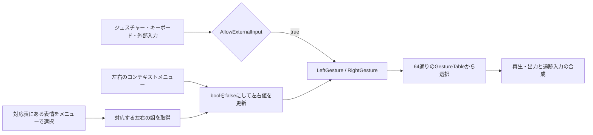

# 表情システムの実装と編集方法

DynamicVariable の型・初期値・更新元・編集用途とグラフ内の定数は、
[変数・定数リファレンス](expression-variables.md)を参照。

左右それぞれの現在のジェスチャーを 0〜7 の整数で保持し、
`LeftGesture * 8 + RightGesture` で64通りの対応表を引く。
対応表の参照先が変わったときだけアニメーションを切り替える。
VRChat の Animator 条件とレイヤーは変換時に評価し、アバター内には状態機械を生成しない。
標準コンポーネントと ProtoFlux で動作し、利用側に ResoPon の DLL は不要。


```mermaid
flowchart LR
    H[ジェスチャー・キーボード・外部入力] --> G{AllowExternalInput}
    G -->|true| S[LeftGesture / RightGesture]
    M[左右のコンテキストメニュー] --> L[boolをfalseにして左右値を更新]
    D[対応表にある表情をメニューで選択] --> T[対応する左右の組を取得]
    T --> L
    L --> S
    S --> P[64通りのGestureTableから選択]
    P --> R[再生・出力と追跡入力の合成]
```

## 生成される構成

```text
Expressions/
  Catalog/                         表情ごとの定義と AnimX
  GestureTable/                    64個の Catalog 参照
  Core/                            左右の状態、現在の表情、再生開始時刻
    Logic/
      Lifecycle/                   初期化、所有者変更、更新順序
      Selection/                   対応表からの選択と切り替え
      Playback/                    再生時刻、フェード、出力の合成
  Outputs/                         BlendShape ごとのベース入力と最終出力
  Inputs/
    ContextMenu/                   対応表にある表情のみメニュー表示
    Keyboard/Bindings/             左右8種ずつのショートカット
    HandGestures/Modules/
      Touch|Index|Vive|WindowsMR/   削除できる機種別入力
        Left/Logic/                左手の入力検出・安定化・通知
        Right/Logic/               右手の入力検出・安定化・通知
  API/Receivers/Logic/
    Left/                          左手の int 入力受付
    Right/                         右手の int 入力受付
    MenuLeft/                      メニューから左手を更新し入力を固定
    MenuRight/                     メニューから右手を更新し入力を固定
    Select/                        Catalog IDを対応表の左右値へ変換
    AllowExternalInput/            boolによる通常入力の許可・停止
  API/Examples/                    左右の int イベントを送るボタンの例
  API/Templates/                   Catalog に複製する表情テンプレート
  Diagnostics/                     自動設定できなかった理由
```

Core に入力元の一覧・優先順位・有効期限・汎用 Animator パラメーターは持たない。
入力内容は `ResoPon/Expression/Gesture/Left`／`ResoPon/Expression/Gesture/Right` タグと int 引数で渡す。Core は入力元の Slot 参照を保持しない。
各手は最後に受理した入力値を保持し、コントローラーが切断されても変更しない。更新番号は保持しない。

Flux は1スロット1ノードで、名前付きの節を保持しながらモジュール全体の接続関係で整列する。
データの供給元を左、入力を使うノードを右に置く。Impulse も発火元から呼び出し先へ左から右に配置する。
循環する接続は同じ階層にまとめ、モジュール間には実際の幅に応じた余白を設ける。
ProtoFlux Tool では調べたい `Selection`、`Playback` などのモジュールを個別に Unpack する。
モジュール間では ProtoFlux ノードを直接接続しない。所有者・時刻・定数の取得も各モジュール内で完結するため、
1つの入力や再生処理を開くだけで全機種・APIまでつながった巨大なグラフにはならない。

Core の更新は `Lifecycle` → `Selection` → `Playback` の順で行う。
呼び出しには対象モジュールだけを宛先とする同期 Dynamic Impulse を使い、
選択の更新が終わってから同じ更新内で再生・出力を計算する。
左右の公開 API は int を受信し、初期化確認 → 片手状態の更新 → Selection → Playback を同期実行する。
同じフレーム内で左右のイベントが連続しても、それぞれの受信時点の両手状態を評価する。
毎フレームの更新も維持し、表の編集・表情の無効化・アニメーションの経過時間を反映する。
モジュール間の状態は Core の DynamicVariable で渡す。
Dynamic Impulse は装着者のクライアントで実行され、所有者による処理制限も各入口で確認する。

## 入力・列挙ノード

固定参照のうち、読み取り元 Slot とノード自身から同じ名前付き空間へ到達できるものは
`DynamicVariableValueInput<T>`／`DynamicVariableObjectInput<T>` で読む。
間に別名の空間があっても、要求した空間名で祖先を検索する。

- 各手の Candidate・Stable・Since・GripHeld・TriggerHeld：`ExpressionGestureHand`。
- 機種ごとの Grip/Trigger しきい値・StabilitySeconds：親モジュールの `ExpressionGestureSettings`。
- Selection の左右値と、Playback の開始時刻・フェード秒数：`ExpressionCore`。
- Selection／Playback の CurrentExpression：`ExpressionCore` の Object Input。

Core の入力ノード化は現行の名前付き空間で再検証し、同一フレームの入力、複製、再装着、
保存再読み込み後の選択・再生を確認した。機種別設定の編集も、両手の入力プロキシが該当する
モジュールの値へ追従し、別機種・複製元と混ざらないことを確認する。
置換により接続先がなくなった固定 Slot 参照ノードは、配線完了後に除去する。

次の読み取りは `ReadDynamicValueVariable<T>`／`ReadDynamicObjectVariable<T>` を維持する。

- API・機種別入力からの Core 参照：Core は兄弟階層にあり、入力ノード自身の祖先にはない。
- ForEach の出力レコード・キー割当、選択中の Catalog：実行中に Source Slot が変わる。
- `ExpressionGestureTable/Pair.N`：左右値や走査番号で読み取る変数名が変わる。

入力ノードには Source Slot を渡せないため、これらはそのまま入力ノードに置き換えない。

子 Slot の処理は `Children` → `ForEachObject<IReadOnlyList<Slot>, Slot>`（表示名 ForEach）で列挙する。
すべてのループ本体は列挙中に子 Slot の追加・削除・並べ替えを行わず、元の直下の子の順序を保つ。
装着者は同じアバター配下の各ボードにある `GetActiveUserSelf` で取得する。
各ボードは独立した FluxGroup を維持する。対応表の逆引きとメニュー表示判定には、安定した Pair.0〜63 を数値で走査する For を使い、GetChild は使わない。

## 不具合の調べ方

まず Core の変数を見て、入力・選択・再生のどこで期待とずれたかを分ける。
Inspector 上の Core の変数名には `ExpressionCore/` が付く。他のレコードも定義別の空間名を使う。

| Core の変数 | 確認する内容 |
|---|---|
| `LeftGesture` / `RightGesture` | 各入力から届いた0〜7の状態 |
| `PairIndex` | 左×8＋右で求めた対応表の番号 |
| AllowExternalInput | true=通常入力も許可、false=コンテキストメニューのみ（編集可能） |
| `CurrentExpression` | Selection の検証を通過した再生対象。無効・未割当なら null |
| `PlaybackStart` / `PlaybackElapsed` | 再生開始時刻と経過秒数 |
| `FadeDuration` / `FadeWeight` | フェード秒数と現在の混合率（0〜1） |

1. 左右の番号が違う場合は、`API/Receivers/Logic/Left`／`Right` と該当入力の `Logic` を調べる。
2. 番号が正しく表情が違う場合は、`PairIndex` に対応する `GestureTable` の参照と `AllowExternalInput` を確認し、`Selection` を調べる。
3. `CurrentExpression` が null の場合は、`GestureTable/Pair.N`（N は PairIndex）の参照があるか確認する。参照がある場合は、参照先の Slot の有効状態、`Enabled`、`Clip` のアセット読み込みを確認する。
4. 選択が正しく見た目が違う場合は、`Playback` と該当する `Outputs` レコードの `Base`、`TrackingWeight`、`Snapshot`、`Result`、`Target` を調べる。

`AllowExternalInput` は入力モードの設定。それ以外の状態は読み取り用の診断情報として扱い、再生結果を変えたい場合は公開 API、対応表、Catalog を編集する。
変換時の警告は引き続き `Diagnostics` に残る。
`Diagnostics/Graph modules` の各レコードには `ExpressionGraphModule/Path` と `ExpressionGraphModule/NodeCount` があり、モジュールの場所と規模を確認できる。
`PlaybackElapsed` と `FadeWeight` はローカルに駆動する表示値で、診断のための毎フレームの同期書き込みを増やさない。
これらは時計から求める値であり、Playback の処理が実行されたことを示すカウンターではない。
反映が止まっている場合は、アバターの装着状態、該当モジュールの有効状態と `Outputs/Result`・`Target` を確認する。


resoloop を使う場合は、リポジトリ直下から次の読み取り専用スクリプトで Core の状態を一覧にできる。
`-CoreSlot` には対象の正確なパスまたは現在のスロット ID、
`-Url` には ResoniteLink に表示される現在のポートを指定する。

```powershell
powershell -NoProfile -ExecutionPolicy Bypass -File scripts/inspect-expression.ps1 -CoreSlot "Root/Plum/Expressions/Core" -Url "ws://localhost:42038"
```

`-Json` を付けると CoreSlot と Values を持つ JSON を返す。SelectionStatus に基づく Selection 要約は出力しない。
URL を省略した場合は resoloop の環境変数・プロジェクト設定を使う。
参照値は現在の ResoniteLink 接続での ID として表示するため、保存後の固定 ID として使わない。
診断スクリプトは旧 `Expr/` と現行 `ExpressionCore/` の両方を読み取れる。新しい空間名・診断項目の反映には再変換・再インポートが必要。


## Selection と再生対象

Core に保存する表情参照は `CurrentExpression` だけ。`MappedExpression` と `CandidateExpression` は生成しない。
Selection は `GestureTable/Pair.N` を読み、Slot 有効・Enabled=true・アセット取得済みを確認する。
通過した参照（無効なら null）をその更新中のローカル値として確定し、CurrentExpression と比較する。
異なる場合は現在の出力を Snapshot に保存し、切替先の FadeIn（解除なら切替前の FadeOut）と
再生開始時刻を設定して、CurrentExpression に確定した参照を直接書き込む。同じ参照なら再生を継続する。
未検証の対応表の参照を調べたい場合は、PairIndex に対応する行を直接見る。
SelectionStatus は生成・計算しない。入力モードは AllowExternalInput、再生対象は CurrentExpression で確認する。
未割当と無効・未ロードはどちらも CurrentExpression=null となり、理由は対応表と参照先を調べる。

## 装着状態と Lifecycle

Core と機種別入力は PreviousOwner を持たず、「現在の装着者がローカルユーザーか」で更新を制御する。
装着者が存在するかだけでは閲覧者も実行してしまうため、ローカルユーザーとの一致判定は残す。
Lifecycle 内の保存されない `StoredValue<bool>` が初期化済みかを記録する。

- 装着中：必要なら初期化し、Selection → Playback を同期実行する。
- 取り外し：初期化済みのクライアントが一度だけ入力・選択状態をクリアし、出力を Base に戻す。初期化済みフラグを解除する。
- 未装着中：選択・再生を停止する。未装着で生成したものや閲覧者は共有状態を書き換えない。
- 再装着・複製・読み込み：初回に左右値を 0、入力許可を true に戻して再開する。API が先に届いた場合も同じ初期化を行う。

取り外し時に別の装着者が既にいる場合は、終了側は共有値をクリアせずローカルフラグだけを解除する。
装着者の履歴は比較しない。装着終了を検出するには LocalUpdate が必要で、同じクライアントで更新の間に
外して即座に戻した場合は連続した装着として扱う。未装着中の追跡値変化も継続転送せず、終了時の出力を保持する。
既存パッケージへ反映するには再変換・再インポートが必要。

## 入力の動作

ジェスチャー番号は次の対応になる。
各左右メニュー項目は 0〜7 の int を固定値として持ち、`ResoPon/Expression/Menu/Left` または `ResoPon/Expression/Menu/Right` Tag に送る。受信側は bool を false にして該当の手を更新する。
キーボードとコントローラーは Gesture/Left・Gesture/Right の int API を使い、bool が true のときだけ受け付ける。文字列への変換は行わない。
動作確認では `Core/LeftGesture`、`RightGesture`、`CurrentExpression` と対応表の参照先を見る。

| 番号 | 状態 |
|---|---|
| 0 | Neutral |
| 1 | Fist |
| 2 | HandOpen |
| 3 | FingerPoint |
| 4 | Victory |
| 5 | RockNRoll |
| 6 | HandGun |
| 7 | ThumbsUp |

同じ手には最後に受理したイベントを採用し、もう一方の手は変更しない。bool が false の間は、通常入力を受理せず、左右値を維持する。
キーボードとメニューの指定はラッチする。キーやボタンを離しても戻らず、Neutral を選ぶと0に戻る。
物理入力は安定したジェスチャーが変化したときと接続時にだけ送る。
通常入力が許可されている間は、手を動かさずにキーボードで設定した状態を維持し、次の物理ジェスチャー変更で更新する。メニュー専用モードでは機種別の判定状態をリセットし、許可を戻した後は再び安定した手形を検出して送る。

- コンテキストメニュー: `Left hand` / `Right hand` に各8項目。
- キーボード: 左手は Ctrl+Alt+1〜8、右手は Ctrl+Alt+Shift+1〜8。数字1が Neutral、8が ThumbsUp。
  `Bindings` の `Key`、`Shift`、`Enabled`、送信先の `Tag` と整数値の `Gesture` を編集できる。
- コントローラー: 不要な `Modules/Touch|Index|Vive|WindowsMR` を削除できる。
  機器の切断・非アクティブ化では判定状態だけをリセットし、Neutral は送らない。
  最後に受理した左右値を保持し、再接続後に安定した手形を検出すると、その手の値を更新する。
  モジュール自体の削除・無効化でも手の状態は残る。解除したい場合は Neutral を明示的に送る。
  Grip/Trigger の押し込み・解放しきい値と安定待ち時間を機種ごとに編集できる。
  指を個別に取得できない機種の Victory/Rock はボタン操作から判定する。

直接表情を選ぶ `Select expression` と Imported menu は、対応表に存在する有効な表情だけを表示する。
選択すると、現在の対応表を逆引きして該当する左右値を両方更新し、`ExpressionCore/AllowExternalInput=false` にする。
同じ表情に複数の組がある場合は `PairIndex` が最小の組を使う。
Catalog の Slot を固定用に保持する Override 変数は生成しない。

`Allow gestures and keyboard` は bool を true に、`Menu only` は false にする。
モードだけの変更では左右値を変えない。初期値は true。
メニューから表情を選ぶと再び false になるため、通常入力へ戻すには許可をオンにする。
コンテキストメニューの左右項目・直接選択は bool が false でも使える。
元の ExpressionMenu の Button/Toggle は、このメニュー専用選択へ変換する。

## 対応表と表情の編集

`GestureTable` の各スロットには `ExpressionGestureTable/Pair.N` という DynamicReferenceVariable<Slot> がある。
N は左×8＋右。例えば左1・右2は `Pair.10`。
参照先を `Catalog` の表情スロットへ変更するだけで割り当てを編集できる。
左右の組み合わせごとにアニメーションを複製せず、同じ表情は同じ Catalog エントリーを参照する。

表は変数名で引くので、スロットの並び替え・表示名の変更・別の行の削除で対応がずれることはない。
変数名は固定し、同じ名前を重複させない。削除した行を戻す場合は同じ変数名で再作成する。
行が未設定、参照先が削除・無効化、またはアセットが未ロードなら Outputs のベース入力を使う。
表の参照を編集すると次の更新で反映される。異なる行でも同じ表情を指す場合は再生を継続する。

表情の追加は `API/Templates` または既存の Catalog エントリーを Catalog へ複製し、
`Enabled` を有効にして `Id`、`DisplayName`、`Clip`、`Duration`、`Loop` を設定する。
`Id` は空でない一意の文字列にする。外部からの直接選択にはこの ID を使う。
直接選択メニューに表示するには、GestureTable の少なくとも1組へ参照を割り当てる。対応表の編集はメニュー表示にも次の更新で反映する。`FadeIn` / `FadeOut` は切り替え秒数。削除は表情スロットごと行える。
テンプレートから複製したメニューの表示名・有効状態・送信する ID は複製先の変数に追従する。

AnimX のトラックは Node=`Expression`、Property=出力の `Id` を使う。
既存の出力を使う表情追加では Flux の配線は不要。
新しい BlendShape を操作する場合は Outputs の出力レコードとフィールド接続も必要になる。
`Bindings` は編集時の参照情報であり、AnimX のトラックを自動で書き換えるものではない。

## 外部イベント API（Version 5、Tag・引数は Version 4 と共通）

アバター装着者のクライアントで `Expressions/API/Receivers` を対象階層にして発火する。
左右の通常入力・メニュー入力は `DynamicImpulseReceiverWithValue<int>` で受ける。

| Tag | 引数 | 動作 |
|---|---|---|
| `ResoPon/Expression/Gesture/Left` | int 0〜7 | bool が true のとき左手を更新 |
| `ResoPon/Expression/Gesture/Right` | int 0〜7 | bool が true のとき右手を更新 |
| `ResoPon/Expression/Menu/Left` | int 0〜7 | bool を false にして左手を更新 |
| `ResoPon/Expression/Menu/Right` | int 0〜7 | bool を false にして右手を更新 |
| `ResoPon/Expression/Menu/Select` | string: Catalog の `ExpressionClip/Id` | 対応表を逆引きし、bool を false にして両手を更新 |
| `ResoPon/Expression/AllowExternalInput` | bool | 通常入力を許可するか設定。左右値は維持 |

0=Neutral、1=Fist、2=HandOpen、3=FingerPoint、4=Victory、5=RockNRoll、6=HandGun、7=ThumbsUp。
Tag は大文字・小文字を含めて完全一致。範囲外の int、引数型違い、無効・未割当の ID は入力状態を変更しない。
固定したいときは Menu 側の Tag を使い、手入力など固定しない送信元は Gesture 側を使う。
メニューの送信にも専用の Tag を使うため、通常入力を無効にしてもメニューは操作できる。

左右メニューは bool と片手の値、直接選択メニューは bool と両手の値を同じ Impulse 内で更新する。
その後、通常と同じ `Selection` → `Playback` を同期実行する。
bool を false にしただけでは左右値は変えず、表情は対応表から引き続き決定する。
初期化は入力許可の判定より前に行い、複製・再ロード・再装着時には bool=true、左右=0 に戻す。
Dynamic Impulse はネットワーク RPC ではなく、装着者以外のクライアントからの実行は無視する。

旧 `ResoPon/Expression/v3/Select` と `v3/Automatic` は生成しない。
旧 Select 送信側は Menu/Select へ変更し、通常入力を再開する操作は AllowExternalInput に true を送る。

## 変換時の判定と制限

`GesturePairCompiler` は左右64通りについて、すべての開始状態から遷移をたどる。
元の遷移順序を使い、行き着く状態が一意になる組み合わせだけを割り当てる。
履歴により結果が変わる、または循環する組み合わせは未設定として診断する。

元のレイヤー順と重み、Write Defaults による既定値を使い、選ばれたクリップを変換時に合成する。
同じ結果は再利用する。単一の動画、定数ポーズとの合成、時間・キー配置・補間が一致する動画の合成では
Hermite 曲線を保持する。固定の正の再生速度もキー時刻と接線へ反映する。
ベース値は変換時のアバターの値を用いる。
上位レイヤーの空 Motion や、その状態でアニメーションされない出力は下位レイヤーの値を引き継ぐ。
右手が Neutral のときに、左手の表情を既定値で上書きしない。

ジェスチャーレイヤーに併用されたメニューの int/bool Toggle パラメーターは、宣言された初期値へ固定して
対応表を生成する。例えば Plum の `FacialSet=0` は最初の表情セットになる。
使用した固定値は Diagnostics と変換ログへ記録し、実行時の表情セット切り替えは生成しない。
メニューにないパラメーターや連続値は推測で固定しない。
`GestureLeftWeight` / `GestureRightWeight` が Motion Time に使われる場合は、
8種類の離散入力向けに最大値1の位置を固定ポーズとして取り込む。握り込みの連続変化は再現しない。
元のアニメーションクリップは Catalog に残す。対応表へ割り当てた表情だけをメニューから選択できる。

Exit Time、再生オフセット、上記の固定化で扱えないパラメーター・GestureWeight 条件が必要なレイヤー、
履歴に依存する Write Defaults、解決できない出力は自動割り当ての対象外。
ループや長さが異なる動画の同時合成、合成できないキー配置も診断する。
対応する独立クリップは Catalog に残し、手動で割り当てられる。
パーサー側の制限も継続する。BlendTree、ネスト、AvatarMask、加算レイヤー、StateMachineBehaviour、
遷移中断、Puppet、Sub-Menu の開閉パラメーターは自動再現しない。
材質・物体・Transform のトラック、weighted tangent、イベントを含む Clip も対象外。

実行時は選ばれた表情を1つの時計で再生する。元 Animator の遷移時間、自己遷移による再開始、
レイヤーごとの独立した再生位相は再現しない。表情を切り替えると直前の出力からフェードする。
未ループのアニメーションは終端を保持する。

既存の瞬き・口パク等のドライバーは Outputs の `Base` に接続し直す。
表情にトラックがない出力は Base を使い、ある出力はアニメーション値を使う。
出力ごとの `TrackingWeight`（0〜1）で Base の混合率を調整できる。
複製・再ロード・再装着時には左右状態を0に、AllowExternalInput を true に初期化する。
VRM の感情表情も同じ Catalog を使うが、VRChat の条件がないため対応表は未設定から始まる。

## 検証

`dotnet run --project tests/ExpressionSmoke -c Release` で、パーサー、64通りの合成、
履歴依存の除外、実 ProtoFlux の入力・再生・編集・モジュール削除・追跡との接続・
複製とパッケージ再読み込みを検証する。
既知の実アバターは `scripts/test-local-avatar.ps1` で変換と inspect を確認する。
物理コントローラー、デスクトップのキーフォーカス、メニュー操作、複数クライアントの動作確認は
Resonite クライアント上で別途必要。

2026-09-14 の検証では ExpressionSmoke と登録済み LilLeo の変換・inspect が成功した。
比較用の保存パッケージ（同じ3機種の入力を残したもの）の Flux は2,530から892ノードへ減少した。
LilLeo の元の左右レイヤーには従来から未対応の挙動・欠落 BlendShape があり、自動割り当てを省略する。
この実アバターテストは変換の回帰確認であり、その顔表情の完全な取り込みを確認したものではない。

2026-09-15: Plum v1.0.1 で左右の表情レイヤーが Motion Time と表情セット条件のために除外される問題を修正した。
保存パッケージを実エンジンへ読み込み、メニューの ButtonDynamicImpulseTrigger を Command 未変更のまま呼び出し、
左右64通り・102出力を検査して8種類の表情を確認した。
空／別プロパティだけを持つ上位レイヤーが下位の値を保持する挙動は、Unity 2022.3.22f1 の
SkinnedMeshRenderer と2レイヤーの Animator を使った再現でも確認した。

2026-09-15 のモジュール分割では、既存 Plum パッケージの1グループ・1,098ノードに対し、
再変換後は15グループ・合計1,174ノード、最大グループ106ノードとなった。
所有者や時刻の取得をモジュールごとに持たせるため総数は増えるが、API・Core・機種別左右の間で
FluxGroupを共有しない。Core は Lifecycle 59、Selection 101、Playback 60ノード。
この構造上の境界は、見出しや座標だけでなく実際の FluxGroup で検査している。

Plum の旧・新パッケージで29クリップの全 AnimX 内容、Catalog設定、出力binding・基準値・追跡混合率、
64通りの割り当てを比較し、一致を確認した。保存パッケージのメニューボタンを実際に発火する試験でも、
64通り・102出力・8種類の表情が成功した。
ExpressionSmoke はフェード、診断値のローカル駆動、入力拒否、所有者の離脱・再装着、
複製と保存再読み込みも検査する。PrefabInputSmoke、PrefabSceneSmoke、Plum の変換・inspect も成功した。

2026-09-15 の旧 API v3 の文字列化では、16種類の完全一致・不正文字列／引数型の拒否・同一更新内の左右イベント、
初回装着時の同期初期化、同じジェスチャーの再送、切断時の更新番号、複製・保存再読み込みを検査する。
左から右への配置は実ノードのデータ入力・参照入力・Impulse 出力から接続をたどって検査し、
循環成分以外の接続が逆向きなら失敗する。今回の生成グラフに循環成分はない。
Plum は15グループ・合計1,444ノード、最大グループ130ノード。
API/Gesture は104、Core は Lifecycle 65、Selection 86、Playback 60ノード。
全1,939データ／参照接続と324 Impulse 接続の方向を検査した。
今回の変更は変換器の生成処理へ適用される。既存ワールド内の変換済みアバターへ反映するには、
新しい ResoPon で再変換したパッケージを再インポートする。

2026-09-19: 左右入力を `ResoPon/Expression/Gesture/Left`／`ResoPon/Expression/Gesture/Right` の `DynamicImpulseReceiverWithValue<int>` に変更。
メニュー・キーボード・機種別入力は 0〜7 を直接送り、文字列化とデコードを除去した。
ExpressionSmoke で各手の全8値、範囲外（int.MinValue、-1、8、255、int.MaxValue）、
型違い・旧 Tag の拒否、同一更新内の左右入力、複製と保存再読み込みが成功した。
Plum の再変換・inspect、および保存済みメニューボタンによる64通り・102出力・8種類の表情の検証も成功。
旧パッケージと Catalog、全 AnimX 曲線、出力binding、64通りの表情割り当てが一致した。
Plum の Flux は1,444から1,235ノードへ減少。左右 Receiver は各31ノード、16グループ、最大109ノード。
接続中ワールドの Plum は旧 string 構成として読み取り確認し、ワールド内の置き換えは行っていない。

2026-09-19 の入力・列挙ノード整理後、Plum の DynamicVariableValueInput は44、
DynamicVariableObjectInput は8、Children／ForEach は各6、GetActiveUserSelf は16。
For、GetChild、GetActiveUser は生成グラフからなくなり、総ノード数は1,235から1,213へ減少した。
ReadDynamicValueVariable は63、ReadDynamicObjectVariable は12を残す。
ExpressionSmoke の複製・所有者変更・保存再読み込み、および再変換した Plum の
旧版との表情データ比較と64通り・102出力・8表情の実行検証が成功した。

2026-09-19 の入力モード変更では、固定用の Override を廃止し、Core の `Expr/AllowExternalInput` と通常の左右値へ統一した。
ExpressionSmoke でメニュー専用時の通常入力・更新番号の保護、再許可、対応表に応じたメニュー表示、複製・再装着・保存再読み込みを確認した。
Plum の再変換・inspect と旧版との全表情データ比較が成功し、保存済みメニューボタンによる64通り・102出力・8表情に加え、
対応表にある8個の直接選択ボタンと入力許可・停止の両ボタンを実行検証した。
生成グラフは1,377ノード・19グループ、最大111ノードで、ボードをまたぐグループは0。
For は安定した Pair.0～63 の逆引き・メニュー表示判定に使う数値ループ2個だけで、GetChild は0。

2026-09-20: Version 5 では共通の Expr 空間を廃止し、変数定義ごとに11種類の名前を付けた。
空間名と変数パス、ProtoFlux の参照、テンプレート、診断スクリプトを更新した。公開イベント Tag・引数は変更していない。
ExpressionSmoke で生成時・保存再読み込み後の全レコードの空間名と変数接頭辞、旧 Expr 書き込みの拒否を確認した。
Plum の再変換・inspect、新旧パッケージの Catalog・AnimX・出力定義・64通りの割り当て比較が成功し、
保存済みメニューによる64通り・102出力・8表情、直接選択と入力モードの動作も確認した。
診断スクリプトは新 ExpressionCore と旧 Expr の模擬応答で読み取りを検証した。

2026-09-20: 空間名を指定して祖先を検索するよう入力ノードの適用条件を拡張し、機種別設定と
Core の固定読み取りを DynamicVariableValueInput／DynamicVariableObjectInput に置換した。
Core の一律除外を廃止し、配線先のなくなった固定 Slot 参照も除去した。
テスト用アバターで ReadDynamicValueVariable は78→41、ReadDynamicObjectVariable は10→8、
DynamicVariableValueInput は44→81、DynamicVariableObjectInput は0→2。
総ノードは1,332→1,284、19グループを維持し、最大グループは106→100、ボードをまたぐグループは0。
ExpressionSmoke で機種別設定の編集、Core 参照の結合、同一フレームの左右入力、
複製・再装着・保存再読み込み後の再生を確認した。Plum の再変換・inspect、旧版との全表情データ比較、
保存済みメニューの64通り・102出力・8表情、直接選択と入力モードの実行検証も成功した。
