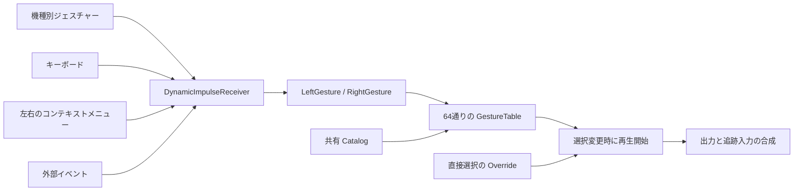

# 表情システムの実装と編集方法

左右それぞれの現在のジェスチャーを 0〜7 の整数で保持し、
`LeftGesture * 8 + RightGesture` で64通りの対応表を引く。
対応表の参照先が変わったときだけアニメーションを切り替える。
VRChat の Animator 条件とレイヤーは変換時に評価し、アバター内には状態機械を生成しない。
標準コンポーネントと ProtoFlux で動作し、利用側に ResoPon の DLL は不要。


```mermaid
flowchart LR
    H[機種別ジェスチャー] --> E[DynamicImpulseReceiver]
    K[キーボード] --> E
    M[左右のコンテキストメニュー] --> E
    X[外部イベント] --> E
    E --> S[LeftGesture / RightGesture]
    S --> T[64通りの GestureTable]
    C[共有 Catalog] --> T
    T --> P[選択変更時に再生開始]
    O[直接選択の Override] --> P
    P --> R[出力と追跡入力の合成]
```

## 生成される構成

```text
Expressions/
  Catalog/                         表情ごとの定義と AnimX
  GestureTable/                    64個の Catalog 参照
  Core/                            左右の状態、現在の表情、再生開始時刻
    Logic/
      Lifecycle/                   初期化、所有者変更、更新順序
      Selection/                   対応表・直接指定の選択と切り替え
      Playback/                    再生時刻、フェード、出力の合成
  Outputs/                         BlendShape ごとのベース入力と最終出力
  Inputs/
    ContextMenu/
    Keyboard/Bindings/             左右8種ずつのショートカット
    HandGestures/Modules/
      Touch|Index|Vive|WindowsMR/   削除できる機種別入力
        Left/Logic/                左手の入力検出・安定化・通知
        Right/Logic/               右手の入力検出・安定化・通知
  API/Receivers/Logic/
    Left/                          左手の int 入力受付
    Right/                         右手の int 入力受付
    Select/                        Catalog の直接指定受付
    Automatic/                     直接指定の解除
  API/Examples/                    左右の int イベントを送るボタンの例
  API/Templates/                   Catalog に複製する表情テンプレート
  Diagnostics/                     自動設定できなかった理由
```

Core に入力元の一覧・優先順位・有効期限・汎用 Animator パラメーターは持たない。
入力内容は `ResoPon/Expression/Gesture/Left`／`ResoPon/Expression/Gesture/Right` タグと int 引数で渡す。Core は入力元の Slot 参照を保持しない。
各手の更新番号は、コントローラー切断時に後から届いた別入力を消さないために使う。

Flux は1スロット1ノードで、名前付きの節を保持しながらモジュール全体の接続関係で整列する。
データの供給元を左、入力を使うノードを右に置く。Impulse も発火元から呼び出し先へ左から右に配置する。
循環する接続は同じ階層にまとめ、モジュール間には実際の幅に応じた余白を設ける。
ProtoFlux Tool では調べたい `Selection`、`Playback` などのモジュールを個別に Unpack する。
モジュール間では ProtoFlux ノードを直接接続しない。所有者・時刻・定数の取得も各モジュール内で完結するため、
1つの入力や再生処理を開くだけで全機種・APIまでつながった巨大なグラフにはならない。

Core の更新は `Lifecycle` → `Selection` → `Playback` の順で行う。
呼び出しには対象モジュールだけを宛先とする同期 Dynamic Impulse を使い、
選択の更新が終わってから同じ更新内で再生・出力を計算する。
左右の公開 API は int を受信し、初期化確認 → 片手状態の更新 → Selection → Playback を同期実行する。
同じフレーム内で左右のイベントが連続しても、それぞれの受信時点の両手状態を評価する。
毎フレームの更新も維持し、表の編集・表情の無効化・アニメーションの経過時間を反映する。
モジュール間の状態は Core の DynamicVariable で渡す。
Dynamic Impulse は装着者のクライアントで実行され、所有者による処理制限も各入口で確認する。

## 入力・列挙ノード

機種別の各手の状態（Candidate、Stable、Since、LastRevision、GripHeld、TriggerHeld、PreviousOwner）は、
同じ `Expr` スコープを参照する `DynamicVariableValueInput<T>`／`DynamicVariableObjectInput<T>` で読む。
これらのノードは該当する手の変数スコープ内に配置する。

次の読み取りは `ReadDynamicValueVariable<T>`／`ReadDynamicObjectVariable<T>` を維持する。

- Core の Lifecycle／Selection／Playback の同期状態。Dynamic Input に置き換えた実エンジン試験では、
  複製後に表情の選択は更新されても出力が古いままになる回帰があったため、直接読み取る。
- 各コントローラーの共通しきい値や API からの Core 参照など、ノードと変数のスコープが異なる固定参照。
- ループ中の子 Slot、選択中の Catalog、左右の番号で決まる `Expr/Pair.N` など、実行中に対象や名前が変わる参照。

子 Slot の処理は `Children` → `ForEachObject<IReadOnlyList<Slot>, Slot>`（表示名 ForEach）で列挙する。
すべてのループ本体は列挙中に子 Slot の追加・削除・並べ替えを行わず、元の直下の子の順序を保つ。
装着者は同じアバター配下の各ボードにある `GetActiveUserSelf` で取得する。
各ボードは独立した FluxGroup を維持し、公開 API の Tag と 0〜7 の契約は変更しない。

## 不具合の調べ方

まず Core の変数を見て、入力・選択・再生のどこで期待とずれたかを分ける。
Inspector 上の実際の変数名には `Expr/` が付く。

| Core の変数 | 確認する内容 |
|---|---|
| `LeftGesture` / `RightGesture` | 各入力から届いた0〜7の状態 |
| `LeftRevision` / `RightRevision` | 受理したイベントの更新番号。同じ状態の再送でも増える |
| `PairIndex` | 左×8＋右で求めた対応表の番号 |
| `MappedExpression` | その行に割り当てられた Catalog の表情 |
| `Override` / `CandidateExpression` | 直接指定と、検証前の選択候補 |
| `SelectionStatus` | 0=未割当、1=対応表、2=直接指定、3=無効またはアセット未ロード |
| `CurrentExpression` | 実際に再生している表情 |
| `PlaybackStart` / `PlaybackElapsed` | 再生開始時刻と経過秒数 |
| `FadeDuration` / `FadeWeight` | フェード秒数と現在の混合率（0〜1） |

1. 左右の番号が違う場合は、`API/Receivers/Logic/Left`／`Right` と該当入力の `Logic` を調べる。
2. 番号が正しく表情が違う場合は、`PairIndex` に対応する `GestureTable` の参照と `Override` を確認し、`Selection` を調べる。
3. `SelectionStatus=3` の場合は、候補の `Enabled` と `StaticAnimationProvider` のアセット読み込みを確認する。
4. 選択が正しく見た目が違う場合は、`Playback` と該当する `Outputs` レコードの `Base`、`TrackingWeight`、`Snapshot`、`Result`、`Target` を調べる。

これらの状態は読み取り用の診断情報として扱い、再生結果を変えたい場合は公開 API、対応表、Catalog を編集する。
変換時の警告は引き続き `Diagnostics` に残る。
`Diagnostics/Graph modules` の各レコードには `Expr/Path` と `Expr/NodeCount` があり、モジュールの場所と規模を確認できる。
`PlaybackElapsed` と `FadeWeight` はローカルに駆動する表示値で、診断のための毎フレームの同期書き込みを増やさない。
これらは時計から求める値であり、Playback の処理が実行されたことを示すカウンターではない。
反映が止まっている場合は、アバターの装着状態、該当モジュールの有効状態と `Outputs/Result`・`Target` を確認する。


resoloop を使う場合は、リポジトリ直下から次の読み取り専用スクリプトで Core の状態を一覧にできる。
`-CoreSlot` には対象の正確なパスまたは現在のスロット ID、
`-Url` には ResoniteLink に表示される現在のポートを指定する。

```powershell
powershell -NoProfile -ExecutionPolicy Bypass -File scripts/inspect-expression.ps1 -CoreSlot "Root/Plum/Expressions/Core" -Url "ws://localhost:42038"
```

`-Json` を付けると機械可読の JSON を返す。
URL を省略した場合は resoloop の環境変数・プロジェクト設定を使う。
参照値は現在の ResoniteLink 接続での ID として表示するため、保存後の固定 ID として使わない。
旧パッケージも読み取れるが、追加した診断項目は再変換・再インポート後に表示される。


## 入力の動作

ジェスチャー番号は次の対応になる。
各メニュー項目は 0〜7 の int を固定値として持ち、`ResoPon/Expression/Gesture/Left` または `ResoPon/Expression/Gesture/Right` Tag に送る。
キーボードとコントローラーも同じ int イベント API を使い、文字列への変換は行わない。
動作確認では `Core/LeftGesture`、`RightGesture`、`CurrentExpression` と対応表の参照先を見る。

| 番号 | 状態 |
|---|---|
| 0 | Neutral |
| 1 | Fist |
| 2 | HandOpen |
| 3 | FingerPoint |
| 4 | Victory |
| 5 | RockNRoll |
| 6 | HandGun |
| 7 | ThumbsUp |

同じ手には最後に届いたイベントを採用し、もう一方の手は変更しない。
キーボードとメニューの指定はラッチする。キーやボタンを離しても戻らず、Neutral を選ぶと0に戻る。
物理入力は安定したジェスチャーが変化したときと接続時にだけ送る。
したがって、手を動かさずにキーボードで設定した状態は維持され、次に物理ジェスチャーが変わると更新される。

- コンテキストメニュー: `Left hand` / `Right hand` に各8項目。
- キーボード: 左手は Ctrl+Alt+1〜8、右手は Ctrl+Alt+Shift+1〜8。数字1が Neutral、8が ThumbsUp。
  `Bindings` の `Key`、`Shift`、`Enabled`、送信先の `Tag` と整数値の `Gesture` を編集できる。
- コントローラー: 不要な `Modules/Touch|Index|Vive|WindowsMR` を削除できる。
  機器の切断を検出すると、その機器からの送信が最新の場合だけ Neutral を送る。
  後から別入力が同じジェスチャーを送っていても、その状態を保持する。
  モジュール自体の削除・無効化はイベントを送らないため、手の状態は残る。必要なら Neutral を送ってから削除する。
  Grip/Trigger の押し込み・解放しきい値と安定待ち時間を機種ごとに編集できる。
  指を個別に取得できない機種の Victory/Rock はボタン操作から判定する。

直接表情を選ぶ `Select expression` は、左右の状態を保持したまま Override する。
`Return to gestures` で現在の左右状態による選択へ戻る。
インポートした ExpressionMenu は、単独のパラメーターで表情を確定できる項目をこの直接選択へ変換する。
元の Button/Toggle の押下期間・パラメーター保存・トグル解除は再現せず、どちらも直接選択としてラッチする。

## 対応表と表情の編集

`GestureTable` の各スロットには `Expr/Pair.N` という DynamicReferenceVariable<Slot> がある。
N は左×8＋右。例えば左1・右2は `Pair.10`。
参照先を `Catalog` の表情スロットへ変更するだけで割り当てを編集できる。
左右の組み合わせごとにアニメーションを複製せず、同じ表情は同じ Catalog エントリーを参照する。

表は変数名で引くので、スロットの並び替え・表示名の変更・別の行の削除で対応がずれることはない。
変数名は固定し、同じ名前を重複させない。削除した行を戻す場合は同じ変数名で再作成する。
行が未設定、参照先が削除・無効化、またはアセットが未ロードなら Outputs のベース入力を使う。
表の参照を編集すると次の更新で反映される。異なる行でも同じ表情を指す場合は再生を継続する。

表情の追加は `API/Templates` または既存の Catalog エントリーを Catalog へ複製し、
`Enabled` を有効にして `Id`、`DisplayName`、`Clip`、`Duration`、`Loop` を設定する。
`Id` は空でない一意の文字列にする。外部からの直接選択にはこの ID を使う。
`FadeIn` / `FadeOut` は切り替え秒数。削除は表情スロットごと行える。
テンプレートから複製したメニューの表示名・有効状態・送信する ID は複製先の変数に追従する。

AnimX のトラックは Node=`Expression`、Property=出力の `Id` を使う。
既存の出力を使う表情追加では Flux の配線は不要。
新しい BlendShape を操作する場合は Outputs の出力レコードとフィールド接続も必要になる。
`Bindings` は編集時の参照情報であり、AnimX のトラックを自動で書き換えるものではない。

## 外部イベント API

アバター装着者のクライアントで `Expressions/API/Receivers` を対象階層にして発火する。
左右の受信ノードは `DynamicImpulseReceiverWithValue<int>`、
送信ノードは `DynamicImpulseTriggerWithValue<int>`。
メニューは標準コンポーネント `ButtonDynamicImpulseTriggerWithValue<int>` を使う。

| Tag | 引数 | 動作 |
|---|---|---|
| `ResoPon/Expression/Gesture/Left` | int 0〜7 | 左手の状態を更新し、その場で両手を評価 |
| `ResoPon/Expression/Gesture/Right` | int 0〜7 | 右手の状態を更新し、その場で両手を評価 |
| `ResoPon/Expression/v3/Select` | string: Catalog の `Expr/Id` | 表情を直接選択 |
| `ResoPon/Expression/v3/Automatic` | string: 空文字列 | Override を解除し、現在の両手で再選択 |

0=Neutral、1=Fist、2=HandOpen、3=FingerPoint、4=Victory、5=RockNRoll、6=HandGun、7=ThumbsUp。
左右で同じ VRChat の番号を使う。

例えば int Trigger の `TargetHierarchy` に `Expressions/API/Receivers`、
`Tag` に `ResoPon/Expression/Gesture/Left`、`Value` に int の `1`、
`ExcludeDisabled` に true を接続して発火すると左手が Fist になる。
`API/Examples/Left Fist (int 1)` と `Right Fist (int 1)` にボタントリガーの例を置く。

Tag は大文字・小文字を含めて完全一致。他のシステムとの衝突を避けるため表情入力専用の接頭辞を付け、一般名の `Left`／`Right` は受け付けない。左右の表情入力 Tag は int 0〜7 のみ受け付け、
範囲外、string、float、Slot、引数なしの入力は左右状態・更新番号・再生を変更しない。
Select と Automatic の string API は変更しない。Select は存在する有効な Catalog ID のみ受け付ける。
旧 `ResoPon/Expression/v3/Gesture` ＋ `Left.Fist` などの送信側は、
`ResoPon/Expression/Gesture/Left`／`ResoPon/Expression/Gesture/Right` ＋ int に変更する。文字列デコード用グラフは生成しない。

状態は次のイベントまで保持する。送り元の Slot を削除しても状態を消さず、解除には該当する手の Neutral を送る。
既存の直接選択中にも左右状態は更新し、Automatic で現在の両手による表情へ戻る。
装着者変更・複製・再ロード時は初期化する。API から初期化も同期して呼ぶため、更新前に届いた最初の左右イベントも保持する。

Dynamic Impulse 自体はネットワーク RPC ではない。装着者以外のクライアントからの実行は無視する。
装着者が最終出力を計算して同期する構成で、各クライアントが状態だけを受け取って独立再生する方式ではない。

## 変換時の判定と制限

`GesturePairCompiler` は左右64通りについて、すべての開始状態から遷移をたどる。
元の遷移順序を使い、行き着く状態が一意になる組み合わせだけを割り当てる。
履歴により結果が変わる、または循環する組み合わせは未設定として診断する。

元のレイヤー順と重み、Write Defaults による既定値を使い、選ばれたクリップを変換時に合成する。
同じ結果は再利用する。単一の動画、定数ポーズとの合成、時間・キー配置・補間が一致する動画の合成では
Hermite 曲線を保持する。固定の正の再生速度もキー時刻と接線へ反映する。
ベース値は変換時のアバターの値を用いる。
上位レイヤーの空 Motion や、その状態でアニメーションされない出力は下位レイヤーの値を引き継ぐ。
右手が Neutral のときに、左手の表情を既定値で上書きしない。

ジェスチャーレイヤーに併用されたメニューの int/bool Toggle パラメーターは、宣言された初期値へ固定して
対応表を生成する。例えば Plum の `FacialSet=0` は最初の表情セットになる。
使用した固定値は Diagnostics と変換ログへ記録し、実行時の表情セット切り替えは生成しない。
メニューにないパラメーターや連続値は推測で固定しない。
`GestureLeftWeight` / `GestureRightWeight` が Motion Time に使われる場合は、
8種類の離散入力向けに最大値1の位置を固定ポーズとして取り込む。握り込みの連続変化は再現しない。
元のアニメーションクリップは直接選択用として Catalog に残す。

Exit Time、再生オフセット、上記の固定化で扱えないパラメーター・GestureWeight 条件が必要なレイヤー、
履歴に依存する Write Defaults、解決できない出力は自動割り当ての対象外。
ループや長さが異なる動画の同時合成、合成できないキー配置も診断する。
対応する独立クリップは Catalog に残し、手動で割り当てられる。
パーサー側の制限も継続する。BlendTree、ネスト、AvatarMask、加算レイヤー、StateMachineBehaviour、
遷移中断、Puppet、Sub-Menu の開閉パラメーターは自動再現しない。
材質・物体・Transform のトラック、weighted tangent、イベントを含む Clip も対象外。

実行時は選ばれた表情を1つの時計で再生する。元 Animator の遷移時間、自己遷移による再開始、
レイヤーごとの独立した再生位相は再現しない。表情を切り替えると直前の出力からフェードする。
未ループのアニメーションは終端を保持する。

既存の瞬き・口パク等のドライバーは Outputs の `Base` に接続し直す。
表情にトラックがない出力は Base を使い、ある出力はアニメーション値を使う。
出力ごとの `TrackingWeight`（0〜1）で Base の混合率を調整できる。
複製・再ロード・装着者変更時には左右状態と直接選択を初期化する。
VRM の感情表情も同じ Catalog を使うが、VRChat の条件がないため対応表は未設定から始まる。

## 検証

`dotnet run --project tests/ExpressionSmoke -c Release` で、パーサー、64通りの合成、
履歴依存の除外、実 ProtoFlux の入力・再生・編集・モジュール削除・追跡との接続・
複製とパッケージ再読み込みを検証する。
既知の実アバターは `scripts/test-local-avatar.ps1` で変換と inspect を確認する。
物理コントローラー、デスクトップのキーフォーカス、メニュー操作、複数クライアントの動作確認は
Resonite クライアント上で別途必要。

2026-09-14 の検証では ExpressionSmoke と登録済み LilLeo の変換・inspect が成功した。
比較用の保存パッケージ（同じ3機種の入力を残したもの）の Flux は2,530から892ノードへ減少した。
LilLeo の元の左右レイヤーには従来から未対応の挙動・欠落 BlendShape があり、自動割り当てを省略する。
この実アバターテストは変換の回帰確認であり、その顔表情の完全な取り込みを確認したものではない。

2026-09-15: Plum v1.0.1 で左右の表情レイヤーが Motion Time と表情セット条件のために除外される問題を修正した。
保存パッケージを実エンジンへ読み込み、メニューの ButtonDynamicImpulseTrigger を Command 未変更のまま呼び出し、
左右64通り・102出力を検査して8種類の表情を確認した。
空／別プロパティだけを持つ上位レイヤーが下位の値を保持する挙動は、Unity 2022.3.22f1 の
SkinnedMeshRenderer と2レイヤーの Animator を使った再現でも確認した。

2026-09-15 のモジュール分割では、既存 Plum パッケージの1グループ・1,098ノードに対し、
再変換後は15グループ・合計1,174ノード、最大グループ106ノードとなった。
所有者や時刻の取得をモジュールごとに持たせるため総数は増えるが、API・Core・機種別左右の間で
FluxGroupを共有しない。Core は Lifecycle 59、Selection 101、Playback 60ノード。
この構造上の境界は、見出しや座標だけでなく実際の FluxGroup で検査している。

Plum の旧・新パッケージで29クリップの全 AnimX 内容、Catalog設定、出力binding・基準値・追跡混合率、
64通りの割り当てを比較し、一致を確認した。保存パッケージのメニューボタンを実際に発火する試験でも、
64通り・102出力・8種類の表情が成功した。
ExpressionSmoke はフェード、診断値のローカル駆動、入力拒否、所有者の離脱・再装着、
複製と保存再読み込みも検査する。PrefabInputSmoke、PrefabSceneSmoke、Plum の変換・inspect も成功した。

2026-09-15 の旧 API v3 の文字列化では、16種類の完全一致・不正文字列／引数型の拒否・同一更新内の左右イベント、
初回装着時の同期初期化、同じジェスチャーの再送、切断時の更新番号、複製・保存再読み込みを検査する。
左から右への配置は実ノードのデータ入力・参照入力・Impulse 出力から接続をたどって検査し、
循環成分以外の接続が逆向きなら失敗する。今回の生成グラフに循環成分はない。
Plum は15グループ・合計1,444ノード、最大グループ130ノード。
API/Gesture は104、Core は Lifecycle 65、Selection 86、Playback 60ノード。
全1,939データ／参照接続と324 Impulse 接続の方向を検査した。
今回の変更は変換器の生成処理へ適用される。既存ワールド内の変換済みアバターへ反映するには、
新しい ResoPon で再変換したパッケージを再インポートする。

2026-09-19: 左右入力を `ResoPon/Expression/Gesture/Left`／`ResoPon/Expression/Gesture/Right` の `DynamicImpulseReceiverWithValue<int>` に変更。
メニュー・キーボード・機種別入力は 0〜7 を直接送り、文字列化とデコードを除去した。
ExpressionSmoke で各手の全8値、範囲外（int.MinValue、-1、8、255、int.MaxValue）、
型違い・旧 Tag の拒否、同一更新内の左右入力、複製と保存再読み込みが成功した。
Plum の再変換・inspect、および保存済みメニューボタンによる64通り・102出力・8種類の表情の検証も成功。
旧パッケージと Catalog、全 AnimX 曲線、出力binding、64通りの表情割り当てが一致した。
Plum の Flux は1,444から1,235ノードへ減少。左右 Receiver は各31ノード、16グループ、最大109ノード。
接続中ワールドの Plum は旧 string 構成として読み取り確認し、ワールド内の置き換えは行っていない。

2026-09-19 の入力・列挙ノード整理後、Plum の DynamicVariableValueInput は44、
DynamicVariableObjectInput は8、Children／ForEach は各6、GetActiveUserSelf は16。
For、GetChild、GetActiveUser は生成グラフからなくなり、総ノード数は1,235から1,213へ減少した。
ReadDynamicValueVariable は63、ReadDynamicObjectVariable は12を残す。
ExpressionSmoke の複製・所有者変更・保存再読み込み、および再変換した Plum の
旧版との表情データ比較と64通り・102出力・8表情の実行検証が成功した。
