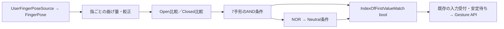

# IndexのNeutral／Idle調査と中間域の実装

2026-10-02に、起動中Unity 2022.3.22f1のプロジェクト内にある
`com.vrchat.avatars` / `com.vrchat.base` 3.10.5を読み取り調査した。
調査時にはSDK、Unityプロジェクト、生成コード、実ワールドの変更は行っていない。
その後、表情入力の3状態判定をVersion 59として実装した。見た目のIdleポーズは提案のまま。
Version 60では分類を維持し、比較boolを`ComposeBits_byte`へまとめて手形ごとのコード比較へ変更した。
実装済みの対応表は
[コントローラー別ジェスチャー判定](controller-gestures.md)を参照。
環境固有のプロジェクトパス、抽出物、検証スクリプトはコミットしない。

## SDKのIdleとIndexの入力判定は別の定義

SDKの `Samples/AV3 Demo Assets/Animation/` を基準として次を確認した。

- `Controllers/vrc_AvatarV3HandsLayer.controller` の実際の左右Handレイヤーから
  子ステートとAny State遷移を辿ると、GestureLeft／Right == 0はIdleで、
  `ProxyAnim/proxy_hands_idle.anim` を参照する。2はOpenで `proxy_hands_open.anim` を参照する。
- `vrc_AvatarV3HandsLayer2.controller` の0はIdle2で `proxy_hands_idle2.anim` を参照する。
  IdleはStopTime=0の静止形、Idle2はStopTime=5.5秒のループである。
- [公式Animator Parameters](https://creators.vrchat.com/avatars/animator-parameters/)でも
  0はNeutral、2はHandOpen。ここでIdleとNeutralは同じ番号0を指す。
- [公式Index操作](https://docs.vrchat.com/docs/valve-index)は実指姿勢を標準7手形へ照合すると説明し、
  各指のup／down条件を掲載している。Neutral専用の姿勢・数値しきい値は掲載していない。
  SDKのC#／JSONからもIndexの認識しきい値やNeutralの判定アルゴリズムは確認できなかった。
  SDKクリップは「番号を受け取った後のポーズ」であり、逆方向の判定条件を定義しない。

通常のIdleクリップは、4指をOpenほど伸ばさずFistほど曲げない形と読める。
ただしmuscle値は角度でもセンサーのcurl値でもなく、左右差・関節差がある。
例えば第1関節のStretchedの実値は次の通り。

| muscle | Idle | Open | Fist |
|---|---:|---:|---:|
| 左人差し指 | 0.25111935 | 0.51009136 | -0.33480328 |
| 左中指 | 0.06274103 | 0.44501653 | -0.476557 |
| 左薬指 | -0.10594944 | 0.4276399 | -0.4980211 |
| 左小指 | -0.022694644 | 0.34084624 | -0.5663649 |
| 右人差し指 | 0.103608675 | 0.5132862 | -0.31847566 |
| 右中指 | -0.13893783 | 0.40836343 | -0.4999805 |
| 右薬指 | -0.20971514 | 0.38006347 | -0.5322404 |
| 右小指 | -0.34317607 | 0.30952653 | -0.584296 |
| 左親指 | -1.1633571 | -1.2562445 | -1.3902905 |
| 右親指 | -1.1403292 | -1.1757555 | -1.3002338 |

親指のこの値はIdleがOpenとFistの間にさえ入らない。
全指を一律の「半分曲げる」にしたり、muscle値をそのままEuler角へ変換したりしない。
全40カーブはStretched／Spreadであり、正確な見た目の再現には関節ごとの評価が必要。

現行VRCについては [SteamVR Input 2.0](https://docs.vrchat.com/docs/steamvr-input-20)も参照する。
Indexの指の見た目にはSkeletal Input、アバター別Legacy Fingers、全体の
Avatars Use Finger Tracking設定が関係する。指追跡を表示に適用しなくてもGestureの認識は動く。
したがってNeutral=0になっても、指追跡中の手がSDKの固定Idle形に置き換わるとは限らない。
[Gesture Toggle](https://docs.vrchat.com/docs/gesture-toggle)を無効にしたAV3では最後の番号を保持する。
これもNeutralへの遷移とは別である。

## インターネットで確認した入力対応（2026-10-02）

### 公式操作表の7手形

[VRChat公式Index操作表](https://docs.vrchat.com/docs/valve-index)の入力条件を整理すると次の通り。
上／下は原文のup／downであり、Resoniteの固定Euler角やcurlしきい値へは直結しない。
人差し指の「触れる」は原文のon triggerであり、トリガーを引き切る条件とは書かれていない。

| 番号／手形 | 人差し指 | 中指 | 薬指 | 小指 | 親指 |
|---|---|---|---|---|---|
| 1 Fist | トリガーに触れる | 下 | 下 | 下 | 下 |
| 2 HandOpen | トリガーから離す | 上 | 上 | 上 | 上 |
| 3 FingerPoint | トリガーから離す | 下 | 下 | 下 | 下 |
| 4 Victory | トリガーから離す | 上 | 下 | 下 | 下 |
| 5 RockNRoll | トリガーから離す | 下 | 下 | 上 | 下 |
| 6 HandGun | トリガーから離す | 下 | 下 | 下 | 上 |
| 7 ThumbsUp | トリガーに触れる | 下 | 下 | 下 | 上 |

公式ページは、中指・薬指・小指の静電容量センサー、人差し指のトリガー接触センサー、
親指のパッド／ボタン接触センサー、握り込みのsqueezeセンサーを説明する。
親指に触れるボタンのTouchバインディングを外すと曲げを認識できなくなるとも説明している。
操作表にはNeutralの専用行や、伸び／曲げの数値境界はない。

この公式表はSkeletal Input更新前からある操作説明である。
[Input 2.0 FAQ](https://docs.vrchat.com/docs/input-20-faq)は従来のIndexを単純なfinger-curl方式と説明し、
新方式ではSteamVRの骨格データを表示へ適用すると説明している。
公式表だけから現行クライアントの全入力経路・優先順位・較正方法は確定しない。

### Neutralの中間域についての具体的な実機報告

[Neutral Flickerの報告](https://feedback.vrchat.com/bug-reports/p/1491-vive-and-index-controllers-neutral-flicker-on-touchpad-gesture-to-fist-tran)
では、2024-08-21にIndexで「Fistを作って人差し指をゆっくり伸ばすと、
FingerPointとの間にGesture=0のdeadzoneがある」という再現手順が投稿されている。
同じスレッドにはFist→ThumbsUpで一瞬0を経由する報告と、2024.3.1以降の挙動とする報告もある。

これは入力当事者の観測であり、公式のアルゴリズム説明や現在の実機検証ではない。
指の中間域をNeutralへ落とす案を支持する材料にはなるが、
全指について共通のdeadzoneがあることや、0.25／0.75等の数値を保証する証拠ではない。
特に「全指を脱力させると必ず0」とは結論しない。

### SteamVRバインディングで番号を直接指定できる

[2024-05-02公式開発報告](https://ask.vrchat.com/t/developer-update-2-may-2024/24284)は
Gesture Directで手形を任意のボタンへ割り当てる機能を説明している。
[VRChat WikiのSteamVR Bindingsガイド](https://wiki.vrchat.com/wiki/Guides:SteamVR_Bindings)は
コミュニティによる具体的な調査資料で、次の経路を掲載している。

- Gesture Activator：親指・人差し指・Gripなどのbool入力。
  別のGesture入力としてTrigger／Grip Axisなどのアナログ入力も掲載されている。
- Use Gesture：`UG - Neutral`から`UG - Thumbs Up`まで、0〜7を直接指定するboolアクション。
- Gesture Wheel：パッドの位置から手形を選ぶ経路。
- Index等のGesture Activatorを持つ機種では入力がないとOpenが成立するという説明。
  `Disable Gesture Tracked`で追跡由来の手形認識を無効にし、明示入力のみを使う方法も説明されている。

このガイドの未解明箇所には「(?)」「TODO」もあり、全経路の優先順位までは示していない。
Neutralを出す方法は実指の姿勢だけに限定されず、バインディングで0を直接指定することもできる。
Resoniteでも既存のGesture APIへ0を送るボタンを設ければ、指角度によらずNeutralを選ぶ経路を作れる。
これは入力方式の追加案であり、今回ボタンや配線は変更していない。

### Index向け表情システムのNeutral再割り当て

[FaceEmo作者の設定資料](https://suzuryg.github.io/face-emo/docs/optional-functions/setting-menu/)には
Controller TypeをIndex Controllerにすると、Fistによる表情変更を無効にしNeutral扱いにする設定がある。
これは表情システム側の再割り当てであり、VRCクライアントのGesture=1が0へ変更される意味ではない。
「通常の握り方で表情を出したくない」という用途には、この選択層の設定も検討できる。

### 公開APIから分かる数値の範囲

[ValveのSteamVR Skeletal Input資料](https://github.com/ValveSoftware/openvr/wiki/SteamVR-Skeletal-Input)には
`GetSkeletalSummaryData`と `flFingerCurl[5]` が定義され、0=伸ばす、1=完全に曲げると説明されている。
WithController／WithoutControllerで手の可動域が異なり、WithoutControllerは
コントローラーを握る形を閉じた拳へ再マッピングする。
これもValveの骨格API仕様であり、VRCのGesture認識に使う境界値の公開ではない。
ResoniteのFingerPoseの角度をこのcurlと同一視せず、利用する追跡ソースを確認して較正する。

今回の公式資料・作者資料・公開実装の検索では、VRC現行クライアントの
全手形の数値しきい値、Neutralの完全な条件表、認識処理の公開ソースは見つからなかった。
公開資料による確認と実機報告を分け、再現案の数値境界は引き続き較正対象とする。

## Gesture Managerにはコントローラー認識処理があるか

同じUnityプロジェクトの `vrchat.blackstartx.gesture-manager` 3.9.9も確認した。
この版にはIndex等のコントローラーの接触・押下・指curlからGesture番号を認識する処理はない。
手形を選択してAnimatorへ番号を渡すエミュレーターである。
[公式README](https://github.com/BlackStartx/VRC-Gesture-Manager)も左右の手形をUIボタンで試す方法を説明している。

- `Scripts/Editor/GestureManagerEditor.cs` の `OnCheckBoxGuiHand` は1〜7のチェックを表示し、
  `module.OnNewHand(hand, isOn ? i : 0)` を呼ぶ。選択解除がNeutral=0であり、実指の脱力判定ではない。
- `Scripts/Runtime/Data/ModuleBase.cs` の `OnNewHand` が左右へ分岐し、
  `Scripts/Editor/Modules/Vrc3/ModuleVrc3.cs` の `OnNewLeft`／`OnNewRight` が
  GestureLeft／Rightパラメーターを直接設定する。リスト上のマウスドラッグも選択行を番号へ変換する。
- `Vrc3WeightSlider.UpdatePosition` はマウス位置を0〜1へClampし、GestureWeightを設定する。
  Gesture変更時にWeightを更新する補助処理もあるが、実トリガー量の測定・手形判定ではない。
- `OpenSoundControl/OscSettings.cs` はOSCの入力値をパラメーターへ渡す。
  外部から値を受け取る機能であり、コントローラーセンサーからの手形認識は実装していない。

パッケージ内の全C#をXR／SteamVR／OpenVR／OVRInput／指curl／Grip／GetAxis／GetButton等で検索し、
上記のUIからパラメーター設定までの経路を直接読んだ。Neutralの実機しきい値の根拠としては使えない。

## Version 58までのResoPonのIndex

`ExpressionGestureInputSetup.BuildControllerGesture` は装着者の
`UserFingerPoseSource` → 各指の `FingerPose.Rotation` → `EulerAngles_floatQ` を読む。
4指はProximalのX >= 40度、親指は左Y <= 25度／右Y <= -25度を既定の曲げ判定とする。
ビット順は人差し指、中指、薬指、小指、親指。

Fist=31、HandOpen=0、FingerPoint=30、Victory=28、RockNRoll=6/22、HandGun=14、ThumbsUp=15。
`IndexOfFirstValueMatch<bool>` の未一致Index=-1に1を足してNeutral=0にする。
全32コードのうちNeutralは次の24コード。

```text
1,2,3,4,5,7,8,9,10,11,12,13,16,17,18,19,20,21,23,24,25,26,27,29
```

このNeutralは特定の脱力ポーズを検出した値ではなく、7手形のどれも成立しない値。
全指が曲げしきい値未満ならHandOpenへ、全指が曲げ判定を満たせばFistへ進むため、
脱力していてもこの2つへ分類され得る。NeutralのNOR行だけを追加しても分類は変わらない。

公式IndexのRock N Rollは親指downだが、既存の6/22は親指を問わない。
VRCへ厳密に合わせる変更と、既存利用者の互換性を保つ変更を区別する。

## 伸び・中間・曲げの3状態で表情を選ぶ（Version 59）

実装は従来のFingerPose角度経路とClosedしきい値を維持し、
`FingerNeutralRange`・`ThumbNeutralRange`（初期20度）でOpen境界を離す。
負の幅は0として扱う。4指はX < FingerThreshold - 幅でOpen、X >= FingerThresholdでClosed。
親指は左右の符号適用済みしきい値をTとして、Y > T + 幅でOpen、Y <= TでClosed。
Open側を厳密不等号にするため、幅0でも状態は重ならず従来の2値判定となる。
親指を問わないRockNRollの互換条件を採用し、その他の必要な指が中間ならNeutral=0とする。
中間状態も既存の安定時間を経て通常のGesture APIへ送信される。
左右各243通り、境界、幅設定、Neutralによる表情切替、通常手形への復帰を実ノードで検証する。
この幅は実機から校正したVRChatの値ではなく、ユーザーが調整するResoPonの初期設定である。

以下はこの実装の設計根拠と、別途検討できる校正方法。
Version 59は手形ごとに指比較をANDへ直接つないでいた。
Version 60のビット配置と一致コードは[コントローラー別ジェスチャー判定](controller-gestures.md)を参照。
各指のClosedをBit0〜4、4指のOpenまたはClosedの成立をBit5、親指OpenをBit6へ入れる。
各手形の比較はTouchと共通のbyte一致処理で生成する。

Resonite向けの設計案であり、VRCクライアントの認識アルゴリズムとして確定したものではない。
各指にOpen判定とClosed判定を別々に設け、その間は両方falseとする。
Closedの否定をOpenとして使うと、中間域がOpenへ混入するため、この案の目的を満たせない。

較正済みの曲げ量cなら、例えば `Open = c <= 0.25`、`Closed = c >= 0.75` とする。
これらは動作説明用の数値であり、VRCの値や実機検証済みの既定値ではない。
左右・指ごとの伸ばした値／曲げた値を測り、脱力時が中間域に収まるか確認して境界を選ぶ。
親指は他4指と測定軸・方向が異なるため独立して較正する。

角度を使う最小案は現在のFingerPose経路を維持し、各指へ2つの比較を置く。
伸ばした角度aOpen／曲げた角度aClosedから
`c = Clamp01((a - aOpen) / (aClosed - aOpen))` を作るなら、標準の
`ValueSub<float>`、`ValueDiv<float>`、`Clamp01_Float` を使える。
分母が0の較正は拒否する。角度の折り返しを跨ぐ区間は、較正前に連続な角度へ直す。
Proximalのみで区別できない場合はIntermediate／Distalも測り、
同じ座標基準の回転を単純に加算せず、関節間の相対回転を基に曲げ量を作る。

次の条件を各手形の `AND_Multi_Bool` へ接続する。O=Open、C=Closed、*=条件なし。

| 番号／手形 | 人差し指 | 中指 | 薬指 | 小指 | 親指 |
|---|---|---|---|---|---|
| 1 Fist | C | C | C | C | C |
| 2 HandOpen | O | O | O | O | O |
| 3 FingerPoint | O | C | C | C | C |
| 4 Victory | O | O | C | C | C |
| 5 RockNRoll | O | C | C | O | * |
| 6 HandGun | O | C | C | C | O |
| 7 ThumbsUp | C | C | C | C | O |

RockNRollの親指*は既存6/22の互換性を保つ案。公式の説明へ寄せる場合はCへ変更する。
*の案では親指が中間でもRockNRollが成立するが、それ以外の必要な指が中間なら手形は成立しない。



`NOR_Multi_Bool.Operands` に7条件を接続してNeutralを作る。
`IndexOfFirstValueMatch<bool>.Match=true`、`Values=[Neutral,Fist,HandOpen,FingerPoint,Victory,RockNRoll,HandGun,ThumbsUp]`
とし、Indexをそのまま0〜7として出力する。Touch Version 56と同じ並べ方で、+1は不要。
全指が中間の脱力形も、テンプレート外の形もNeutralになる。
Neutralは有効なGestureTableの0行であり、表情解除・Baseと同義ではない。
VR終了や機器切断の-1、入力許可、変更検出、安定待ち／Timeoutは既存の共通制御を使う。
既存のTimeout中の変化破棄も継承するため、静止したNeutralへ戻る時系列は実機確認が必要。

## 指の見た目を再現する場合

実行中Resoniteの実DLLをilspycmdで確認し、次の標準コンポーネント／ノードが存在することを確認した。

- `FingerPosePreset.PresetPose=Idle` はResoniteの `FingerPosePresets.Idle` を供給する。
  Resonite標準の脱力形を表示する最小案。VRC SDKのIdleとの同一性は確認していない。
- `FingerPoseMultiplexer` のSources／Indexで追跡ソースとIdleソースを選び、
  InterpolationSpeedで補間できる。各手の `HandPoser.PoseSource` へ渡す。
  左右を独立して切り替える場合は、各手のHandPoserに対応する選択経路を用意する。
- VRCの固定形が必要なら、対象Humanoid AvatarでSDKのIdleクリップを評価し、得た指ボーン回転を
  Resoniteの指座標系へ変換してポーズソースへ保存する。Idle2まで再現するなら時間カーブも必要。

Indexで実指追跡を維持する目的なら、通常は表示を追跡ソースのままにし、表情番号の判定だけを変更する。
固定Idleを表示する案では、判定は表示切替より上流の追跡ソースから読む。
表示したIdleを再び入力として判定するフィードバックを作らない。

実DLLの `FingerPose` はデータ取得失敗時にPosition=0、Rotation=Identityを返し、成功フラグを出力しない。
既存のしきい値へIdentityを渡すと、旧2値表では左はコード16でNeutral、右はコード0でHandOpenとなる。
Version 59の初期中間域でも左はNeutral、右はHandOpenになり得る。
ソースnullや追跡停止を脱力と同一視しない。3状態判定だけではこの問題は解決しないので、
入力受付時には上流ソースの有効性・追跡状態を別に確認する必要がある。

## 今回の検証と実装時に残る確認

- SDKの両Controllerで実際に参照される左右レイヤーの全32遷移を辿り、0／2のクリップを照合した。
  Idle／Idle2／Open／Fistの各40muscleカーブとStopTimeを抽出した。
- 既存Indexの32コードを列挙し、Neutralが24コードであることを確認した。
- 提案の5指3状態の全243通りで条件の排他性を検証した。
  親指*のRockNRollを採用すると非Neutralは9通り、Neutralは234通り。
  中間を含まない32通りは既存の番号と一致し、全指中間はNeutralとなる。
- 起動中Resoniteと同じインストールのDLLでFingerPose、UserFingerPoseSource、NOR、
  IndexOfFirstValueMatch、FingerPosePreset、FingerPoseMultiplexer、HandPoserの定義を確認した。

調査時の243通りの検証は離散条件のオフライン検証だった。
Version 59〜60では生成Fluxを動かす左右各243通りのテストも実施する。実機の認識テストは未実施。
実装時は左右でOpen→脱力→Fist、Victory→脱力、親指の接触先変更、境界での揺れ、
指追跡喪失、VR終了／復帰、Timeout中からのNeutral復帰、GestureTableの0行の選択を確認する。
VRC同値性を求める場合は、VRCのGestureLeft／Right表示と同じ実手形・バインディングで照合する。
